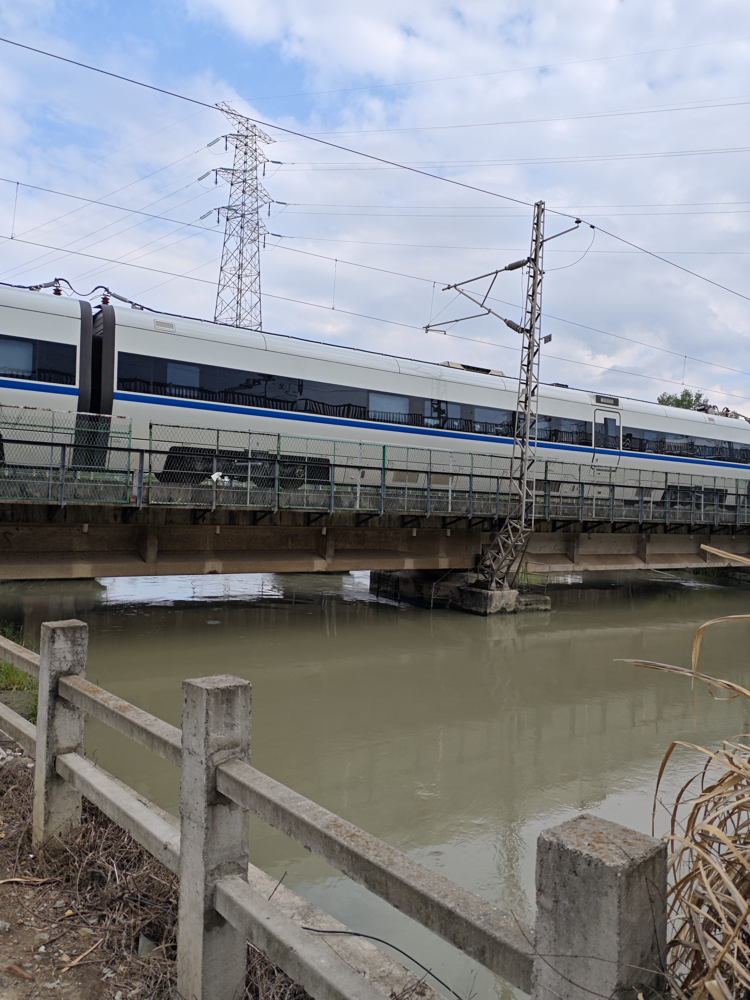

敬请期待。

东风渠灌区位于成都平原腹地，是全国特大型灌区都江堰灌区的重要组成部分，灌区直灌面积291.72万亩，控灌面积达862.90万亩，占都江堰设计灌面的57.5 %；灌区内有干渠16条，总长816公里，主要承担着向成都、眉山2市19个县（市）区和天府新区输送生活、生产、生态用水，以及向龙泉山、黑龙滩两大水库灌区输水的任务。

http://www.scdfz.org.cn/scyx/scfw/content_126654

## 大画面

起点位于安靖。

总干渠在固结闸处，分出了北干渠。

总干渠在麻石桥处（疑似东安湖），疑似分出东干渠。

总干渠终点位于罗家河坝。

罗家河坝分为两支：
1. 龙泉山干渠，包括三座水库，三岔湖、王家岩水库，石盘水库。简阳规划馆。
2. 新南干渠，向南流入岷江及黑龙潭？从地图上看，新南干渠的起点位置存疑问。原为东风渠四期工程。

东风渠新南干渠(原为东风渠四期工程)，起于双流县太平镇罗家河坝 节制分水闸，经双流、至仁寿黑龙滩勤劳节制闸，全长 57.5km。新南干工 程于 1966 年春动工兴建，1970 年 12 月底建成。1970 年 10 月兴建东风渠五期工程，即黑龙滩水库工程，在勤劳闸左 侧引水 35m3 /s入库囤蓄，计划灌溉田土面积 106 万亩。为满足五期扩灌工 程需水的要求，省上决定对四期工程进行扩建。渠段扩建分两个流量段， 罗家河坝至三合支渠口为 50m3 /s，三合支渠口至勤劳节制分水闸为 45m3 /s。 扩建工程于 1972 年春动工，先修渡槽、隧洞、暗渠、公路桥、节制闸、山 溪涵洞等渠系建筑物，然后于 1977 年进行全线扩渠，1978 年春完工通水。 四期干渠工程扩建完工后，将四期干渠更名为新南干渠。（[参考资料](https://slt.sc.gov.cn/scsslt/gsgg/2021/1/3/de6fadef34014218962e922135a522fb/files/12-24%E5%9B%9B%E5%B7%9D%E7%9C%81%E9%83%BD%E6%B1%9F%E5%A0%B0%E4%B8%9C%E9%A3%8E%E6%B8%A0%E7%81%8C%E5%8C%BA%E6%96%B0%E5%8D%97%E5%B9%B2%E6%B8%A0%E7%BB%AD%E5%BB%BA%E9%85%8D%E5%A5%97%E4%B8%8E%E8%8A%82%E6%B0%B4%E6%94%B9%E9%80%A0%E5%B7%A5%E7%A8%8B%E6%B0%B4%E5%9C%9F%E4%BF%9D%E6%8C%81%E6%96%B9%E6%A1%88%E6%8A%A5%E6%89%B9%E7%A8%BF_15091760836730.1370841714305614.pdf)

## 2025年5月骑行

目前地图上没有标新南干渠，但官方的说法是从取水处到罗家河坝叫东风渠总干渠，罗家河坝以下叫新南干渠。

东风渠目前总体是属于可以沿河骑行的状态。至罗家河坝的话，骑行长度约为70公里。整体没什么大的爬坡。河流经过主要城市道路时，大都没有专门的过街天桥或者涵洞，只能从左右路口绕行。市区一般绕行不太远，龙泉区有些地方可能要远一点。有些地方的沿河区域被占用。

这几个地方要穿铁路，只能绕路。

成都理工大学占据了一段河道，只能绕路，不知道找门卫登记身份证是不是可以进去。

进入青龙湖公园时，我好象没有选对路。也许应该沿地铁线方向找一个入口的。

这一段穿108国道绕行地比较远。不沿河的那一段应该是东安湖公园，那一段说是水源地，不让沿河走。东安湖也不让自行车走，我是偷偷进去的。

成龙大道附近比较混乱，可能是因为有施工，封路等原因，有一大段没法沿河走。

成环路向下游没多远有一段被围起来了，不让走。

罗家河坝向龙泉山方向分出一支，向下游跨过了鹿溪河。

### 骑行记录

东风渠进水口，从府河中分了一大块出来。这样的水利工程确实是起作用的。

从进水口向下游看，这一带在绕城以内，但北门的城市发展和南门差别巨大，这里基本本还没有大规模的住宅和商业。

这里离渠首没多远，前方是个小水电，道路还是新修的绿道。

前人种树，后人乘凉具象化了。这些树木估计是当时修渠时种下的。可以完全遮住夏天的烈日。

这里离城市群还有点距离，不过会越来越接近的。

漂亮的林荫道。但据我观察，这么高规格的路占比不超过一半吧。

东风渠的主题词就是“漂流”，成都人都知道每年夏天，东风渠都会淹死人。但我看河水不算激流，离岸边也很近，应该是很安全的啊。这一带可能是保护水源地，沿河全装上了铁丝网，但仍然挡不住爱好者们下水。

沿渠还有一些居民住宅和单位，但总体来说不算多。这些可能也会被拆迁？

中老年男人们的最爱！夏天漂东风渠。时不时都能看到这种成群结队的漂流人，几乎全是老男人。钓鱼的也有，但不多。

比较麻烦的是遇到铁路线都无法直接通过，只能向两头走绕路。选哪一头有时还很费思量，因为有可能一绕就几公里了。

渠上常有这样的交通桥。大约也就一米来宽，也没有护栏。

处于漂流态中的老头们。

沿河也并不全是好路，象这样的野路也不少。不过总体来说，就算是这样的路，山地车没有压力的。通行性还比较好，只有少数单位占道，少数修路封闭。大多数绕路的情况都是河流穿铁路，或者穿大路。

这个节制闸看起来比较新。边上的路还没有修好，可能是才修好的。

河边还有这样的疗养院，看起来是比较适合康养的。

接近三环了。楼盘多了起来。不知道供应居民的用水需求和农业的用水需求，之间差别有多大？

沿河漂亮的三角梅。

靠近市区反而没有铁丝网了。

 

三环附近还有这么幽静的小路和森林，确实很舒服。

跨成渝铁路，没办法，又只能找路了。

沿河都有禁止下河的标志，但这个地方好象成了漂流聚集区了，很多人在这里玩。

对面是理工东苑，属于漂景房了。

靠近理工大学这一带的沿河两边道路设施都很好，可以说是精华段了。

不时还有点工业风的建筑。估计是哪个楼盘又要在开发了。

前面是理工大学的校内段了。不知道用身份证能进去不？我怕麻烦还是绕行了。

看地图，这是穿西成线了。不得不再次找路，好在这次边上有个涵洞。

十陵节制闸桥头有个卖锅盔的，骑累了来一个是真正爽。

进入了青龙湖公园内。不用怀疑，这应该就是成都最好的公园了。

这一段的东风渠是最好骑最漂亮的。补给也没问题。

从这附近开始就要离开青龙湖和环城绿道折范围了。这么好的环境是真有点不舍啊！

从青龙湖出来，道路还不错的，但少了很多遮荫的树了。

这一带都是水源保护地。水的流量还可以的。

东安湖公园是很奇葩的。修的非常好的路，但不让人进去骑。在东风渠的左岸还围了一大片，不让任何人进。

反正是第一次看到边路都不让过的情况。

花巨资修的沙滩，但是不让自行车进。没多久我就被保安轰了。

这里应该是东风渠的东干渠的起点。这个风光带，哪天也可以去走一下。

找的一些资料上说从这里东分出一条到龙泉的分渠。

龙泉这边好象没什么下河漂流的老头了。我看这也挺适合的。

没找对路，或者是有施工，误入了一条支渠，也就顺便看看支渠什么样。总的感觉就是几乎没有水了。

这里就是跨过五环的地方，经过多次了。这个所谓公园很小。没几步就结束了。

又一个节制闸。

龙泉山下的东风渠。这条渠是解了山下大片土地的渴。

两边是农业为主，少了树林遮挡太阳。

高铁跨过东风渠。

终于到了著名的罗家坝枢纽了。这里应该是官方的东风渠总干渠的终点。向南为新南干渠，向龙泉山为龙泉山遂洞。

据说后里的引大济岷工程，这里也是一个接水点。所以说这里很重要。

骑完总干渠之后，又向龙泉山方向骑了两公里，就看到了龙泉山隧洞。洞口上，当年的标语还清楚可见。

地图上，罗家河坝是跨了鹿溪河的。特意找到了相交点查看，只看到一条干枯的水沟。

总干渠已经结束了，我沿着新南干渠继续向下游方向探索。总体来说还是有路的，但路好路坏各占一半吧。这路山地车没有压力，但下雨天肯定不行。

东风渠是把府河水引到了各个原来缺水的地方，但是要发挥作用还要靠这一路的提灌站。

第一次认真看渡槽，看来这一个渡槽经过了几十年的使用，最近几年进行了翻新。我确实也看到过一份政务公开的文件，是关于东风渠的改造的。

从下面看渡槽的样子。感觉这设施还是会比较耐用的。

沿着新南干渠骑的话，一路的补给点比较少，需要拐出去。但五月下旬的时候，正是枇杷成熟的筋节，沿河的路上到处都是结满了果实的树，而且伸手可取。这很难不动心对吧。特别是又累又渴的时候。

这是第二个渡槽，可以看到前面的地势明显是更高的，经过这个渡槽之后，东风渠就消失了。当时我是很奇怪的。后来看地图，确定是通过了某个隧洞，而我是从洞顶上过的。这一带是东山大道附近。下次探索准备从这里断续向下到黑龙滩。地图上显示，从这向下游可能还会有多个不长的隧洞。