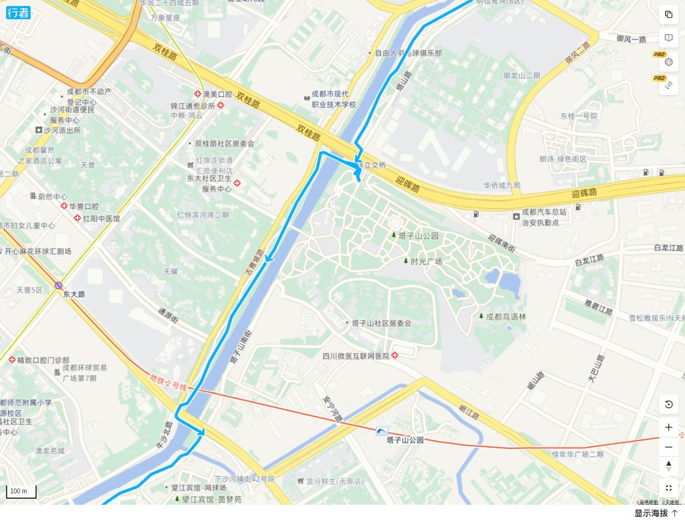

“沙河”古称升仙水，为自然河流，“沙河”之称始自元、明两代。沙河和府河、南河都是流经[成都](https://baike.baidu.com/item/%E6%88%90%E9%83%BD/0?fromModule=lemma_inlink)市的主要河道，被称为成都“三河”，属岷江水系。沙河为府河左岸分支，起于成都市北郊洞子口，向东南流约3公里又分洗瓦堰、砖头堰。洗瓦堰是沙河干流，主要向成都东郊供水，为区内主要排水渠道。经驷马桥向东、穿越东郊腹地，后逐渐转向西南，于南郊返回府河。 [1]

1954年至1957年间，在原有小沙河的基础上改造和扩建而成了全长22.223公里，河道最窄处15.6米，最宽处55米，平均水深4米的穿城河。该河现有11座水闸，3座跌水坝及3座小型发电站，主要担负着东郊企业的生产供水、市民生活用水、沿河农田灌溉及城市东郊防洪排汛等任务，被称为成都的“生命河”。

2001年初，成都市委市政府作出了对沙河进行以污水治理、环境治理为重点的综合整治的战略决策。2001年11月28日，沙河综合整治工程正式动工。2004年12月30日，沙河综合整治工程全面竣工，整治一新的沙河重又再现了碧波荡漾、绿树成荫的盛景。

沙河综合整治工程投资32.48亿元，规划整治范围涉及4.63平方公里、河道长度22.22公里、河道两侧50—200米。

经过近3年的艰苦努力，全线共建成城市道路和护岸护洪道路43公里，新建、重建桥梁16座，新建、重建水闸9座，修建景点建筑30座，修建景点广场及景点文化构筑物9万平方米；修建8个重点景区光彩工程，埋设各种管线35万米，修筑边坡及河堤50万米，铺设园林小道18.6万平方米，修建园路25.5万平方米，安装各类照明灯具2.3万盏。工程建设44.44公里绿化灌溉线，总体绿化面积345公顷，全线栽植各类高大乔木12.2万株，栽植各类花草310多万株，种植草坪21万多平方米，构成自然和谐的植物生态群落，建成“树树景各异，季季景不同”的绿色长廊。为把成都历史文化、水文化、现代文化等融入沙河工程，沙河全线着力打造了北湖凝翠、新绿水碾、三洞古桥、科技秀苑、麻石烟云、沙河客家、塔山春晓、东篱翠湖八大景点，称为“沙河八景”。

[澳大利亚](https://baike.baidu.com/item/%E6%BE%B3%E5%A4%A7%E5%88%A9%E4%BA%9A/0?fromModule=lemma_inlink)东部时间2006年9月5日，成都市沙河综合整治工程经过激烈的角逐，在澳大利亚昆士兰州首府布里斯班市成功地获得2006年澳大利亚“国际舍斯河流奖”。这也是国内首条获得该奖项的河流。2006年12月1日上午，沙河边监控中心的小广场上，一个水瓢形状的雕塑与市民见面了------它就是沙河获得的国际舍斯河流奖的奖杯模型。据介绍，沙河全长22.2公里，这个奖杯也做成了2.22米高，以表示它与沙河的特殊意义。

在成都市东郊沙河上游的新绿水碾景点，站在50米高的观光塔上俯瞰沙河，沿岸两侧各200米宽的绿化带，浮在水中的[湿地](https://baike.baidu.com/item/%E6%B9%BF%E5%9C%B0/0?fromModule=lemma_inlink)小岛，约150亩的人工湖泊，与不远处的“[城市森林](https://baike.baidu.com/item/%E5%9F%8E%E5%B8%82%E6%A3%AE%E6%9E%97/0?fromModule=lemma_inlink)”相映，犹如一幅如锦如绣的山水画。这是两年前成都市在整治沙河时打造的“沙河八景”之一。

新绿水碾

位于成华区北部双水村附近，市自来水二厂以北，成彭公路以东、大件路以南，占地面积106.3公顷。景点内有约150亩的人工湖，是成都市西北部的大型开阔景观水面，与北湖凝翠景区的城市森林相呼应。景区其他部位散置多处小型湖泊，水中各种水生动物悠游嬉戏。远望沙河监控中心，看着宛如蝴蝶也似贝壳的宏伟建筑，你肯定会觉得心情开阔。站在50米高的观光塔上俯瞰沙河美景，满眼绿色，甚是惬意。双沙路侧40米高的大型音乐喷泉，将是市民休闲的又一好去处。景区内清澈的沙河水环绕着秀美的四季岛，古蜀文化雕塑展示着沙河悠久灿烂的过去。

科技秀苑

西起电子科大东院桥，东至建设北路踏水桥，北以沙河为界，南至电子科大校园，占地面积3.8公顷。

景区沿着电子科大东院校门铺开，整洁的河道，潺潺的清水，随风飘飞的银杏落叶，小巧的石头拱桥，散发着浓浓的学院派气息。中心广场简洁、明快的建筑体现着IT时代的风格：现代时尚的张拉膜演讲广场、钢架长廊，大型水幕投影数码喷泉及多彩涌泉让广场既丰富多彩又活力四射。游人还可互动参与景区内的灯光小品及显示屏活动。

北湖凝翠

位于金牛区洞子口乡政府以南，自沙河与府河分流口起，以沙河支渠同流至府河并与府河所围合的地域，占地面积33.8公顷。景区内有黄桷树、银杏、竹类等，还有桂花树、樱花树、杜鹃、蕨类等小乔木及地被植物，苍翠的绿色和五彩缤纷的花草装扮出了一片近水的“城市森林”。蜿蜒的沙河水岸线畔遍生着各种亲水植物，浮萍般围绕着河堤。

三洞古桥

西起三友路沙河桥，东至中三洞桥水闸，北以沙河为界，南至李家沱小区，占地面积约5.3公顷。踏上景区上游的三洞古桥，下游的新建三洞桥及三洞景观桥，川西平原的桥文化将让你感到悠远陶醉。水源广场、水渠、假山水池、方格水池、卵石驳岸等反映了川西平原水利格局，体现着千百年来蜀人的治水成就。中心广场的文化景墙镌刻着古蜀治水的历史画卷。形式各异的喷泉有各种各样的水型，彰显着沙河的水文化。景区东侧的茶文化展示馆，室外广场的古今人物对话造型的茶文化雕塑，体现川西悠久的茶文化和休闲文化。

麻石烟云

西起二环路麻石桥，东至光明器材厂，北以建设南路为界，南至杉板桥路，占地面积23.8公顷。

漫步其中，可欣赏到钢架长廊、旱喷广场、音乐喷泉广场等风格各异的风情，分别意味着手工业时代、钢铁纺织时代及电子信息时代。景区中心是保留的原工厂车间改造而成的工业文明展示馆，陈列有反映成都工业发展历程的展品和艺术品。

塔山春晓

以沙河为界两侧各50米，占地面积9公顷。从成渝高速公路出城方向过五桂桥后不远处，在右侧下车，就来到公园门前广场。该景区充分展示了传统园林景观，形成城市纵深的视线通道。具有中国特色的九天门（牌坊）、古雅高挺的九天楼居于景区的中轴线上，塔子山公园别致的风景环绕四周。进入公园内大门后，若左拐后直走，经过九天门（牌坊），就来到高高的九天楼。若右拐后直走，会来到休闲区。这里有餐厅、茶园，还可来到河边与沙河水亲近。

沙河客家

西起多宝寺路，东至沙河，北以跳蹬河为界，南至成洛路沙河桥，占地面积8.4公顷。景区入口处在牛龙路边，按客家建筑形式特点进行构图。一座展示客家文化的碉楼陈列有展品和艺术品。反映客家迁徙历史的艺术墙、亲水平台缤纷登场。从河岸的河滨观景连廊，会遇见一河心喷泉广场。文化广场是景区最大亮点，水景门、客家文化展示厅、茶廊等让你目不暇接。

东篱翠湖

西起府河，东至老成仁路沙河桥，北以沙河50米为界，南至机场路东沿线，占地面积9.8公顷。景区以沙河为界分为左右两部分，左侧部分以小沙河为景观轴线设置亲水平台、河道、人工湖泊等；右侧部分设置有观景台，为游人提供观赏两河合流的最佳视点，台上镌刻有成都市城市发展历程。景区设置钢结构人行桥，造型新颖现代，河口设有大型拱形喷泉生命之门。

## 2025年5月底骑行

### 总体评价

从源头骑到汇入府河。总长度约25公里。没什么坡度。一路都有森林，但绿道不算完善。是夏天骑行的最佳选择。

### 路线路况

总体来说，沙河算是处于成都三环到绕城这一带的河流。加上2006年代经过了专门治理，沿河两边的路是不成问题的。河岸被私人住宅、不相关设施占用的情况很少。所以可以不用看地图也基本能顺着河骑下来。

需要注意的是，由于靠近市区，所以通过的城市道路比较多，这么多年来修的桥梁，大部分没有在桥下留出行人通道，所以必须在桥上绕行。据我经验，在桥上向两头看一下，大致能确定从哪一头过马路比较近。就象远也不会太远。

升仙湖这里，可能走右岸好一些。本来应该去看一眼湖的。

塔子山公园不让自行车进，可以绕行右岸。

### 沿河骑行

地图上显示这里是沙河的起点，实际上可能还要下游一点。这里把上游府水基本全闸到了左手边。

府河分洪闸不远处就是这个叫拦漂闸的设施。估计是早年为了拦下从上游漂过来的木材而设立的。这个设施看起来还比较新，但拦木材这种事，我感觉几十年前应该就停止了吧？至少象紫坪铺修起来之后就没这可能了吧？

府河两岸的环境十分好。沿河大部分河道，特别是上游，都用铁网拦起来了。目的是为了保护水源地。但民众还是能找到办法突破封锁，在沙河边钓鱼。本来不让进，更不让钓鱼，更何况还是禁渔期。

夏天骑行在这绿荫里是很享受的事，而且道路上基本上能见河。

令人感动的市区森林。这一路的树种比较丰富。据说也是为了增加多样性，避免被一种病害一次团来了。

有河有森林，有公园，就肯定少不了老年人的活动。但这里的活动规模和层次确实是超出了我的想象。别的地方可能就一个人玩个乐器，唱歌什么的。这里已经进化到管乐团了。有专门的舞台、乐池，乐队配整齐，节目估计也包括唱歌、独奏、甚至舞蹈。道具也非常齐全，我甚至看到了专门用于献花活动的假花。你要是看他们表演得好，就上去献个花，完全免费，可重复使用。最厉害的是，我看到不止一个这样的规模。这说明这一带离居民区是有一定距离的，要不然早被骂死了。

另外一个大舞台。前面的花纸伞不知道是舞台效果，还是等一下有舞蹈表演。

有的地方沿河没有专门的人行道，但就算是市政道路，也是全森林覆盖。

后备廂咖啡也占领了一部分沿河道路。我觉得咖啡还是太贵了。

沙河其实离城市是比较近的。前面高楼应该是四马桥，还有火车北站附近的铁路。

这一带树种换成了粗壮的法国梧桐树了，夏天遮荫之良选。沙河两岸大部分还是原始堤岸，这也是比较难得的。

这东郊一带，还修了带点纪念意义的公园。介绍这里曾经辉煌过的一些信箱单位。如今这些单位早已成为历史。

当年这些工厂都在附近，估计没少污染。现在工厂都不在了，但我看水质也比较一般。主要原因估计还是水量不足，造成沙河自净能力有限。

有一些历史遗迹，但不多。毕竟东郊这一带经历过了好几轮大拆大建。

中下游更靠近市区，绿道要修得好一些。

只要有河，必有茶馆。这里的管理还比较严格，商家还没有侵略到绿道上来。

沙河上一座奇怪的呆桥。不知是景观还是真可以走人的。

二环附近的森林公园。设施更新更全。树种好象又有变化了。叫桤树？

这应该是东郊记忆那一带了吧？看着那些曾经的厂房，如今文艺化了，还很有感觉的。

沙河边上的天街，我想着如果哪天想骑个沙河环线，可以考虑把汽车停到这里。

这个沙河边上的楼盘还有点压迫感。

可以看得出，水流缓慢，水面上已经有些水生植物了。

下游还看到有竹子、红枫等。景观很漂亮。道路适合步行不太适合骑行，有时需要抬车。

确实需要多介绍一下这条河流对成都的重要性。保留这些历史记忆。

塔子山公园应该是很多成都人的记忆，可能每个人小时候至少去那郊游过一次。这里不准自行车进行。感觉没什么道理，只好换到右岸。

站在桥上看沙河，这一段水质还不错。

下游的公园，绿道在森林里穿行，感觉特别好。

沙河从府河分出来25公里左右后，终于又汇入了府河。看来水量确实小，那个钓鱼佬的小腿都没淹过。