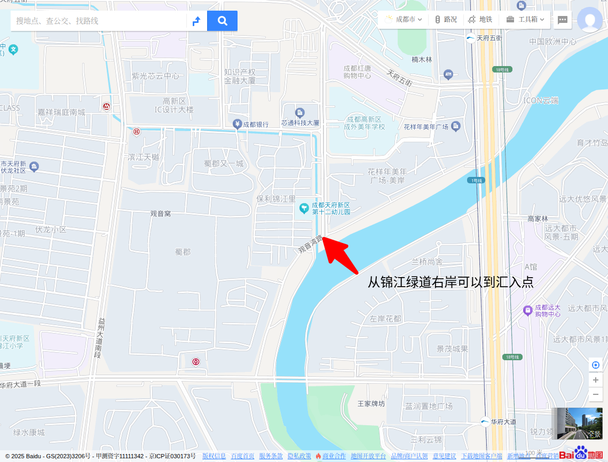
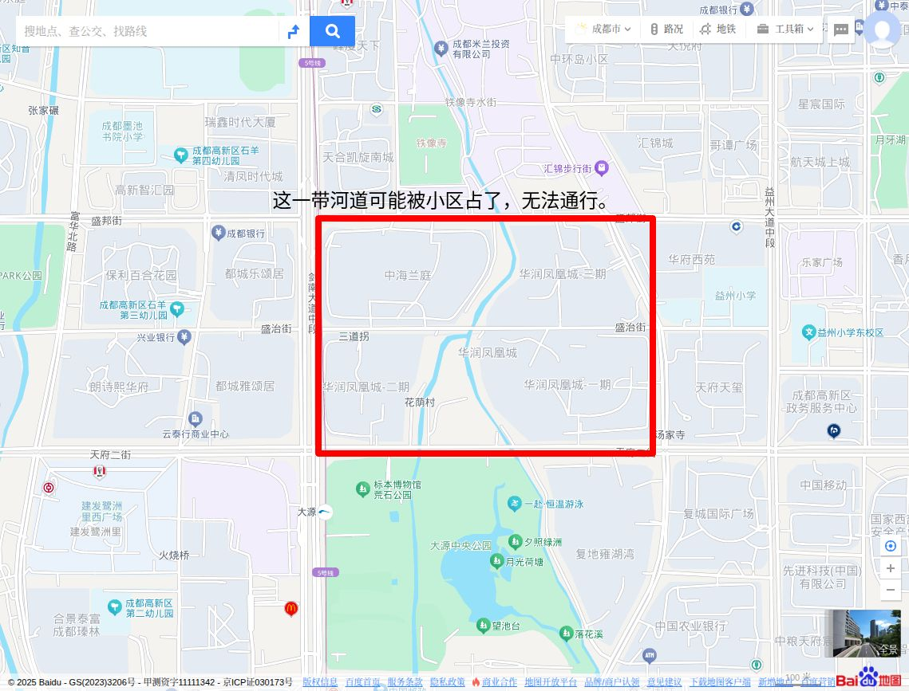
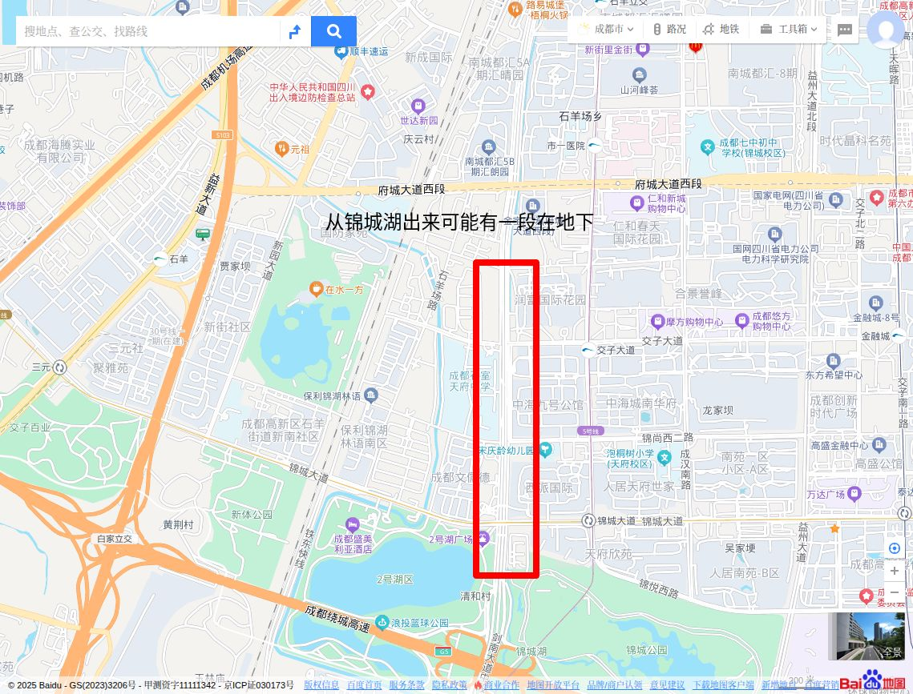
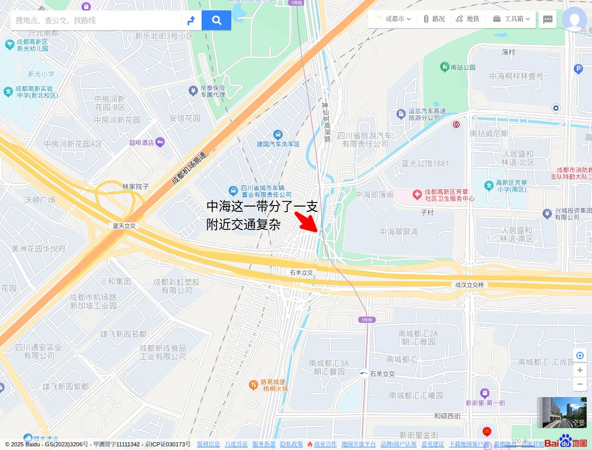
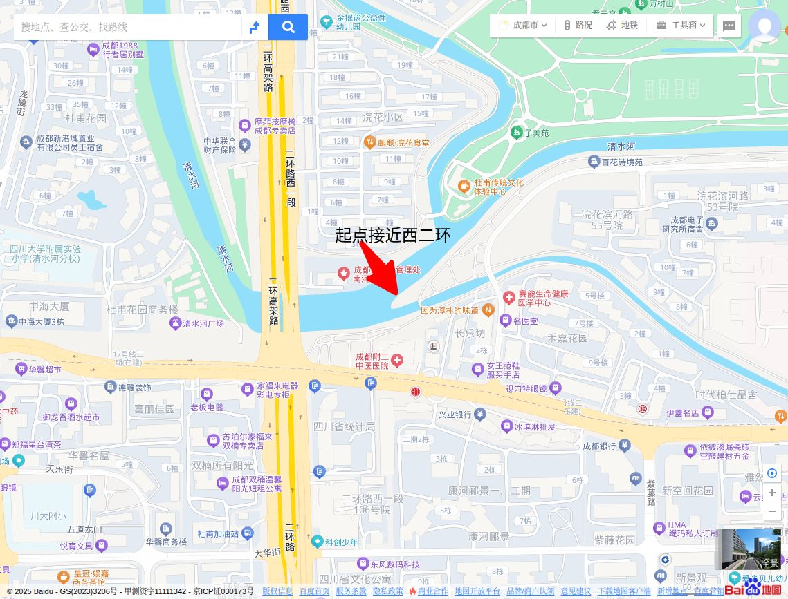
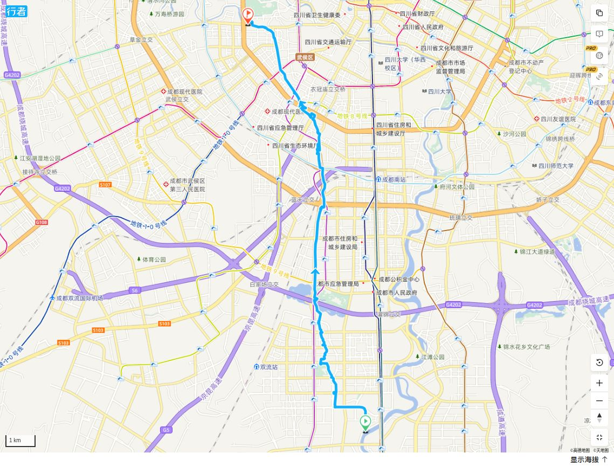
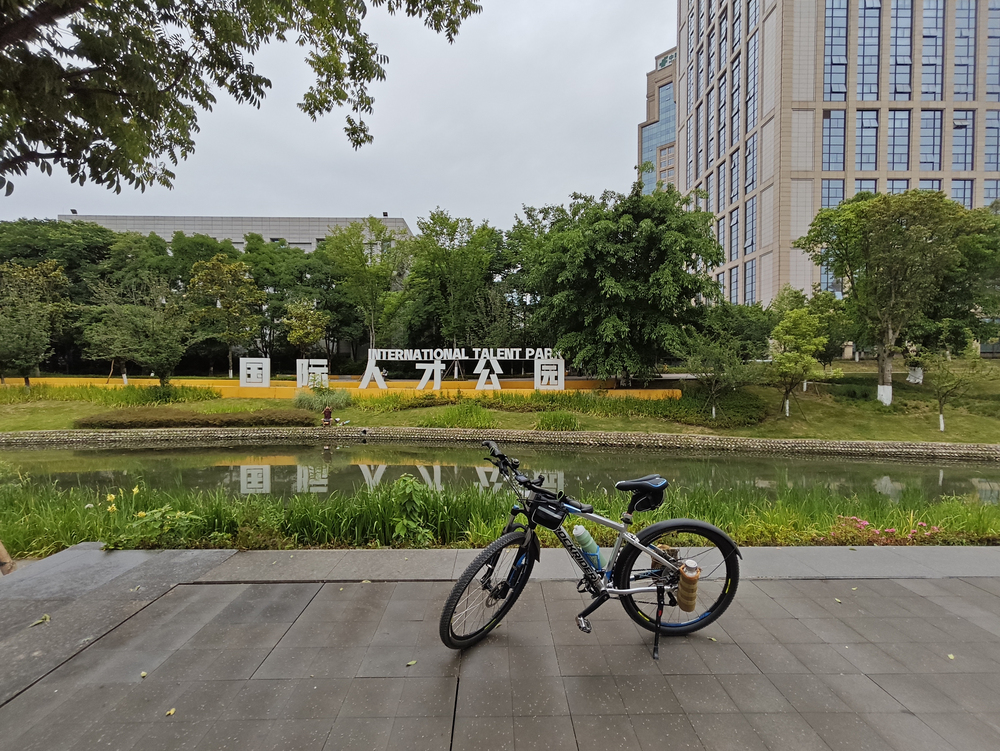
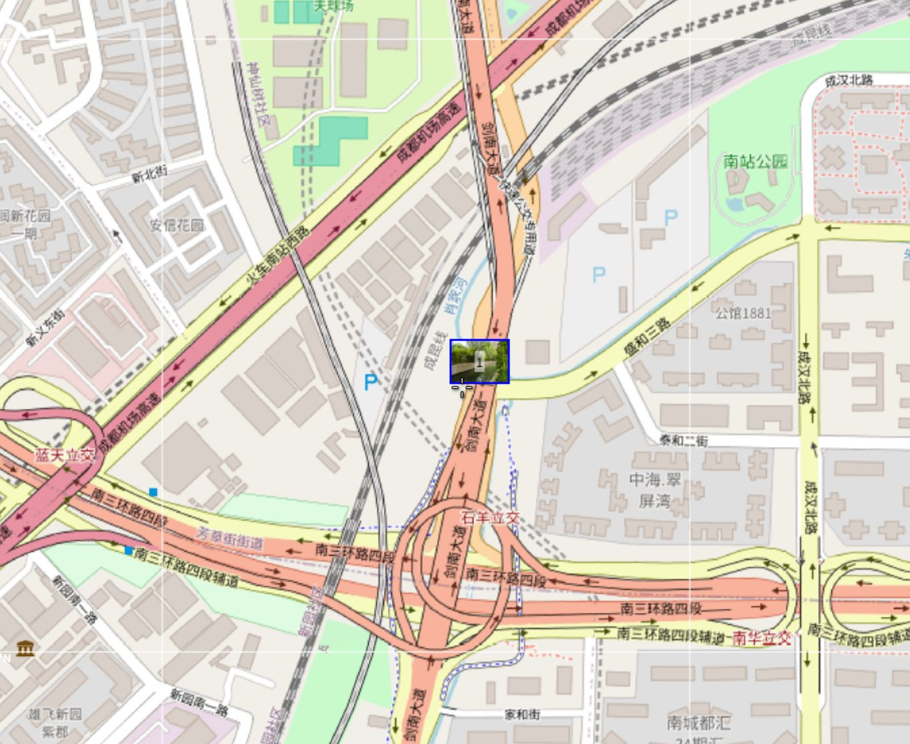

肖家河，清水河分流[浣花溪](https://baike.baidu.com/item/%E6%B5%A3%E8%8A%B1%E6%BA%AA/5743832?fromModule=lemma_inlink)前150米处分流，东去主流，仍称清水河，南下支流，流入清朝以来的肖氏家族地界，故称“肖家河”。《肖家河街道志》记载：“肖家河北起[都江堰](https://baike.baidu.com/item/%E9%83%BD%E6%B1%9F%E5%A0%B0/122963?fromModule=lemma_inlink)灌溉区水体清水河，属长江上游[岷江](https://baike.baidu.com/item/%E5%B2%B7%E6%B1%9F/883255?fromModule=lemma_inlink)支流[锦江](https://baike.baidu.com/item/%E9%94%A6%E6%B1%9F/12504987?fromModule=lemma_inlink)水系。”是[成都](https://baike.baidu.com/item/%E6%88%90%E9%83%BD/128473?fromModule=lemma_inlink)城市干流的重要组成部分。

## 地图作业

全长大约16公里。

快到天府大道的时候注意这个汇入口。

## 2025年5月23日骑行

从肖家河的终点，即汇入锦江的天府大道附近，骑行到起点，即肖家河分清水河分出的西二环附近，骑行距离约19公里。

肖家河汇入锦江处。宽不过三五米。

在汇入锦江前，肖家河的右岸被小区住宅区占了，无法进入，左岸看着有条小路，但估计后面的市政道路变化，也废弃了。这一段一直到天府五街，没有找到沿河的路，也许是被小区占了，或者就是直接在地下了。

穿过天府五街后，就可以看到河了。河水看起来确实象是流入了一个地下的渠道。

过了天府五街就是文化方洲公园。中午有不少人在散步。

继续向上游穿过天府四街，来到国际人才公园。不知道和国际人才有什么关系。

公园打理得很漂亮，现在正是蓝花楹开放的季节。

前面看着象是拉德方斯？

穿过天府三街就到了大源中央公园。以前逛过这个公园，但不知道肖家河是穿园而过的。

这一段是自然河岸。整条河渠化的比较多。

穿天府二街要多绕点路，过一个天桥。天桥下来之后，能看到一条水渠。地图上看叫艾家河，不远处就汇入了肖家河。

这一带有个凤凰艺术馆，没有进去看，但周围环境舒适。看地图这一带是华润凤凰城，华府西苑，记得快十年前应该是看过那边的房子。很可惜没有先那边，现在应该是成都升值最多的楼盘之一。

穿过华润凤凰城，中海兰庭就到了铁像寺水街。这地方去了多次，但今天才知道，边上的小河就是肖家河。

铁像寺边上的一个门，从没有见其开放过。

水街这一带河岸打理得很漂亮。只是这河水几乎没有流动。

著名的陈锦茶铺。它家的雅间外面的小河就是肖家河。

还有在左岸的星巴克。三角梅盛开中。

这是在天府一街上往下游看肖家河。去过几次的那家米兰咖啡不知道还在不在。

穿过盛兴街后，差不多进入环城绿道和锦城湖的地界了。绿道修得还比较新。

右边是锦城湖，左边就是肖家河。从这个绕城收费站开始，肖家河基本沿着剑南大道了。

这个寺庙相信很多人都见到过，金顶辉煌，但从来没有开放过。好象叫慈恩寺？感觉有一段肖家河进入到了院墙之内了。

剑南大道边的肖家河完全就是一条小水沟了。只有左岸可以沿河骑行，右岸是机动车道。

南三环这一还确实交通复杂，过了一座天桥跨了三环。

盛和三路这里分了一条渠看火车南站方向流去了。

一直到中海名城边上，才有机会重新见到河边上的公园。

又一家河边的星巴克。

南二环附近的河边。右岸被小区占了。多少有点象我的老房子。

二环边上的河边基本上都渠化了。

过了南二环，可以看到祟德园，一个著名的河边喝茶地。据说名气已经超过人民公园了。成都没有一条河能逃过河边茶铺，哪怕小到肖家河。这一带边上多是老旧的居民楼，第一层多为底商，所以形成了喝茶聚集地。新的小区不会有这情况了。

这张图片不足以展示河边喝茶的盛况，还是必须到亲自去一趟。沿河并不欢迎自行车，我基本上是推过这一段的，口子上还抬了车的。

著名的西川中学也在肖家河边。这里离河口已经不远了。这一带的格局大致都是右岸被各种单位，小区占了，不能行人，或者道路不通。左岸是肖家河沿街和广福桥北路。

市中心没有公园了，但一些街区还是设法搞了一些文创的东西。

左边是肖家河的闸口。左边是清水河，向前方流去成为南河，最后和府河在合江亭汇合成锦江。