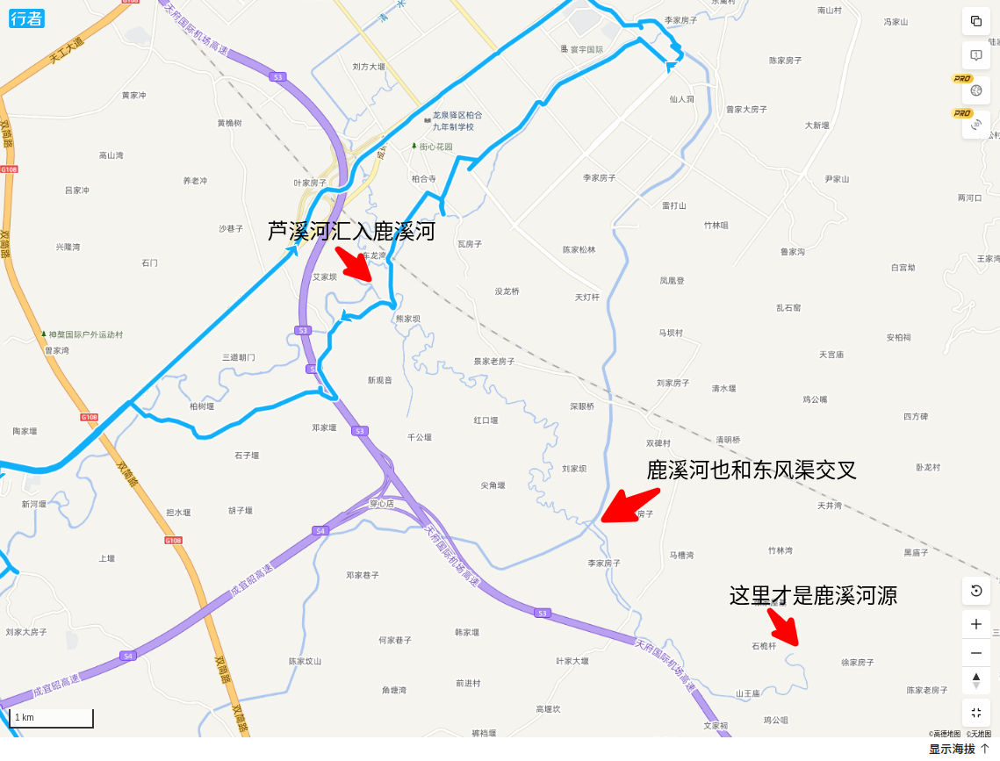
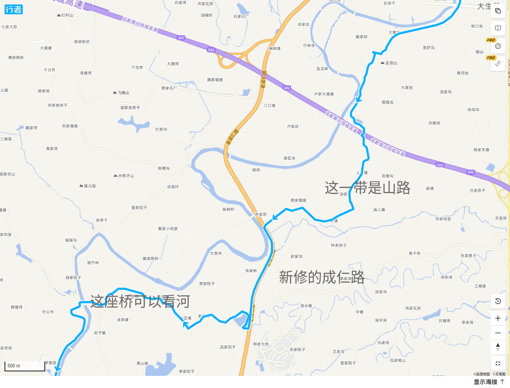

# 鹿溪河

鹿溪河位于成都天府新区，起源于哪里不太清楚，但最终在黄龙溪流入了锦江。我已经多次在黄龙溪的码头看到这条河，有一次还坐游船在河里游览了半个多小时。

2025年春天，我骑行了天府新区绿道。其中有很大一部分就是沿着鹿溪河的。绿道修得很好，有的地方还保持了原生的水岸，但也有很多地方是没有树荫的路面。

2025年4月，我从天府新区开始顺河而下，一直骑行到黄龙溪。

## 宝狮湖至东风渠

百度上说鹿溪河起源于龙泉的王家湾，又说是府河的支流，没有详细说明。但从地图上看，从宝狮湖确实有一条叫芦溪河的小河，和东风渠道相交叉。这点有点奇怪。交叉之后没有汇流到一起。

实地骑行后发现，其实这是东风渠的一个渡構。

## 芦溪河

从地图上看，我一直以为芦溪河就是鹿溪河，直到认真研究地图才发现并不是。这两条河可能发源于龙泉山不同的地方。

这就是站在东风渠上，向芦溪河上游方向看。很小很小的一条溪水，几乎不流动，好象已经断流。如何穿过东风渠的，我没有下去看了，估计就是个洞吧。

## 芦溪河汇入鹿溪河

没有路，所以看不现两河汇入的情况。从地图上看鹿溪河也是和东风渠有交叉。源头可能就是东山上的某条小水沟。

这是首次经过鹿溪河时看到的河面。感觉人可以跳过去。边上有人种了玉米，可能是觉得这河水是涨不起来了。

## 麓山大道附近

这一带河流非常蜿蜒，不太象有沿河道路的样子。跨过双简路的时候，离五环最近，可以实地去查看一下。

实际骑行的结果如下：

这一带的景象基本上差不多，但越到下游，水量似乎也大了起来。

右岸有一段非常接近五环。

水还是比较清的，也比较原生态。周围不太可能有骑行或者人行道路。

河面宽了起来。

有一小段土路可以沿河骑行。看起来是准备硬化后，带动边上的草莓采摘吧。

不知道是家养的还是野的，应该是家养的可能性较大。现在不能大规模养这种家禽了。

走右岸可以过机场高速。然后转到左岸，也并不沿河。

可能需要从东分路再到右岸，然后过铁路线和蓉遵高速。过了之后，就和天府新区的绿道连起来了。

## 兴隆湖段

这一段骑行这多次了，大约6公里，两这都是绿道，也是天新新区绿道的一部分。

绿道的上游起点。

向下游看去，左边的闸门应该是通往兴隆湖的，右边是鹿溪河继续向黄龙溪流去。

从这里就和上次骑行的路线连接起来了。

## 天府新区段

从天府公园出来，向下游骑行3公里左右，绿道就结束了。

沿着五里路一直骑行到科学城南路，这一段都是新修的大路，但周围非常荒凉，有几处楼盘，看起来象是烂尾了。这条路倒是一直沿着河，但从路上看不到河，有很大一部分河岸是围起来的，估计在修，或者也烂尾了。目前来看这一段骑起来没什么意思。

## 科学城南路至籍红大桥

这段路从地图上看没有河边路，也无法接近河边。走了一段新修的成仁路，做为一条国道，对机动车友好，但是对自行车来说不友好，留的路肩很窄，而且没有树荫。

## 籍红大桥至黄龙溪

这一段基本上是沿河骑行，但见河的地段也不多。会经过一个大佛寺。