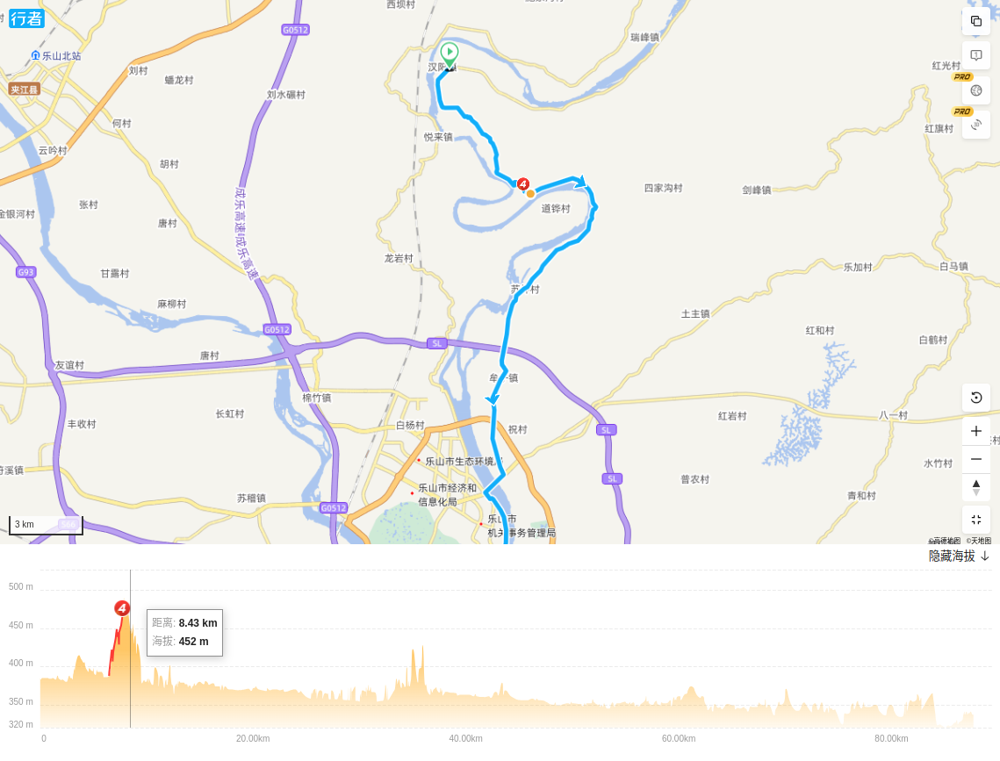
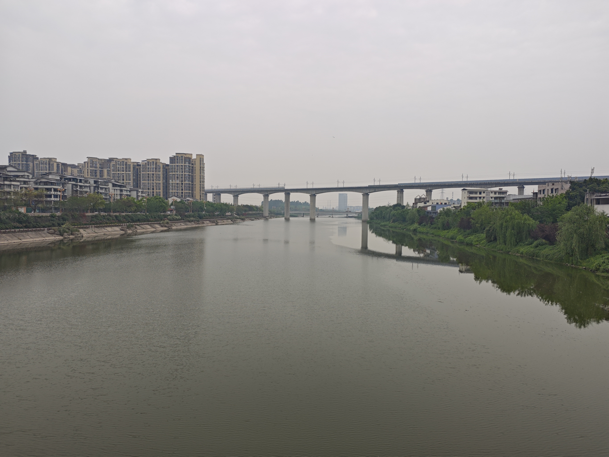
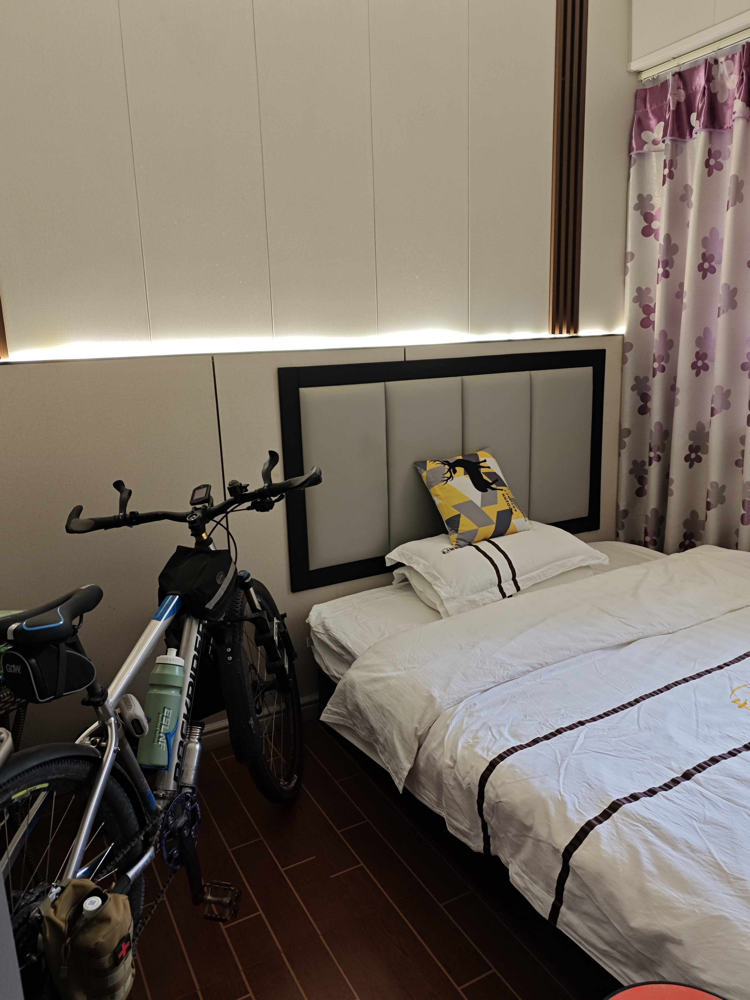
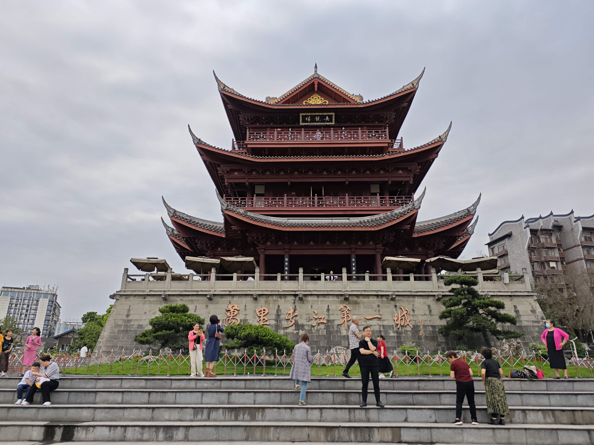

# 骑行岷江

2025年4月22日，终于完成了岷江的骑行。

更准确地说是完成了从江口镇到宜宾合江门这一段的骑行。

我把岷江分成三段。第一段从源头到都江堰宝瓶口，第二段从都江堰宝瓶口到江口镇，第三段从江口镇到宜宾合江门。第一段我曾经沿江坐车走过，山路非常危险，不适合骑行。第二段我曾经骑行过，这一段100多公里，其中一部分叫金马河。最后一段就是2025年骑行的。花了三天时间。总里程数大约325公里。除去锦江的40公里，纯岷江段为285公里。

总体而言，骑行岷江是一个非常不错的选择。如果路线选择得当，没有特别难的路段，沿路风景也还不错。主要的看点就是感受江景，见证岷江可能正在发生的重大变化。那就是岷江这一段正在修建多处航电枢纽，预计在不远的将来，具体是多少年不好说，至少五年吧，岷江可能实现通航。

## 从江口镇到眉山（约26公里）

这一段路正确的选择是应该全部在右岸骑行，我这次错误地选择了左岸。结果遇到了大坡和烂路。

这一段的起点是江口镇，锦江和岷江的交点。一个著名的地标就是江口沉银博物馆。修了好多年了，感觉是要永远修下去了。江边上的吊脚楼已经封闭的差不多了，但都还没有拆除。所以感觉会很久以后才能参观。

博物馆主体建筑好象已经完成了，但配套的路和水下文物的发掘可能没那么快。我是希望它能早点开。查了下进展，说是2025年6月就能开展试运行。江口沉银遗址累计出水文物达7.6万余件。2021年，江口明末战场遗址与广汉三星堆遗址、成都金沙遗址一同入选“百年百大考古发现”。

明末战场遗址的介绍很有意思。谁能想到大约就300多年前，这地方还能进行大型的水上战争。而且不止这里，上游也能行船。现在，是不可能会有船只在这的。

从江口出来，新修的岷江大桥可以从江口到彭山市区。边上的绿道也是新修的，我记得以前这里是卖飘汤的一排餐馆。这么好的绿道，我决定在左岸骑行。但这是个错误的决定。这几年的话，还是要老老实实过河骑右岸。

在四川看到‘海事码头’这个词，还是觉得有点新鲜的。这应该就是岷江自紫坪铺大坝以下，第一个大坝了。查了下是叫尖子山航电枢纽。从远处看这个工程接近完工了，预计今年能发电。从这往下有一系列类似的工程，都是叫航电枢纽，介绍中都强调是以航运为主，兼顾发电、防洪等。但可以肯定的是，发电都会是最快实现的上档。我感觉现在水已经拦起来了，随时可以发电。

我骑到工程的门口时，才发现路断了。工程区的门是开着的，也没有看守，我犹豫了好一阵子要不要从坝顶上穿到右岸去。但还是觉得过于冒险放弃了这想法。愤愤不平地掉头找路。

回头了1公里，找到了小路，绕过了工地，终于还是上了左岸的沿江路。但这条路维护很差，怀疑是不是以后要被放弃了。

左岸没什么沿江的路段，都是在小山区里骑行，中午时分特别炎热，温度已经达到了38度。我在一个简陋的小店买了瓶尖叫，然后休息了好一阵子。

一群老头在这个阴凉通风的地方打牌九，用豆子和小木棍做筹码。这里的老头喜欢抽自制的一种烟叶，气味非常冲。这里离和成都很近，但方言已经很不一样了。老板娘问我几句话我都要靠猜才知道。

我从左岸有点遗憾的看着右岸的城区。江水水面很宽，而且几乎看不出流动。这也不出乎意料。可以想象下游肯定还有水坝拦着的。

可能是因为主要在左岸施工的原因，这种烂路还是不少的。不过，我这台带点减震的山地车能够很好地适应这种地形，完全没有压力。

在推过了一座极变态的小山之后，终于能够过上桥过江了。对面是轻松的沿江大道，左岸是各种小山坡和烂路。

从桥上看左岸好象是在修沿江的路，但看这个样子，对进度不要有什么指望。还是要坚定地骑右岸。

## 眉山到青神（约38公里）

这一段路转到了右岸，有8公里沿江路，剩下的是看不到江的公路。路况都比较好。

如果我上一段也走的右岸，就是这样的绿道。维护地很好，有大树可防晒。

眉山绿道上有很多这种的卫生间。我甚至觉得是不是过多了。条件和设施都很好，比如还有扫码出纸的机器。但由于今天太过炎热，我一次厕所都没有上。在这里也只是洗了个脸。

绿道上方还有修建很好的防洪设施。估计离地面20来米，以这样的高度，应该就永远不会被淹了吧？这个堤坝顶上很宽，可以开货车，骑行也不是问题。但这种天气疯子才会在这上面骑。

市区不远可以看到汤坝航电的标志，但有围档挡住，不象是已经完工的样子。我在网上的资料最早在2012年就有建设的消息了。有些说是2017年开始建设的，到目前显然没有完工，但蓄水肯定是无成了的，也许已经发电了。

汤坝工地的边上就是这种很漂亮的江景房。所以我估计这里应该是已经蓄水了，有很漂亮的湖景可以看。这个超级豪华的阳台确实让人有点向往啊。不知道房价多少，要知道这里是通高铁的。

从汤坝再往下游就没有沿江路了。转上了G245,一直到青神。这条国道的资料也很少。看起来很新，边上的人行道至少有两米，对于骑车来说很友好。不过，在这烈日下，骑行很少有遮阳的国道也算是件很boring的事。

接近青神的时候，我找了小路尽量骑到了江边，这里好象是在修一座桥。具体是什么，我不太清楚。但感觉不象是航电枢纽工程。

这一段江景很美。江水几乎不流动象一个湖，这种情况会出现多次。不过，这一带有多个工地，无法顺畅骑行，近期还是走国道吧。

这样的工地很多，无法通过。远处就是青神县城了。

## 青神到汉阳（约20公里）

这一段从青神过江，全程沿青关路在左岸骑行。路比较平，而且见江的路段也挺多的，风景不错。

很漂亮的表关路，可以看到静静的江水。江边的树木繁盛，可以遮阳。竹林比较多。

又一个航电枢纽工程，这个就象是完工的。每一个工程可能都不一样，比如上一个汤坝航电枢纽，好象就不能开放公众过江。具体情况不太清楚。在它下游还有个汉阳航电，根据资料那是确实完工的，但我没有经过它。

青关路中间的划线是表示绿道的彩色线。这条路确实很不错，值得骑行。

青关路必经中岩寺。我没有进去逛，但看到游客不少。这是个全国重点文物保护单位。

中岩寺江边的水面很宽，风景宜人。这就是所谓前有照后有靠，确实是个风水宝地。

路也很好，速度可以骑上去，不过那时我已经骑了110多公里，喝了八瓶水，感觉很累。

终于在太阳下山之前，到了汉阳古镇。

这可以说是个很萧条的古镇，如果你在成都说古镇，会想到的是人山人海。这里，会说连个鬼影子都没有。

这是我第一天骑了127公里后的晚餐。很累，累到没什么食欲了。但是在喝下第一大口啤酒时，还是发出了幸福的呻吟。今天整得太猛了，而天气又太炎热了。小餐馆里还有另外两个骑车的，一男一女，那男的和我一样也是神情萎靡，前面放着一瓶啤酒。后来听他们说还要骑回眉山，我对他们说要小心点，因为还有至少50公里路，肯定是要夜骑了。

晚上就是镇上找了个住宿，100块不肯少。条件一般，蚊子巨多。但因为实在太累不想去找了。店老板说向上游两公里的河边有些风景可看。我想了想还是算了。结果就错过了已经建好的汉阳航电枢纽，以及它所拦成的汉阳湖。

## 汉阳镇至乐山市（约30公里）

从这开始第2天的骑行。

这一段在左岸骑行，只有一小段很漂亮的江景路，其它都是城镇路。除了三峡村附近有个大坡外，一路都很平坦。因为前一天太累了，所以今天计划慢一天。

早上大约7点半，二两炸酱面，然后开始骑行。

继续沿着青关路骑行，一路风景还好。见河几率不高。看见江的地方都还比较原始。这一带已经算是平羌小三峡了。但显然不那么名副其实。

乐山古称嘉州。进入乐山后，踣况要稍好一点。

在最高处俯看岷江，有壮阔的感觉。这一带非常宽广，可能是个露营的好地方。

乐山市区岷江两岸好象都有绿道。

我在右岸的绿道骑行了一段。这里的树林长得很茂盛，是市民休闲的好去处，但铺的地砖并不适合骑行。

这种红色的护栏，好象是乐山的品牌色。据说和岷江的沙子颜色很像。

岷江和大渡河汇合。大渡河向上一点又是大渡河和青衣江汇合。新的岷江向下游奔流。有种说法是大渡河汇入的水量占岷江的8成了。

远处可以看到乐山大佛。目前正在维修步道。乐山大佛在这保佑人们不被洪水侵拢。上一次乐山大佛洗脚是2020年8月18号，这是百年一遇的事件。

## 乐山市区至五通桥（23公里）

这一段在左岸骑行，一路很平，但全无江景。可能的原因是在进行建设航电枢纽。这一段应该有个叫老木孔航电枢纽，但我没有看到。

这一路沿江的一面几乎都被打围了。里头的施工情况大概这样子。看来不会很快完工的。

五通桥城区倒是非常干净整洁。河水也平静。沿江都修有绿道，但好象并不鼓励人们在下面骑行，我只看到楼梯下去。

乐山必吃的跷脚牛肉。牛肉、血旺、白菜、米饭加泡菜，还有汤，大约30块。两分钟上齐。比吃一个汉堡套餐更合算些。

五通桥河边的大树，非常茂盛。

河里的浮桥曾经被冲走过，这应该是重新修建的。

## 五通桥区至犍为县（约30公里）

这一段仍然在左岸骑行。地势平缓，骑行没有难度。

这一带的水面非常宽广，象大海一样。附近应该有个东风岩航电枢纽，但我好象没有看到工地，查了资料说2022年时还在前期准备中。也许还早。

再往下游就是犍为航电枢纽了。这是岷江上第二个已经建好的航电枢纽。可以很看水闸和边上的一些设施。但我很怀疑是否真的能使用水电梯实现通航了。

从下游看，确实可以看到过闸门的航道，不过，要通航肯定得全线都具备条件才行，至少到这个点位具备条件才行。看这条件有点悬。

犍为县城在右岸。过了这座桥，然后可以下到堤坝上去。

河堤修得很好。

在河边上还有个抗洪纪念馆，是为了纪念2020年8月18日大洪水。但这个地方大门紧闭，也没法观。

犍为市区内还有个全国重点文物保护单位，文庙。由于有点下雨，所以没有去参观了。

在街边上找了一个可以推车进入的小店。70元。准备明天一早出发。今天一天没有被暴晒，但明天预报不乐观，所以早睡早起早出发。

晚餐又是翘脚牛肉，29元。还买了四个香蕉。骑行过程中，还是要随时带点补充体力的东西。

## 犍为县城至新民镇（约30公里）

从右岸转到左岸骑行。路线比较平缓，中间会经过一个隧道。

我大约6点半左右出发，没有吃饭，只吃了一根香蕉就出发了。出城没多久就经过了一个长隧道。

这一带虽然不是常沿江边走，但路上的风景还可以的。一路有很多竹林。

偶尔透过竹林还可以看到岷江。

这个东西点点象是过闸设施。下游就是龙溪口航电枢纽。目前已经在蓄水了，也许已经发电了，但航运设施的进度好象还很久远。

看起来龙溪口航电枢纽已经基本建成了，外墙可能还在施工。水位已经很高，发电应该没问题了。

也许左岸是下行的，右岸是上行的？看不懂。

一直骑到了新民镇，才找到吃早饭的地方。10个包子一杯豆浆共12元。感觉这个镇主要是为修龙溪口航电枢纽服务的。

## 新民镇至屏山县（约45公里）

从新民到泥溪大桥骑左岸。经小路上泥溪大桥转到右岸。然后一直沿省道骑行到屏山。道路开始变成起伏路，经常上50米又下50米，比较累人了。

从龙溪口往下，有种说法是没有航电枢纽了。而是要疏通河道来实行通航。确实看到了一些航标灯。

犍为经济开发区看起来有很多企业在动工。可能这里会是一个重要的物流节点？下面的挡水坝是新修的。

这个设施是不是意味着目前是通航了？我在路上问了个老头，他说这一段确实是可以通行几百吨的小船。岷江上终于可以看到船了吗？

这是我遇到的唯一一个还在运营的渡口。

进入宜宾后似乎很容易见到宗祠。虽然看来比较简朴。

我门口的几个大哥聊天，才知道泥溪渡口已经停了一年了。这应该是一个比较大的渡口，还有汽车渡。边上还有职工之家。但现在已经废弃。幸亏和他们攀谈了几句，他们告诉我应该要转到右岸去更好走些，左岸的很难走的大坡，自行车几乎不可行。

我倒回去一点，找了点小路上了桥。这是一条非正式的上桥道路，我感觉这桥是新建成没多久，车子不多。

在泥溪大桥上，我终于见到了岷江上第一只船。也是唯一见到过的船只。看起来确实是小船。向上游航行时是空船。

从泥溪大桥看下去，江边上的土地都是正在开发使用的状态。这也似乎说明，至少在短期内，下游不太可能会筑坝拦水。
我看的资料显示，岷江在宜宾段内还是规划了古柏和喜捷两座航电枢纽的，也许经过多方考虑，还是采取疏通更好？

转到右岸后，一路都是沿着省道215骑行的。这条省道修得非常新，双向四车道，非机动车道也很宽。虽然有的路段很靠近岷江，但由于是靠右骑行，所以很难看到左边的河流了。总得来说，在烈日下骑行这条路是比较乏味的。但要离开主路去找沿江的小路，从地图上看又不太现实。

在快到屏山时，看到了正在施工的桥梁。平时还很少看到这种景观。

到屏山时，早上的包子已经完全消化了，路上还吃了根香蕉。在屏山路边的小馆子吃了个回锅肉饭，15元。开店的小两口对于能骑车出去玩很向往。

屏山县的江景漂亮地让人有点惊讶。屏山以前是贫困县，高考都要加分的。

宜宾的特色小吃凉糕，特别适合在这种酷热的天气中吃上一份。冰冰凉，又有蜂蜜，补充能量。

屏上沿江修了绿道，虽然不太长，但弄得还是很漂亮的。

## 屏山至合江门（约40公里）

这一段一直在右岸骑行。沿省道骑行，虽然也是起伏路，但起伏较小。如果是离开省道下到江边找路，那起伏会太很多。

出屏山县城，感觉是进入了一个新的开发区。道路很好也比较平。虽然道路沿江，但高出江面很多，在路右边骑行基本见不到江。

这里已经很有大城市的气质了。

一般人大概不会理解为什么这里会有村子叫红楼梦村。答案可能是这里是红楼梦酒厂所在地。

红楼梦村一带我从省道下来找沿江路骑行了，起伏要多很多。但多少能看到一点岷江。

这里的街道沿江，很有一点气质，但家家户户都关着的，看起来象是在拆迁？后来我查地图，这里大概是靠近喜捷，也许真的还要修航电枢纽？
远处的桥是高铁桥。

对面的公园可以说是大手笔了。我盲猜是五粮液。结果不意外，这里就是五粮液酒厂。

到这里，基本是进入市区了。大城市的感觉起来了。对面好象也修了不错的绿道。

这里的堤岸修得叫做豪横无边。我已经数不清有多少层了。有停车场地、有绿道、有步道、还有近水平台。最上面还有公路。

晚上，这里应该有很多网红在这灯光下活动。

不知道这算不算岷江的官方终点。

这就是合江门了。左边是岷江，右边是金沙江。两江汇合成前面的长江。长江从这开始。

万里长江第一城这个说法是否合适不好说，但从宜宾此地开始，江从此叫长江了。如果我要骑行长江，这里就是起点。

从合江门骑行5公里左右，就可以到达翠屏站。在这里可以把自行车寄回成都。后来我才知道，宜宾没有直接到成都的货运火车，我的自行车从昭通、贵阳、达州中转后才回到了成都。花了三四天时间。我自己在宜宾西坐高铁只花了1个半小时，就到家了。