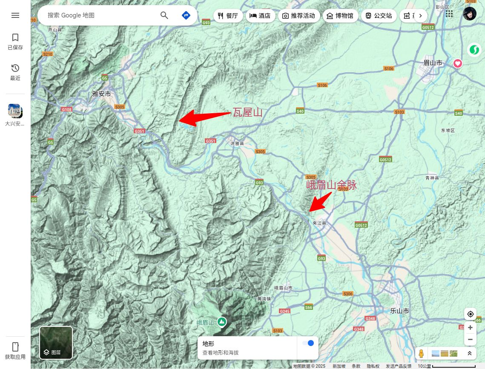
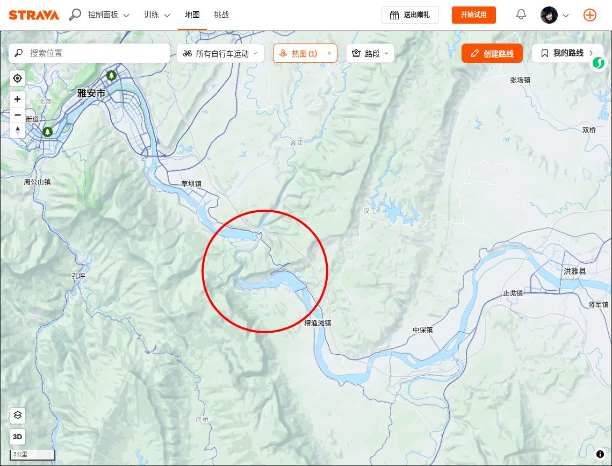
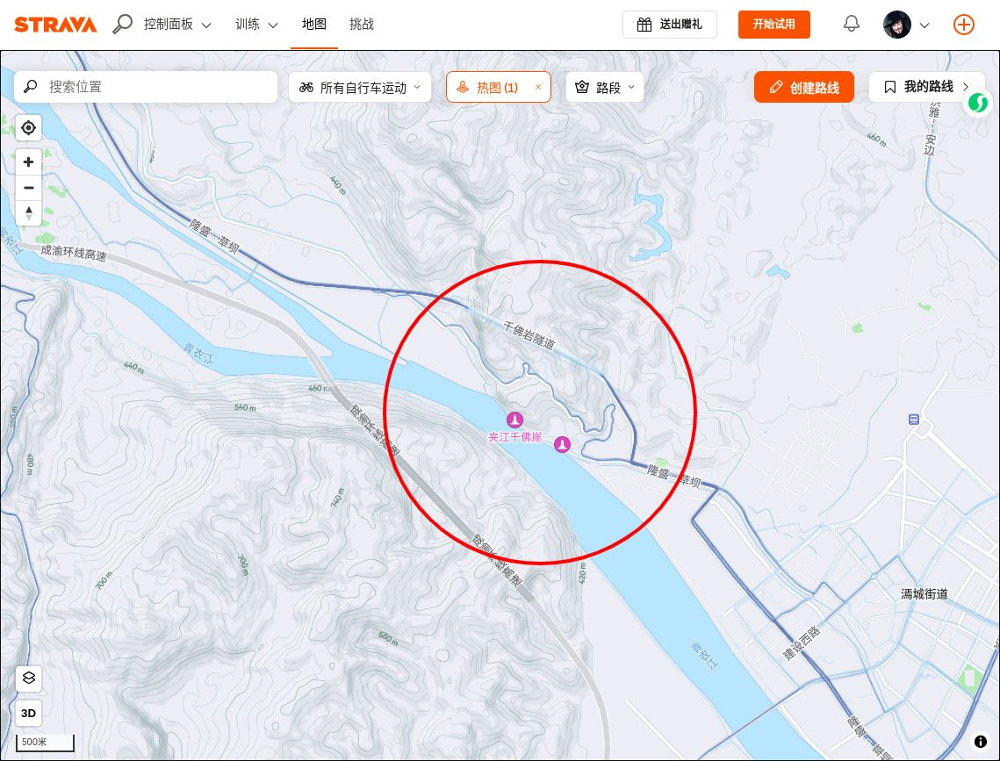

**青衣江**古称**平羌江**、**雅水**，是[中国](https://zh.wikipedia.org/wiki/%E4%B8%AD%E5%8D%8E%E4%BA%BA%E6%B0%91%E5%85%B1%E5%92%8C%E5%9B%BD "中华人民共和国")[四川省](https://zh.wikipedia.org/wiki/%E5%9B%9B%E5%B7%9D%E7%9C%81 "四川省")的[长江](https://zh.wikipedia.org/wiki/%E9%95%BF%E6%B1%9F "长江")流域上游内的一条河流，干流全长289千米，为[大渡河](https://zh.wikipedia.org/wiki/%E5%A4%A7%E6%B8%A1%E6%B2%B3 "大渡河")的最大的支流。青衣江主源发源于[邛崃山脉](https://zh.wikipedia.org/wiki/%E9%82%9B%E5%B4%83%E5%B1%B1%E8%84%89 "邛崃山脉")巴朗山与夹金山之间的蜀西营，干流自北向南流经[雅安市](https://zh.wikipedia.org/wiki/%E9%9B%85%E5%AE%89%E5%B8%82 "雅安市")，在[乐山市](https://zh.wikipedia.org/wiki/%E4%B9%90%E5%B1%B1%E5%B8%82 "乐山市")汇入[大渡河](https://zh.wikipedia.org/wiki/%E5%A4%A7%E6%B8%A1%E6%B2%B3 "大渡河")，并与[岷江](https://zh.wikipedia.org/wiki/%E5%B2%B7%E6%B1%9F "岷江")在乐山市中区形成三江汇流的自然景观。青衣江通航能力差，因地势起伏大水力资源较为丰富，流域内建设有三座[水电站](https://zh.wikipedia.org/wiki/%E6%B0%B4%E7%94%B5%E7%AB%99 "水电站")。李白曾有诗句形容“峨眉山月半轮秋，影入平羌江水流”。

## 流域概况

### 地理

青衣江主源为宝兴河，发源于[邛崃山脉](https://zh.wikipedia.org/wiki/%E9%82%9B%E5%B4%83%E5%B1%B1%E8%84%89 "邛崃山脉")[巴朗山](https://zh.wikipedia.org/w/index.php?title=%E5%B7%B4%E6%9C%97%E5%B1%B1&action=edit&redlink=1 "巴朗山（页面不存在）")与[夹金山](https://zh.wikipedia.org/w/index.php?title=%E5%A4%B9%E9%87%91%E5%B1%B1&action=edit&redlink=1 "夹金山（页面不存在）")之间的蜀西营（海拔高程4930m）。其源又分东河和西河，并以东河为主流，两河流交汇于[宝兴县](https://zh.wikipedia.org/wiki/%E5%AE%9D%E5%85%B4%E5%8E%BF "宝兴县")北，流经[飞仙关](https://zh.wikipedia.org/w/index.php?title=%E9%A3%9E%E4%BB%99%E5%85%B3&action=edit&redlink=1 "飞仙关（页面不存在）")处与支流[天全河](https://zh.wikipedia.org/wiki/%E5%A4%A9%E5%85%A8%E6%B2%B3 "天全河")、[荥经河](https://zh.wikipedia.org/wiki/%E8%8D%A5%E7%BB%8F%E6%B2%B3 "荥经河")汇合后，始称青衣江。经[雅安](https://zh.wikipedia.org/wiki/%E9%9B%85%E5%AE%89 "雅安")、[洪雅](https://zh.wikipedia.org/wiki/%E6%B4%AA%E9%9B%85 "洪雅")、夹江于[乐山](https://zh.wikipedia.org/wiki/%E4%B9%90%E5%B1%B1 "乐山")草鞋渡处汇入[大渡河](https://zh.wikipedia.org/wiki/%E5%A4%A7%E6%B8%A1%E6%B2%B3 "大渡河")。青衣江在飞仙关以上为上游，河长147公里，控制集雨面积8750平方公里，飞仙关以下为中下游，河长142公里，区间集雨面积4147平方公里。总计干流长289公里，落差2844米，流域面积12897平方公里。

青衣江流域地形大致以[炳灵](https://zh.wikipedia.org/w/index.php?title=%E7%82%B3%E7%81%B5&action=edit&redlink=1 "炳灵（页面不存在）")、[荥经](https://zh.wikipedia.org/wiki/%E8%8D%A5%E7%BB%8F "荥经")、[天全](https://zh.wikipedia.org/wiki/%E5%A4%A9%E5%85%A8 "天全")、[灵关](https://zh.wikipedia.org/w/index.php?title=%E7%81%B5%E5%85%B3&action=edit&redlink=1 "灵关（页面不存在）")、[大川](https://zh.wikipedia.org/w/index.php?title=%E5%A4%A7%E5%B7%9D&action=edit&redlink=1 "大川（页面不存在）")一线为界，分东西两大片。东面属低山丘陵区，地势平缓，海拔高程约600—1100米，河谷呈“U” 型，有宽阔的漫滩和阶地，河道比降约1.8‰。出露地层多属[侏罗系](https://zh.wikipedia.org/wiki/%E4%BE%8F%E7%BD%97%E7%B3%BB "侏罗系")及[白垩系](https://zh.wikipedia.org/wiki/%E7%99%BD%E5%9E%A9%E7%B3%BB "白垩系")，地质构造较单一，以折皱变动为主，河床覆盖较浅，地震烈度Ⅵ一Ⅶ度。西面约占流域面积的60％，多为高山峡谷。人口稀疏，耕地较少，森林广布，覆盖良好，海拔高程一般在1000米以上，河谷多呈“V"型，漫滩阶地极少，河道比降大于8‰。区内出露地层多属古生界，地质构造复杂，折皱强烈，断裂发育，[地震烈度](https://zh.wikipedia.org/wiki/%E5%9C%B0%E9%9C%87%E7%83%88%E5%BA%A6 "地震烈度")为Ⅶ至Ⅷ度。

### 自然

青衣江流域属[亚热带湿润气候](https://zh.wikipedia.org/wiki/%E4%BA%9A%E7%83%AD%E5%B8%A6%E6%B9%BF%E6%B6%A6%E6%B0%94%E5%80%99 "亚热带湿润气候")区，受地理位置、地形制约和季风环流的影响，具有春早气温多变化，夏无酷热雨集中，秋多绵雨湿度大，冬无严寒霜雪少的特点，多年平均气温15～18℃。流域内大部分处于暴雨区，雨量丰沛，但地区变化较大，大致由西北向东南递增，北部[宝兴](https://zh.wikipedia.org/wiki/%E5%AE%9D%E5%85%B4 "宝兴")多年平均降雨量仅790毫米，而东部雅安1800毫米，荥经麓池竟达2400毫米以上，雨量多集中在7～9月，占全年60％左右，而春灌期的3～5月仅占17％。流域内径流与降雨基本一致，河口（海拔361.2米）多年平均径流量171亿立方米。洪水多出现在6月下旬~9月中旬，且具有峰高、量大的特点，历时3至5天。青衣江干流中、下游代表站径流特征值及最大、最枯流量如 河流泥沙主要来自多营坪以上的干支流。多营坪站年平均输沙量为923万吨，汛期（5~10月）沙量为909万吨，多年平均含沙量约0.783kg/m3。

青衣江水系水力资源十分丰富，干支流水能理论蕴藏量合计5824MW，技术可开发量3602.4MW，经济可开发量3118.2MW。目前，已建和正建中型电站4座，装机290MW。青衣江径流稳定，在干、支上游有建大型水库的条件，电站距离负荷中心也近，开发潜力巨大。

### 社会经济特点

青衣江流域涉及雅安、眉山、乐山三地（市），流域内总人口约135万人，其中农业人口占83％，耕地总面积约128.7万亩，国民生产总值51.8亿元，多集中在雅安、洪雅、夹江等地。区内有川藏、川滇公路穿过，成雅高速公路以及县级、乡级公路与之相连，交通方便。

矿产资源以花岗石、大理石最为丰富，其次为煤、铅锌矿等。自80年代以来流域内工业发展较快，初步形成了以雅安为中心，以电力、采矿、机械、化工、轻纺等行业为主体的工业体系。

## 水力开发计划

根据青衣江水资源开发条件和国民经济各部门的发展需要，开发任务为：

- 上游以发电为主，其次为灌溉、防洪。
- 中下游则以灌溉、防洪为主，兼顾发电和水源保护等。

### 上游

青衣江上游为山区河流，生产和生活用水量不大，目前在支流[玉溪河](https://zh.wikipedia.org/wiki/%E7%8E%89%E6%BA%AA%E6%B2%B3 "玉溪河")已建成玉溪河引水工程，灌溉[岷江](https://zh.wikipedia.org/wiki/%E5%B2%B7%E6%B1%9F "岷江")以西的86.64万亩耕地。干流从[宝兴县](https://zh.wikipedia.org/wiki/%E5%AE%9D%E5%85%B4%E5%8E%BF "宝兴县")硗碛至飞仙关三江口近97km河段内，天然落差1395m，平均比降14.4‰。硗碛乡河段地势较为开阔平坦，河床平均比降7‰，具备建大型龙头水库的地形地质条件，宝兴河干流规划为8级开发，从上至下依次为：穿洞子（45MW）、硗碛“龙头”水库电站（176MW）、民治（105MW）、宝兴（160MW）、小关子 （160MW）、灵关（54MW），铜头 （80MW已建）、灵关河（36MW），共利用落差1416m，总装机容量816MW，年发电43.3亿kW.h。

### 中下游

中、下游的开发目标是以长征渠引水工程为中心，以灌溉为主，兼顾防洪，结合城乡生活用水及发电。长征渠引水工程，取水枢纽位于洪雅罗坝场上游3km处的槽渔滩，控制流域面积1.08万km2，多年平均流量489m3／s，径流量154亿m3，取水高程516.4m，设计流量230m3／s，规划灌溉面积 1400万亩，其中[四川省](https://zh.wikipedia.org/wiki/%E5%9B%9B%E5%B7%9D%E7%9C%81 "四川省")1015.65万亩，[重庆市](https://zh.wikipedia.org/wiki/%E9%87%8D%E5%BA%86%E5%B8%82 "重庆市")384.35万亩 。

青衣江干流槽渔滩以下河段，开发的目标主要是沿江的工业和城乡生活用水、灌溉和防洪，兼有发电。在长征渠引水工程未实施以前，为充分利用水能资源，根据实际情况，采用低闸坝河床式和混合式开发兴建梯级电站，如水津关、龟都府、高凤山、洪州、城东等11级中型水电站和5座引水式小电站，合计装机 820.6MW，年发电量42.32亿kW.h。目前已建成雨城（60MW），槽鱼滩（75MW）、城东 （75MW）、高凤山（75MW）等，在建龟都府水电站（62MW）、水津关水电站等。

### 主要支流

#### 玉溪河

[玉溪河](https://zh.wikipedia.org/wiki/%E7%8E%89%E6%BA%AA%E6%B2%B3 "玉溪河")又称芦山河，流域面积1397km2，河长113km，落差3595m其开发任务是灌溉和发电。早在70年代兴建的玉溪河大型引水工程，渠首位于[芦山县](https://zh.wikipedia.org/wiki/%E8%8A%A6%E5%B1%B1%E5%8E%BF "芦山县")[宝胜乡](https://zh.wikipedia.org/w/index.php?title=%E5%AE%9D%E8%83%9C%E4%B9%A1&action=edit&redlink=1 "宝胜乡（页面不存在）")，跨流域灌溉[芦山](https://zh.wikipedia.org/wiki/%E8%8A%A6%E5%B1%B1 "芦山")、[邛崃](https://zh.wikipedia.org/wiki/%E9%82%9B%E5%B4%83%E5%B8%82 "邛崃市")、[蒲江](https://zh.wikipedia.org/wiki/%E8%92%B2%E6%B1%9F "蒲江")、[名山](https://zh.wikipedia.org/wiki/%E5%90%8D%E5%B1%B1 "名山")等县86.64万亩耕地，并利用渠道跌水已建成小水电站总装机30MW。玉溪河水力资源开发在金鸡峡以上拟 12级开发，共装机123.8MW，年发电量6.64亿kW.h。其中单站装机在10MW有马桑坪（10.1 MW），长石坝（10MW）、宝珠山（18.9MW）和金鸡峡水库电站（42MW）四座。金鸡峡水库总库容3.5亿m3，系玉溪河引水工程的规划的调节水库。

#### 周公河

[周公河](https://zh.wikipedia.org/wiki/%E5%91%A8%E5%85%AC%E6%B2%B3 "周公河")是青衣江右岸一级支流，流域面积1078km2，河长95km，落差1757m。炳灵以下至河口规划为7级开发，即瓦屋山（240MW）、葫芦坝 （26MW）、将军坡（18.9MW）、沙坪（40MW）、河坪（13MW）、大石板（13MW）和周公河（14MW），共装机364.9MW，年发电量 13.66亿kW.h。第一级瓦屋山水库电站（总库容5.62亿m3），已完成初步设计，建设条件优越，调节性能高，可承担四川电网的部分调峰调频任务。

## 路线情况

总体来说非常平，洪雅县附近的瓦屋山有些起伏，夹江县附近的是峨眉山余脉，基本没有大起伏了。

过瓦屋山的话，似乎左岸要平直一些。

夹江附近似乎是只能走左岸。

综合起来看，规划路线。
雅安市至槽渔滩镇：右岸。小红书有人走过，一路有竹林。
槽渔滩至洪雅县：转左岸，沿G351骑行，国道一般不会太靠河边，但可以探索一下。
洪雅县至木城镇：转右岸，似乎可以一直骑到大渡河汇入处。但也可在木城镇又转到左岸。
木城镇至夹江：左岸，从夹江过千佛洞，好象有隧道。过夹江后可以转右岸。
夹江到乐山：右岸。
