## 云南

### 昆明

西山区

富民县
- 富民自古为川藏、滇北入滇中省会昆明之要律，素有“滇北锁钥”之称，因境内土地肥沃，气候宜人，物产丰富，一年两熟，自食有余，故称“富民”。境内有天马山景区、宝石洞景区、半山耕耘景区等国家A级旅游景区。
- 富民县地形南高北低，川起伏明显，不规则梯形。境内山脉属三台山余脉，多为南北走向。望海山脉由南向北延伸，把县域分成东部的龙泉河流域和西部的螳螂川流域。全县呈现出山原峡谷交错，逶迤连绵的地貌特点。境内盆岭相间、河流纵横，山多坝子少，有“八分山、一分水、一分地”之说。全县有河谷平坝和山间小坝18个，面积124平方千米，占全县总面积的12.5%，山区面积869平方千米，占全县总面积的87.5%。平地主要分布在螳螂川、龙泉河、过河流域，山区面积分布较广，海拔1700米以上均为山区。
- 富民县属低纬高原季风气候区。年平均气温16.3℃，无霜期245天，全年日照2287小时，太阳辐射值为10746~123830卡/平方厘米，年平均降雨量856.4毫米，蒸发量2032.5毫米，相对湿度72%。
- 富民杨梅

罗免镇
- 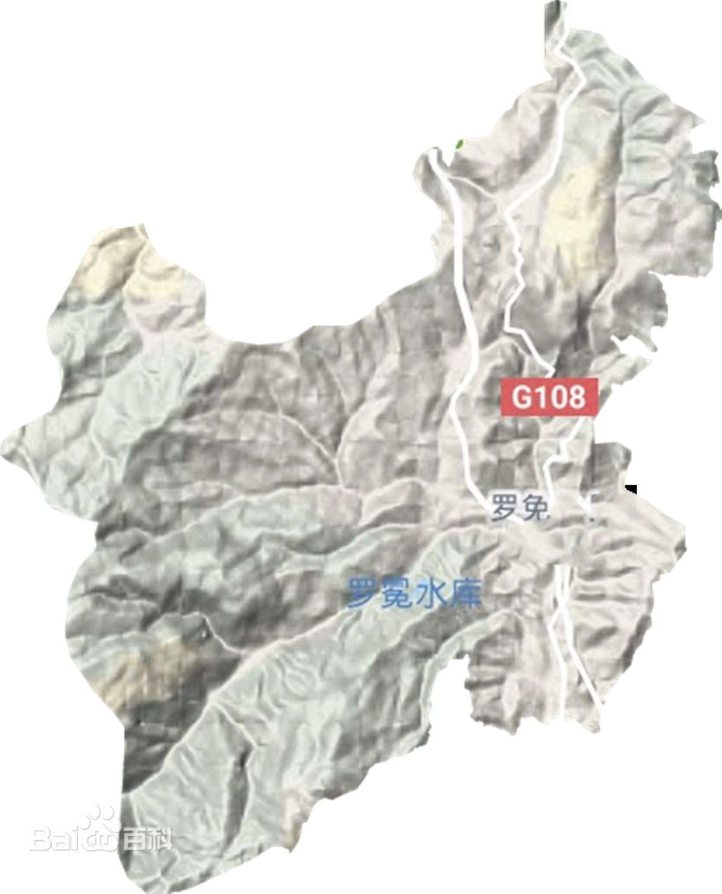
- 罗免镇，隶属于云南省昆明市富民县，地处[富民县](https://baike.baidu.com/item/%E5%AF%8C%E6%B0%91%E5%8E%BF/1166170?fromModule=lemma_inlink)西北部，东与[赤鹫镇](https://baike.baidu.com/item/%E8%B5%A4%E9%B9%AB%E9%95%87/19446496?fromModule=lemma_inlink)相连，南与永定街道毗邻，西与楚雄彝族自治州禄丰县[碧城镇](https://baike.baidu.com/item/%E7%A2%A7%E5%9F%8E%E9%95%87/6643009?fromModule=lemma_inlink)接壤，北靠禄劝彝族苗族自治县崇德镇及楚雄彝族自治州[武定县](https://baike.baidu.com/item/%E6%AD%A6%E5%AE%9A%E5%8E%BF/1208548?fromModule=lemma_inlink)，距富民县人民政府15千米， [1]区域总面积131.4平方千米。
- 超市3个。
- 罗免镇地势西南、西北高，东偏低，以喀斯特及缓坡丘陵地形为主；主要山脉有金铜盆山，境内最高峰金铜盆位于则核村，海拔2817米；最低点位于者北行政村下河里自然村，海拔1643米。
- 罗免镇属亚热带半湿润气候，其特点是冬季无严寒，夏季无酷暑；多年平均气温15.8℃，1月平均气温3℃，极端最低气温-5℃（1982年12月28日）；7月平均气温27℃，极端最高气温31℃。
- 罗免镇因彝语地名“罗梅白”音译而得名。罗免，意为老虎山。

禄劝县
- 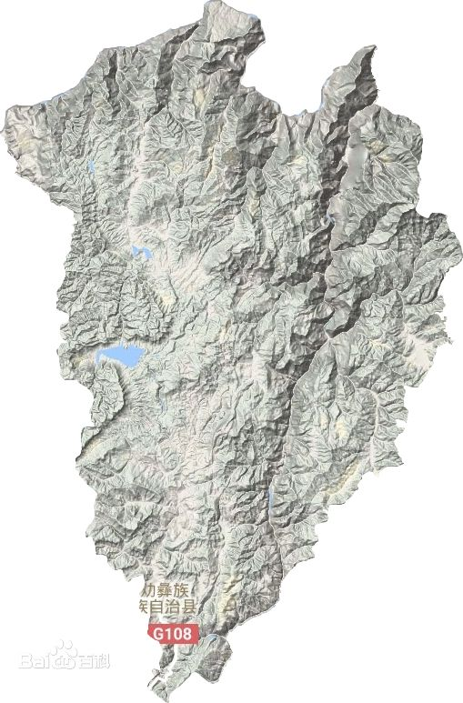
- 元代，赛典赤主滇，嫌“夷名不雅训”改碌券为禄劝，禄劝一名由此而来，并沿用至今。一说“禄劝”为彝语“罗好知”的译音，意为有坚硬大石头的地方。
- 禄劝彝族苗族自治县地处滇中红层丘原东部，东北向西南倾斜，地表被溪河切割，最为明显的是自南向北而流的普渡河与自北向南而流的掌鸠河，把县境切割为普渡河以东、普渡河与掌鸠河之间及掌鸠河以西三大块，形成很多断裂带，依次分布着相对平缓的山间盆地，俗称“坝子”，为主要的农业生产区域。县域内最高海拔4247米，最低海拔746米。
- 禄劝彝族苗族自治县属亚热带季风气候，2023年平均气温17.2℃，极端最高气温35.9℃（6月1日），年极端最低气温-2.4℃（1月7日）。

### 楚雄

武定县
- 境内有“西南第一山”美誉的[狮子山](https://baike.baidu.com/item/%E7%8B%AE%E5%AD%90%E5%B1%B1/660076?fromModule=lemma_inlink)；有堪称“地球伤疤”的[己衣大裂谷](https://baike.baidu.com/item/%E5%B7%B1%E8%A1%A3%E5%A4%A7%E8%A3%82%E8%B0%B7/10812069?fromModule=lemma_inlink)。
- 武定县平均海拔1910米，地势东西两侧及西南部高，北部低，东南部较开阔。海拔最低点为境内金沙江边的己衣新民大沙地862米，最高点为己衣乡白龙会峰2956米，高低相差2094米。县城海拔1710米。海拔在2500米以上的山峰有36座，乌蒙山余脉从东贯穿全境，组成一系列南北走向的高山重叠的地形，立体气候明显。
- 武定县属低纬高原季风气候区。武定境内山岭纵横，地形地貌复杂多样，地势、海拔高低悬殊较大，[季风气候](https://baike.baidu.com/item/%E5%AD%A3%E9%A3%8E%E6%B0%94%E5%80%99/0?fromModule=lemma_inlink)明显。由于受地形地势影响，[金沙江](https://baike.baidu.com/item/%E9%87%91%E6%B2%99%E6%B1%9F/0?fromModule=lemma_inlink)[谷地](https://baike.baidu.com/item/%E8%B0%B7%E5%9C%B0/0?fromModule=lemma_inlink)热量丰富，东部高原、坝区次之，东西部山区气温较低；形成北热、南暖、东西凉的分布格局。呈现出中亚热带、北[亚热带](https://baike.baidu.com/item/%E4%BA%9A%E7%83%AD%E5%B8%A6/0?fromModule=lemma_inlink)、[暖温带](https://baike.baidu.com/item/%E6%9A%96%E6%B8%A9%E5%B8%A6/0?fromModule=lemma_inlink)、温带、寒带的景象，有“山上飘雪花、山下开桃花、江边收庄稼”的[立体气候](https://baike.baidu.com/item/%E7%AB%8B%E4%BD%93%E6%B0%94%E5%80%99/0?fromModule=lemma_inlink)[特点](https://baike.baidu.com/item/%E7%89%B9%E7%82%B9/0?fromModule=lemma_inlink)。
- 气候总特征为：冬暖夏凉，气温年较差小，日较差大；降水丰沛，干湿季分明；气候垂直变化显著，类型多样；雨热同季，大陆性强。

插甸镇
- 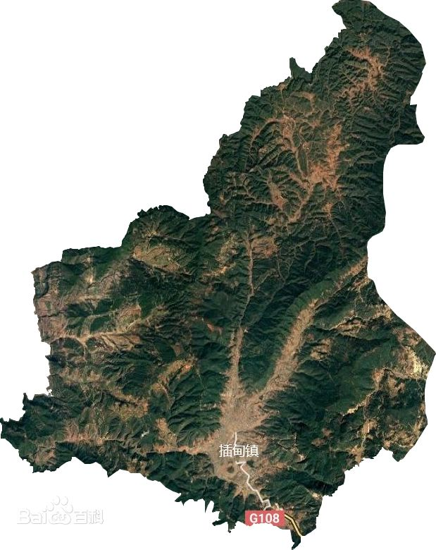
- 超市11个。
- 插甸镇地处高原区中的东部，位于吆鹰山以北，地形渐降渐展为插甸坝子。主要山脉有阿则问山、卧璋山、过界梁、安节巫峰等，均属三台山东支。境内最高点位于阿则问山，海拔2881米；最低点位于乐茂河长虫甸，海拔1570米。
- 插甸镇属高原季风气候。多年平均气温13.9℃，年平均降水量1000毫米。
- “插甸”系彝语“产稻的坝子”之义。

高桥镇
- 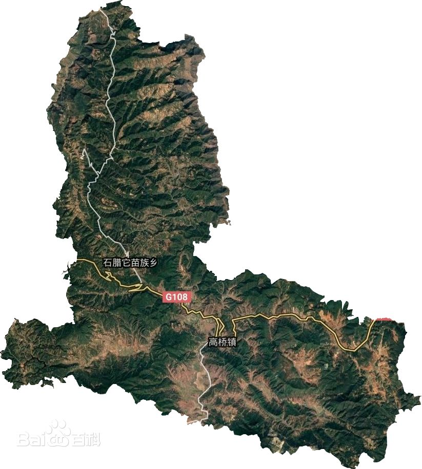
- 超市2个。
- 高桥镇地处高原区中的东部，地形渐降为高桥坝子，东西边境较高。
- 高桥镇属高原季风气候。多年平均气温15.4℃，年平均降水量1050毫米。
- 明正统十年（1445年），武定军民府土知府阿宁在老街通往新街的河面上建石拱桥一座，人们称“高桥”，故得名。

白路镇
- 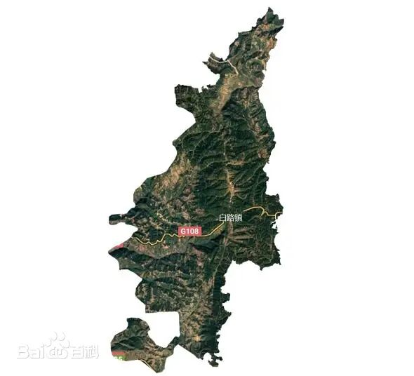
- 白路原名“白露”，春夏气温如白露节而得名。后因方便书写改“露”为“路”。

元谋县
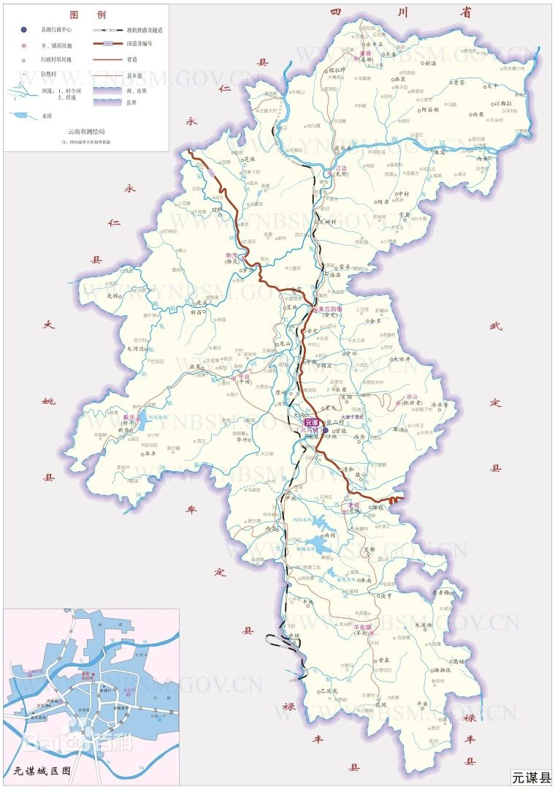
- 地势东南高，西北低。最高点江边乡大营盘山，海拔2835.9米，最低点姜驿乡黑者村东北金沙江出境处，海拔898米。
- 元谋属低纬度高原季风气候，因为海拔最高与最低之差近2000米，气候垂直分布明显，大致可分为4个气候类型，即温暖带一中温带、北亚热带、中亚热带和南亚热带气候。
- 金沙江、永定河北来入境，龙川江南来穿境，蜻蛉河、班果河、动岗河西来过境，江河聚会江边龙街，汇入金沙江，东北向出境。
- G108国道71.54千米。
- 元谋因孕育了170万年前的元谋人，被誉为“东方人类发祥地”。
- 元谋青枣、楚雄撒坝猪、元谋番茄、元谋洋葱
- 1965年5月1日，为配合[成昆铁路](https://baike.baidu.com/item/%E6%88%90%E6%98%86%E9%93%81%E8%B7%AF/747372?fromModule=lemma_inlink)修建工作，[中国地质科学院](https://baike.baidu.com/item/%E4%B8%AD%E5%9B%BD%E5%9C%B0%E8%B4%A8%E7%A7%91%E5%AD%A6%E9%99%A2/10090815?fromModule=lemma_inlink)地质力学研究所在元谋考察的过程中发现两枚疑为猿人的牙齿化石，后被命名为“直立人元谋新亚种”简称“元谋直立人”，后经古地磁测定距今约170万年，是中国乃至亚洲最早的直立人化石。是继我国北方发现的[北京猿人](https://baike.baidu.com/item/%E5%8C%97%E4%BA%AC%E7%8C%BF%E4%BA%BA/29057?fromModule=lemma_inlink)和[蓝田猿人](https://baike.baidu.com/item/%E8%93%9D%E7%94%B0%E7%8C%BF%E4%BA%BA/1370082?fromModule=lemma_inlink)之后的又一重要发现，对进一步研究古人类和我国西南地区第四纪地质，具有重要的科学价值。将中国人类历史向前推进了100多万年，表明长江流域的云南是人类起源与发展的关键地区，作为中国人类历史的开篇被写入中国历史教科书首页。 [24]1982年2月23日，元谋猿人遗址被中华人民共和国国务院公布为[第二批全国重点文物保护单位](https://baike.baidu.com/item/%E7%AC%AC%E4%BA%8C%E6%89%B9%E5%85%A8%E5%9B%BD%E9%87%8D%E7%82%B9%E6%96%87%E7%89%A9%E4%BF%9D%E6%8A%A4%E5%8D%95%E4%BD%8D/8622343?fromModule=lemma_inlink)。 [25]

黄瓜园镇
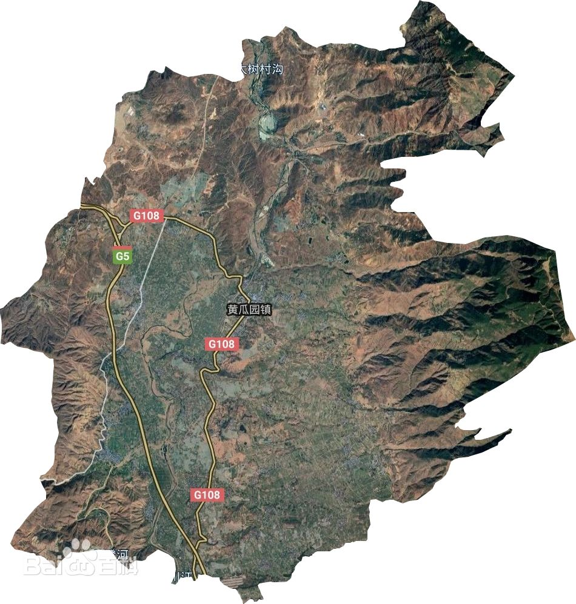
- 整个地势由东南向西北倾斜，
- 黄瓜园镇属亚热带季风气候。因海拔高低差异，形成山区的冷凉气候与坝区的燥热气候。山区冷凉、潮湿多雨，坝区则冬暖夏热、日照充足。年平均气温23℃。年降水量410—934毫米。
- 超市32个。
- 108国道单向1车道，通往物茂乡。
- 黄瓜园镇因清康熙年间此地盛产黄瓜得名。
- 烈士陵园位于[黄瓜园火车站](https://baike.baidu.com/item/%E9%BB%84%E7%93%9C%E5%9B%AD%E7%81%AB%E8%BD%A6%E7%AB%99/7278071?fromModule=lemma_inlink)，安葬着修筑成昆铁路元谋段牺牲的103名烈士。

物茂乡
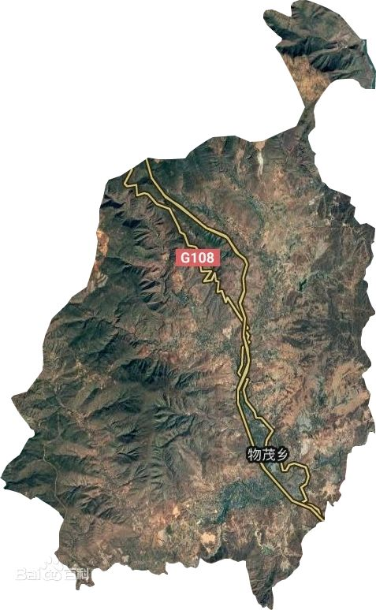
- 超市5个。
- 108国道过境，境内长30千米，单向1车道，通往永仁县。
- 物茂系傣语地名，含义为新水井旁边的村子因乡人民政府驻物茂新村而得名。

永仁县
- 永仁古称苴却，地处云南北部，自古就是出滇入川之要塞。1924年设县，取原境内永定、仁和两大集镇名称首字定名“永仁”。拥有得天独厚的资源优势。光热资源丰富。被誉为“中国阳光城”。4A国家级风景名胜区诸葛方山。
- 永仁县属内陆高原区，位于滇中红色高原北缘，具有“V”字形和“山”形结构特点，地势西北高，东南低，中部地势开阔，平均海拔1530—1700米之间。县城永定镇海拔1536米，境内最高点为宜就镇大雪山主峰，海拔2884.6米，最低处是永定镇石坎子下的金沙江边，海拔925米。
- 永仁县属亚热带气候，受海洋季风的影响，形成冬春干燥，夏秋多雨，干、湿两季分明的气候特点，雨量偏少，蒸发量非常大。永仁县日照时间长，年均日照达2824.4h，居全国第二（仅次于西藏拉萨）、全省第一，具有丰富的光热资源。年均气温17.8℃，年均降水量840mm，无霜期315天，≥10℃的年平均积温为5934℃。
- 永仁拥有日益凸显的区位优势，是交通枢纽，地处“云南北大门”，是面向攀西、成渝的前沿，交通四通八达，到攀枝花车程1小时，动车仅26分钟；到成都动车5个半小时。京昆高速、108国道、南永二级公路以及永大高速 [12]在县城汇接，大攀高速公路（永仁段）即将开工建设。
- 永仁核桃、黑山羊、莲池金丝小枣

永定镇
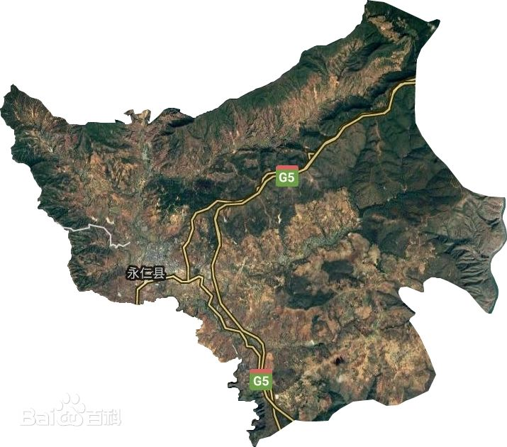
- 永定镇地处方山南麓的缓坡丘陵地带，地势北高南低。境内最高点位于方山，海拔2377米；最低点位于云龙村民委员会石坎子村下金沙江边，海拔926米。
- 永定镇多年平均气温17.8℃，极端最高气温37.5℃，极端最低气温-3℃，无霜期年平均274天，年平均降水量883.9毫米。
- 超市24个。
- 永定镇得名于清朝中叶，取永远安定之意。

## 四川

### 攀枝花市

平地镇
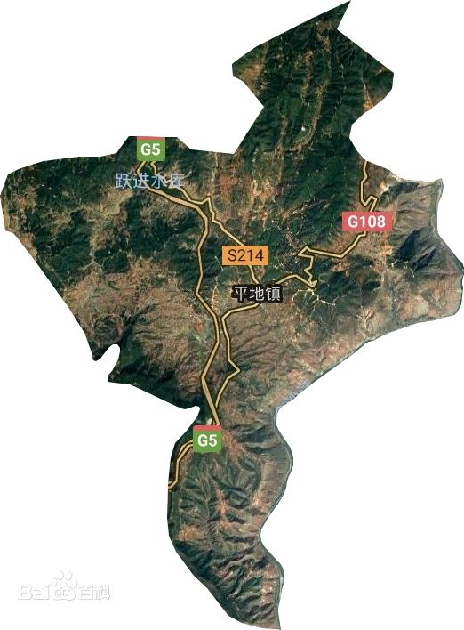
- 超市3个。
- 平地镇地势西高东低，南高北低。境内最高点位于方山顶，海拔2367米；最低点位于波西村师庄，海拔937米。
- 平地镇属亚热带为基带的立体气候，其特点是夏季长，四季不分明，旱、雨季分明。多年平均气温16℃。无霜期年平均300天。年平均日照时数2930小时。年平均降水量1000毫米。
- 平地镇地名因原治所设在山谷中的小块平坦土地上而得名。

大龙潭彝族乡
- 大龙潭乡是[四川省](https://baike.baidu.com/item/%E5%9B%9B%E5%B7%9D%E7%9C%81/15626925?fromModule=lemma_inlink)攀枝花市仁和区下辖的乡，该乡位于[仁和区](https://baike.baidu.com/item/%E4%BB%81%E5%92%8C%E5%8C%BA/8745163?fromModule=lemma_inlink)东南部，东邻金沙江，与会理市 [1]隔江交界，南与[平地镇](https://baike.baidu.com/item/%E5%B9%B3%E5%9C%B0%E9%95%87/6190446?fromModule=lemma_inlink)毗邻，西与大田，总发，[金江镇](https://baike.baidu.com/item/%E9%87%91%E6%B1%9F%E9%95%87/7666197?fromModule=lemma_inlink)三乡接壤，北与盐边县红格镇隔江相望。面积260平方公里，1.58万人。
- 过金沙江。

### 凉山州

#### 会理市

关河镇
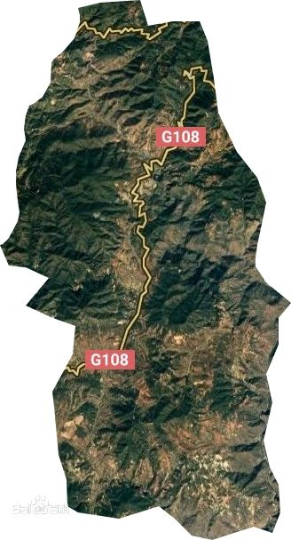
- 超市15个。
- 关河镇地势西北高、东南低。境内最高点位于老关山，海拔2631米；最低点海拔1079米。
- 关河镇属亚热带季风气候，立体气候明显，光照强，无霜期长，昼夜温差大、四季温差小，冬无严寒、夏无酷暑，四季如春。多年平均气温14.7℃。无霜期年平均235天。年平均日照时数2421.5小时。年平均降水量800毫米。
- 关河镇境内有108国道贯穿全境，境内长10千米。
- 关河镇因人民政府驻地小关河群山环抱，登高远眺看不到水流出的地方，故名。

鹿厂镇
- 超市6个。
- 鹿厂镇境内最高点位于月鲁山顶，海拔2680米；最低点位于黎明村，海拔1580米。
- 鹿厂镇属亚热带季风气候，其特点是立体气候明显，光照强，年温差小，昼夜温差大、无霜期长，冬无严寒、夏无酷暑，四季如春。多年平均气温15.1℃，无霜期年平均240天。年平均日照时数为2421.5小时。年平均降水量1158.7毫米。
- 据传，前人曾在此开办铜、铁、金、硫黄、炭、陶瓷等矿窑，都用火炉烧炼，故名“炉厂”，后演变为“鹿厂”。

会理市
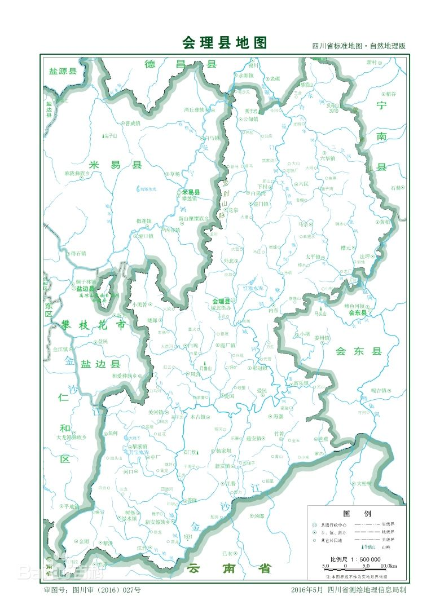
- 古称会无、会川，因“川原并会，政平颂理”而得名。
- 会理市位于西南[横断山脉](https://baike.baidu.com/item/%E6%A8%AA%E6%96%AD%E5%B1%B1%E8%84%89/2293027?fromModule=lemma_inlink)东北部，[青藏高原](https://baike.baidu.com/item/%E9%9D%92%E8%97%8F%E9%AB%98%E5%8E%9F/849?fromModule=lemma_inlink)东南边缘。全市地形轮廓由东北到西南呈一狭长的山间盆地。因城区如船形分布，故有“船城”之称。境内山峦起伏，河流纵横，山高坡陡，地形复杂，地形以山地、丘陵、平坝为主。境内山脉均为北南走向，交织环绕[金沙江](https://baike.baidu.com/item/%E9%87%91%E6%B2%99%E6%B1%9F/461344?fromModule=lemma_inlink)和[安宁河](https://baike.baidu.com/item/%E5%AE%89%E5%AE%81%E6%B2%B3/2058439?fromModule=lemma_inlink)之间，分属[螺髻山](https://baike.baidu.com/item/%E8%9E%BA%E9%AB%BB%E5%B1%B1/2048353?fromModule=lemma_inlink)和[牦牛山](https://baike.baidu.com/item/%E7%89%A6%E7%89%9B%E5%B1%B1/15618647?fromModule=lemma_inlink)的余脉。全境相对高差在800～1000米之间，最大相对高差3081米，一般海拔高度约2000米左右。
- 会理市属[中亚热带](https://baike.baidu.com/item/%E4%B8%AD%E4%BA%9A%E7%83%AD%E5%B8%A6/6246688?fromModule=lemma_inlink)西部半湿润气候区，阳光照射充足，年均2400小时日照，年均气温15.1℃，年平均降水量1212毫米，有丰富的光热资源，蒸发旺盛；雨量集中，干湿季分明；气温年较差小，日较差大；冬暖无严寒，夏凉无酷暑；气候垂直变化大，高山积雪、峡谷炎热；气温回升和下降波动亦大，有一雨成冬之说。因城区一带气候温和，冬暖无夏，四季如春，会理素有“小春城”之美称。
- 会理古城：位于凉山彝族自治州最南端，为[国家AAAA级旅游景区](https://baike.baidu.com/item/%E5%9B%BD%E5%AE%B6AAAA%E7%BA%A7%E6%97%85%E6%B8%B8%E6%99%AF%E5%8C%BA/7574615?fromModule=lemma_inlink)，城内景点有钟鼓楼、武侯祠、东岳庙、景庄庙、红军长征陈列馆、碑林、[文塔](https://baike.baidu.com/item/%E6%96%87%E5%A1%94/18325421?fromModule=lemma_inlink)等。
- 会理：石榴、羊肉粉、油鸡枞、熨斗粑、抓酥包子、会理鸡火丝饵块。
- 2011年11月2日，会理县获批列为[国家历史文化名城](https://baike.baidu.com/item/%E5%9B%BD%E5%AE%B6%E5%8E%86%E5%8F%B2%E6%96%87%E5%8C%96%E5%90%8D%E5%9F%8E/6412721?fromModule=lemma_inlink)。

益门镇
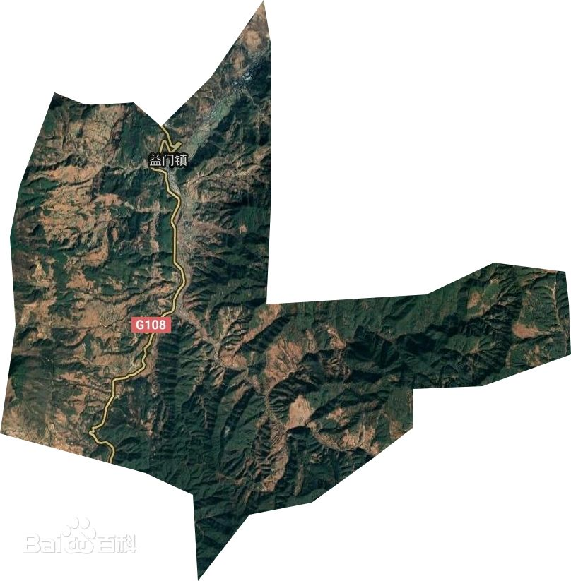
- 超市12个。
- 益门镇属亚热带季风气候，其特点是立体气候明显，光照强，年温差小，无霜期长，昼夜温差大、四季温差小，冬无严寒、夏无酷暑，四季如春。多年平均气温14.1℃。无霜期年平均240天。年平均日照时数为2421.5小时。年平均降水量1130毫米。
- 益门镇境内河道属雅砻江水系，主要有益门河，境内河道长26千米。
- 史称夷门镇，后改“夷”字为“益”。

云甸镇
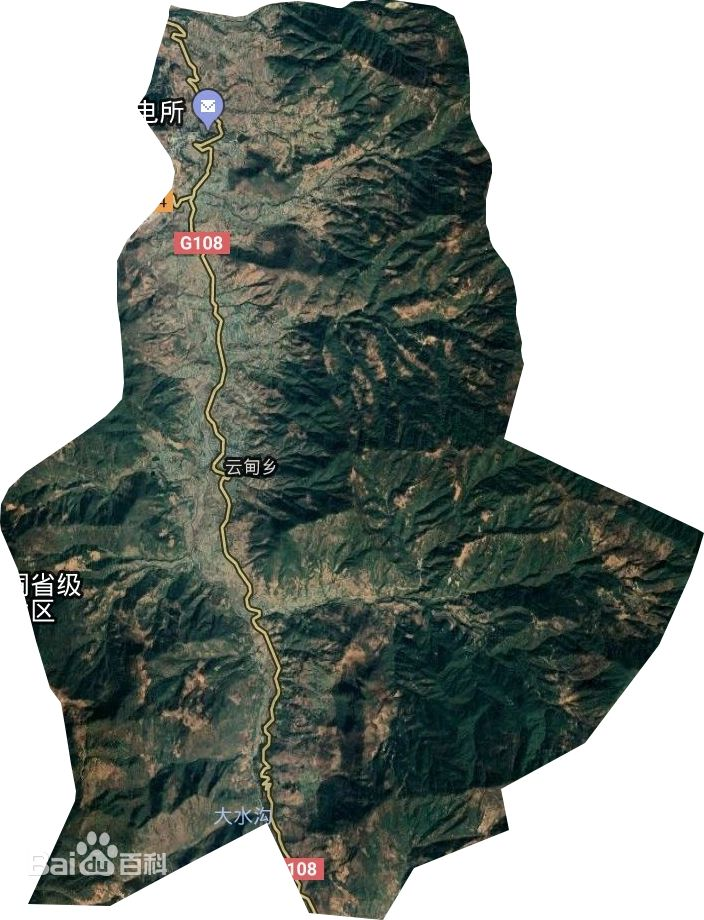

- 超市4个。
- 云甸镇地势略为南高北低、东高西低。
- 云甸镇属亚热带季风气候，立体气候明显，光照强，无霜期长，昼夜温差大、四季温差小，冬无严寒、夏无酷暑，四季如春。多年平均气温15.1℃，极端最低气温3℃（1999年12月25日）；极端最高气温38.2℃（2011年6月5日）。

永郎镇
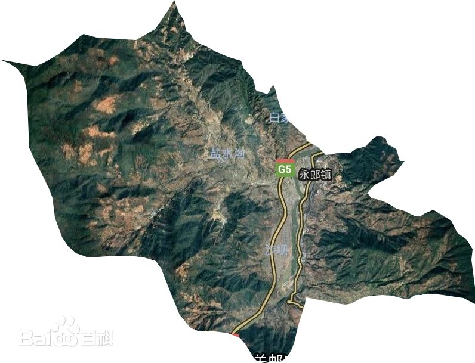
- 超市14个。
- 永郎镇地处安宁河两岸，境内中部为河谷盆地，地势东西两侧为丘陵和低山。
- 永郎镇属亚热带季风气候，其特点是日照时间长，气候温暖干燥，多南北大风，蒸发量大，雨水稀少，立体农业气候。多年平均气温17.7℃，1月平均气温10.5℃，极端最低气温-4.6℃（1977年2月9日）；7月平均气温22.7℃，极端最高气温37.3℃（2005年5月28日）。
- 永郎镇境内河道属雅砻江水系。安宁河由北而南贯穿全境，境内河道长12千米。
- 成昆铁路穿境而过，境内长5.2千米；火车货运站1个，年发货200万吨，年接发货能力240万吨。西攀高速公路、108国道纵贯境内南北，境内长6.8千米。
- 截至2023年，永郎镇有成昆铁路、G5京昆高速、108国道、德会高速及成昆铁路复线自北向南贯穿全镇，2个火车站和3个高速公路出入口。

乐跃镇
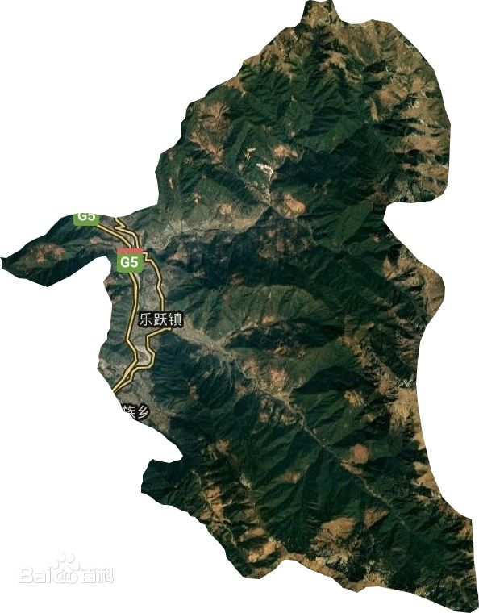
- 超市2个。
- 乐跃镇地处安宁河两岸，中部是河谷台阶地，东西部系山地。
- 乐跃镇属亚热带季风气候，其特点是日照时间长，气候温暖干燥，多南北大风，蒸发量大，雨水稀少，立体农业气候。多年平均气温17.7℃，1月平均气温10.5℃，极端最低气温-4.6℃（1977年2月9日）；7月平均气温22.7℃，极端最高气温37.3℃（2005年5月28日）。
- 乐跃镇原名落腰，以街道环山而建，形似腰带而得名。

德昌县
- 德昌建制已经有两千余年历史，是“北达京畿，南通蒙昭”的南丝绸之路必经地。蕴含凤凰文化、“九宫十八庙”佛道教文化、傈僳族文化、红军红色文化及历史民俗文化，全国重点文物战国至西汉大石墓群被誉为“中国金字塔”，有省级保护文物钟鼓楼、字库塔、凉山唯一的傈僳族文化及23处国家、省、州级文物重点保护单位和22项非物质文化遗产保护名录。“德昌桑椹”“建昌板鸭”获国家地理标志产品保护，是“中国果桑之乡”。获评中国天然氧吧、全国绿化模范县、最具投资价值目的地城市、自然（养生）旅游目的地、四川省十大最具潜力森林康养目的地、四川省园林县城，省级乡村旅游示范县。
- 德昌县地形复杂多样，以中山地貌为主，地处安宁河谷地带，横断山区康藏高原东缘。境内螺髻山海拔高度为4354.2米。
- 德昌县西临雅砻江、东连螺髻山，属亚热带高原季风气候，年均日照总时数2356小时，年均气温17.7℃，年均相对湿度64.7%，年均PM2.5指数25，负氧离子含量平均12000个/立方厘米，年均降水1074.4毫米，无霜期300天以上，优质天气330天以上，夏无酷暑、冬无严寒。
- 德昌县境内成昆铁路、雅攀高速、108国道及正在建设的成昆铁路复线纵贯南北，有火车站7个、高速公路出口3个，距西南一流支线机场青山机场64千米，同处西昌半小时经济圈和攀枝花一小时经济圈，由铁路、公路、航空构成的立体交通网络。
- 德昌桑椹

麻栗镇
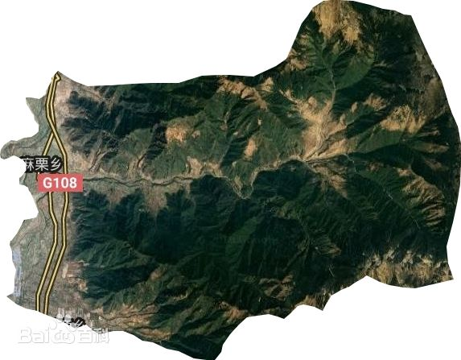
- 超市5个。
- 麻栗镇地处安宁河东岸阶地，地势东高西低。
- 麻栗镇属亚热带季风气候区。其特点是日照时间长，气候温暖干燥，多南北大风，蒸发量大，雨水稀少，立体农业气候。多年平均气温17℃，1月平均气温10.5℃，极端最低气温-4.6℃（1977年2月9日）；7月平均气温22.7℃，极端最高气温37.3℃（2005年5月28日）。
- 2011年，麻栗镇境内有成昆铁路从西北部过境，设有麻栗火车站；雅西高速公路、108国道纵贯境内南北。北距州府西昌55千米。

#### 西昌市
黄联关镇
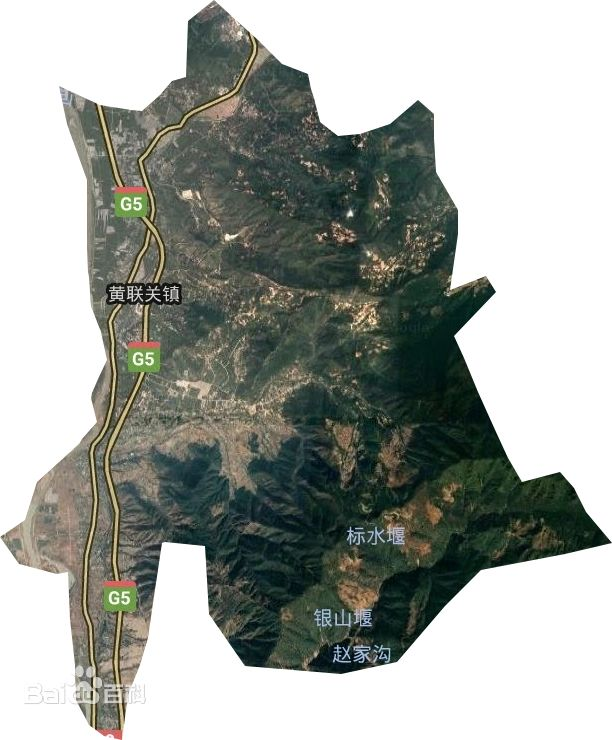
- 超市2个。
- 黄联关镇地处[螺髻山](https://baike.baidu.com/item/%E8%9E%BA%E9%AB%BB%E5%B1%B1/2048353?fromModule=lemma_inlink)下，安宁河边。地势自西向东倾斜，地形分为高寒山区、浅山区及河谷地带。境内最高点位于哈土村的鸠里登；最低点位于大德村的下坝子。
- 黄联关镇属亚热带季风气候，其特点是夏季多雨，冬季少雨，四季分明，雨热同季，光照充足，无霜期长。多年平均气温16.5℃，无霜期年平均275天。年平均日照时数2450小时。年平均降水量856毫米，主要集中在每年的6~8月。
- 黄联关镇因当地属带形黄土斜坡，因坡上黄连树多而得名。清朝末年在黄联老街设关收税，改称黄联关。

西昌市
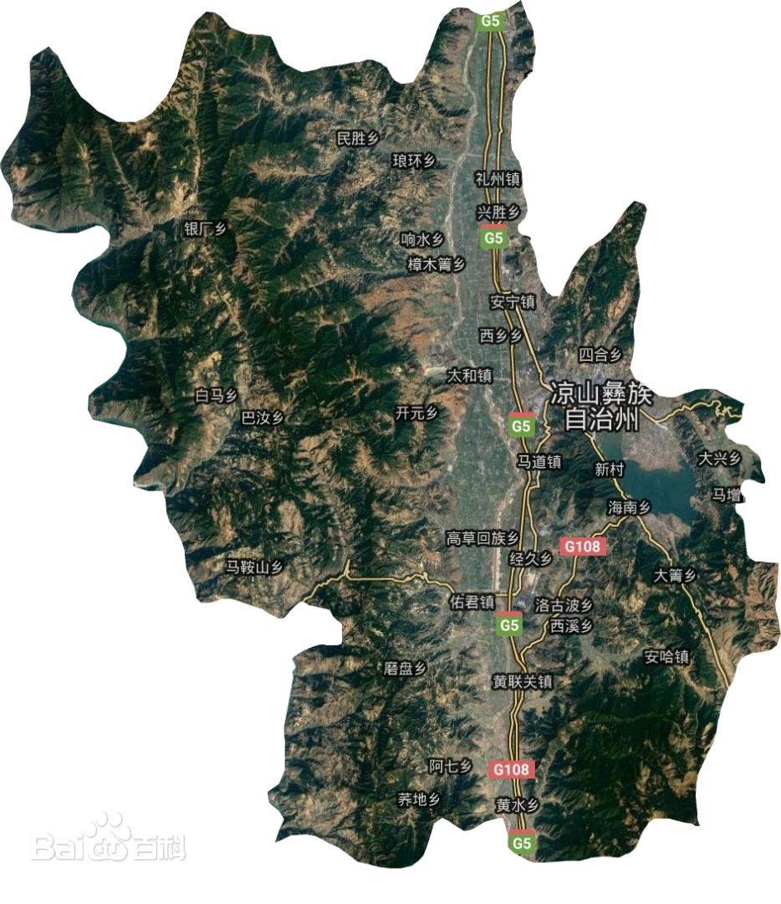
- 西昌市，[四川省](https://baike.baidu.com/item/%E5%9B%9B%E5%B7%9D%E7%9C%81/15626925?fromModule=lemma_inlink)[凉山彝族自治州](https://baike.baidu.com/item/%E5%87%89%E5%B1%B1%E5%BD%9D%E6%97%8F%E8%87%AA%E6%B2%BB%E5%B7%9E/2721144?fromModule=lemma_inlink)辖县级市、首府 [1]，古称[邛都](https://baike.baidu.com/item/%E9%82%9B%E9%83%BD/5171631?fromModule=lemma_inlink)、建昌，地处[四川省](https://baike.baidu.com/item/%E5%9B%9B%E5%B7%9D%E7%9C%81/15626925?fromModule=lemma_inlink)西南部，[安宁河谷](https://baike.baidu.com/item/%E5%AE%89%E5%AE%81%E6%B2%B3%E8%B0%B7/17648976?fromModule=lemma_inlink)地区，是攀西地区政治、经济、文化和交通中心，是古代“[南方丝绸之路](https://baike.baidu.com/item/%E5%8D%97%E6%96%B9%E4%B8%9D%E7%BB%B8%E4%B9%8B%E8%B7%AF/3397701?fromModule=lemma_inlink)”上的重镇，被誉为“蜀滇锁钥”。气候属于热带高原季风气候区，光热资源丰富，冬暖夏凉、四季如春；素有月亮城、太阳城、航天城、小春城之美誉，是一座春天栖息的城市。 [38]总面积2882.9平方千米， [23]截至2022年10月，辖7个街道、11个镇、5个乡、2个少数民族乡。 [41] [69]市政府驻西昌市大水井12号。2022年，西昌市常住总人口为96.6万人，城镇化率为68.48%。
- 西昌市是[国家森林城市](https://baike.baidu.com/item/%E5%9B%BD%E5%AE%B6%E6%A3%AE%E6%9E%97%E5%9F%8E%E5%B8%82/4088530?fromModule=lemma_inlink)、[国家卫生城市](https://baike.baidu.com/item/%E5%9B%BD%E5%AE%B6%E5%8D%AB%E7%94%9F%E5%9F%8E%E5%B8%82/7019998?fromModule=lemma_inlink)、[中国优秀旅游城市](https://baike.baidu.com/item/%E4%B8%AD%E5%9B%BD%E4%BC%98%E7%A7%80%E6%97%85%E6%B8%B8%E5%9F%8E%E5%B8%82/1677344?fromModule=lemma_inlink)、中国最美的五大养生[栖息地](https://baike.baidu.com/item/%E6%A0%96%E6%81%AF%E5%9C%B0/1537512?fromModule=lemma_inlink)、综合实力百强县、全国新型城镇化质量百强县市、 [2]中国县级市全面小康指数前100名、2019年度全国综合实力百强县市、2019中国西部百强县市。
- 截至2022年，西昌市境内有G5[京昆高速公路](https://baike.baidu.com/item/%E4%BA%AC%E6%98%86%E9%AB%98%E9%80%9F%E5%85%AC%E8%B7%AF/934762?fromModule=lemma_inlink)、G7611[西昭高速公路](https://baike.baidu.com/item/%E8%A5%BF%E6%98%AD%E9%AB%98%E9%80%9F%E5%85%AC%E8%B7%AF/15818147?fromModule=lemma_inlink)（在建） [46]、G7611[西香高速公路](https://baike.baidu.com/item/%E8%A5%BF%E9%A6%99%E9%AB%98%E9%80%9F%E5%85%AC%E8%B7%AF/15818169?fromModule=lemma_inlink)（在建） [46]、[西宁高速公路](https://baike.baidu.com/item/%E8%A5%BF%E5%AE%81%E9%AB%98%E9%80%9F%E5%85%AC%E8%B7%AF/61539850?fromModule=lemma_inlink)（在建） [46]、[108国道](https://baike.baidu.com/item/108%E5%9B%BD%E9%81%93/2846555?fromModule=lemma_inlink)、[248国道](https://baike.baidu.com/item/248%E5%9B%BD%E9%81%93/13014145?fromModule=lemma_inlink)、[348国道](https://baike.baidu.com/item/348%E5%9B%BD%E9%81%93/13014334?fromModule=lemma_inlink)、218省道、219省道等国省公路干线。
- 西昌市境内有成昆铁路过境，设有[西昌站](https://baike.baidu.com/item/%E8%A5%BF%E6%98%8C%E7%AB%99/7265728?fromModule=lemma_inlink)，成昆铁路复线设有西昌西站。2022年1月10日，[西昌西站](https://baike.baidu.com/item/%E8%A5%BF%E6%98%8C%E8%A5%BF%E7%AB%99/15463415?fromModule=lemma_inlink)投入使用。 [30]乐山-西昌、宜宾-西昌高速铁路全面启动。 [38]2022年12月26日，新成昆铁路全线通车，西昌至成都缩短至3小时左右。
- 西昌市唐置建昌府，元置建昌路，明代又改卫，清雍正六年置西昌县。因城在唐代建昌旧城之西，故名“西昌”。

安宁镇
- 超市18个。
- 安宁镇地处东山山脚，安宁河边。地势北高南低，除东山村为坡地外，均属平坝，境内最高位于青山咀山顶，海拔1722米；最低点位于安宁河东岸，海拔1510米。
- 安宁镇属亚热带季风气候，其特点是夏季多雨，冬季少雨，四季分明，雨热同季，光照充足，无霜期长。多年平均气温18℃。无霜期年平均306天。年平均日照时数2448小时。年平均降水量1087.5毫米，主要集中在每年的6~8月。
- 安宁镇因地处安宁河谷平原，取安宁祥和之意而得名。

礼州镇
- 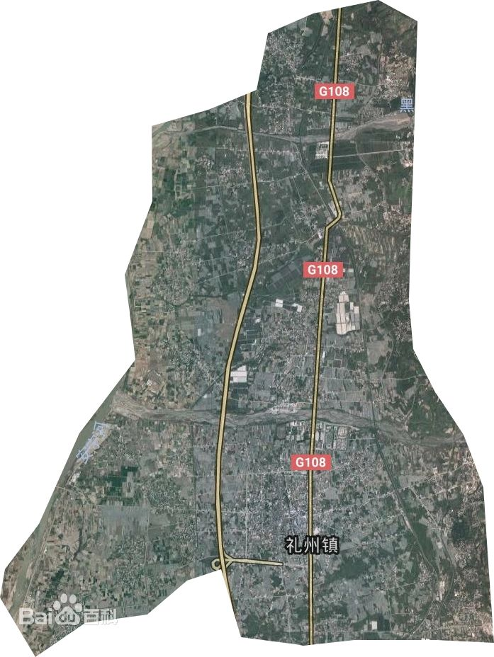
- 超市9个。
- 礼州镇地处帽盒山大梗山西麓，西昌市东北部，地势北高南低、东高西低，地形为安宁河谷冲积坝平原。境内最高点位于同心村红山嘴，海拔1620米；最低点位于桂林村大坝口，海拔1540米。
- 礼州镇属亚热带季风气候，其特点是四季分明。冬春季节干旱少雨，夏秋季节炎热多雨，初秋有晒秋老虎的气候现象。多年平均气温16℃，极端最高气温31℃，无霜期年平均280天。年平均日照时数2700小时。年平均降水量1000毫米。
- 1286年，废苏祁县取崇德尚礼之义为礼州（彝语称笼么城）。

#### 冕宁县

漫水湾镇
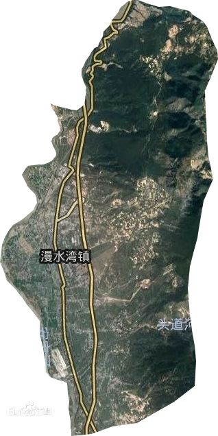
- 超市5个。
- 漫水湾镇地势为东高西低、北高南低。
- 漫水湾镇属亚热带季风气候，其特点是气候温和、降雨充沛、日照充足、雨热同季、干湿季分明，冬春多风，春多冰雹，春旱突出。多年平均气温15.8℃，1月平均气温7.4℃，极端最低气温-3.4℃（1998年2月1日）；7月平均气温23.5℃，极端最高气温34℃（2003年5月20日）。
- 安宁河流经本地时形成一个大回水湾，俗称漫水湾塘，因建有漫水湾水文站而得名。

泸沽镇
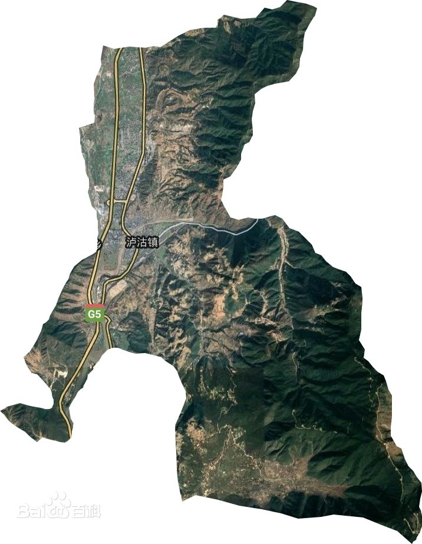
- 超市7个。
- 泸沽镇境内东高西低、北高南低。
- 泸沽镇属亚热带季风气候，其特点是气候温和、降雨充沛、日照充足、雨热同季、干湿季分明，冬春多南北大风，春多冰雹，春旱突出。多年平均气温15.2℃，1月平均气温6.8℃，极端最低气温-5.1℃（1998年2月4日）；7月平均气温22.3℃，极端最高气温34.8℃（2003年5月18日）。
- 泸沽镇因元世祖至元十五年（1278年）在此置泸沽县而得名。

宏模镇
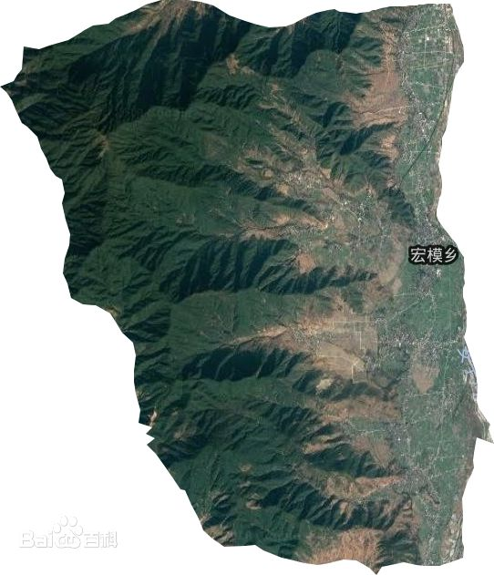
- 超市11个。
- 宏模镇地势为西高东低、北高南低。
- 宏模镇属亚热带季风气候，其特点是气候温和、降雨充沛、日照充足、雨热同季、干湿季分明，冬春多南北大风，春多冰雹，春旱突出。多年平均气温14.7℃，1月平均气温6.9℃，极端最低气温-7.4℃（1962年2月2日）；7月平均气温21.1℃，极端最高气温34.2℃（1998年5月12日）。

复兴镇
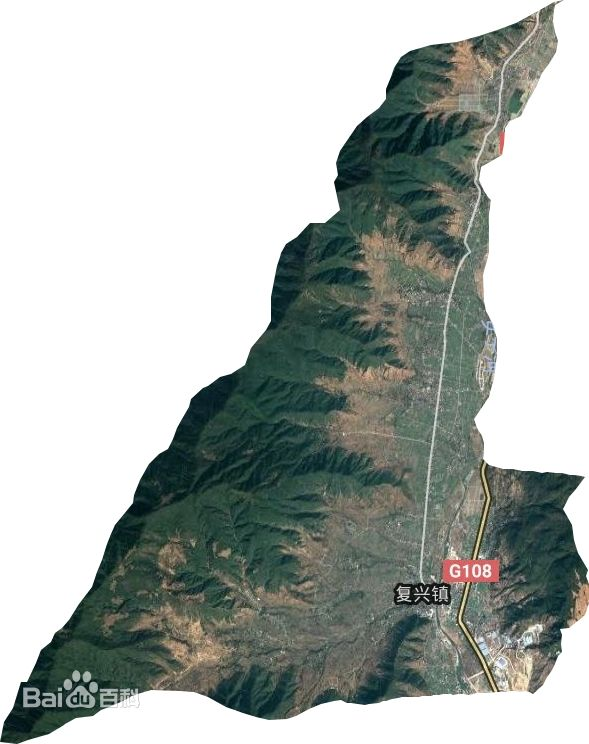
- 超市34个。
- 复兴镇境内大部为山前平原，地势为东南低西北高。
- 复兴镇属亚热带季风气候，其特点是气候温和、降雨充沛、日照充足、雨热同季、干湿季分明，冬春多南北大风，春多冰雹，春旱突出。多年平均气温15℃，1月平均气温6.1℃，极端最低气温-4.9℃（1998年2月1日）；7月平均气温21.9℃，极端最高气温34℃（2003年5月18日）。
- 2011年，复兴镇境内有108国道过境，境内长5千米。

冕宁县
- 冕宁地处攀西大裂谷地带，安宁河和楠桠河发源于境内，雅砻江从西南蜿蜒而过，被誉为安宁河畔米粮仓，是“国家粮食生产大县”和“生猪调出大县”，已探明有开采价值的矿种30多种，其中稀土储量位居全国第二。
- 冕宁地处横断山脉东侧、川西南山地与川西北高原过渡地带。境内岩石坚硬，断层发育，山脉连绵起伏，河流深切，沟壑纵横，地形复杂，地貌类型多样。根据《冕宁县农业地貌区划报告》，全县可分为平坝、台地、低丘、低中山、中山、高山、极高山、山原、高平原和高山原十个基本地貌类型。在4420平方千米总面积中，有16%是海拔3500—4000米以上的高山，76%是海拔1500—3500米的中低山，5%是海拔1550—2600米的河谷和盆地．3%是海拔1330—1640米的峡谷。整个地势由北向南倾斜，北高南低。最高点为北端则尔山顶，海拔5299米，是冕宁、石棉、九龙3县的分界点，一年中积雪十个多月，阴山则积雪终年，人迹罕至，最低点在西南部雅砻江与大水沟交汇处，海拔1330米。境内有3列主要山脉，有超越4000米海拔的高峰242座。小相岭居东，锦屏山居西，牦牛山居中，均属大雪山系，都是北南走向。
- 冕宁处于较低纬度、高海拔地区，属亚热带季风气候，兼有高原气候特点。雨量丰沛，日照充足，冬暖夏凉，雨热同季，干湿分明．冬春多南北大风，低温霜冻频繁；春秋多冰雹，春旱突出。气温年较差小，日较差大，有冬无夏，春秋连季，四季不甚分明。晴雨间，冷暖变异大。冬半年（干季）：高空受南支西风环流控制，云雨稀少，天气晴朗，日照多，蒸发大，空气干燥。北部有高山阻挡，北方冷空气不易侵入，焚风效应显著，太阳辐射强烈，冬无严寒。夏半年（湿季）：高空受副热带高压及印度低压影响，降雨集中，雨水多，日照少，空气潮湿。云雨多，太阳辐射弱，地面吸收热量少，夏无酷暑。山谷高差悬殊，气候立体变化明显。年降雨量随海拔的升高而增大，北部高山区多于南部河谷区，东部安宁河谷多于西部雅砻江河谷。气温则随海拔的升高而递减，南部高于北部，西部高于东部。海拔每上升100米，年平均气温下降0.5—1.0℃。境内海拔最高点与最低点之温差达30℃左右。按照气候带划分标准，全县有中亚热带、北亚热带、暖温带、温带、寒温带五个类型气候区，构成了“十里不同天，一山分四季”的气候特色。

彝海镇
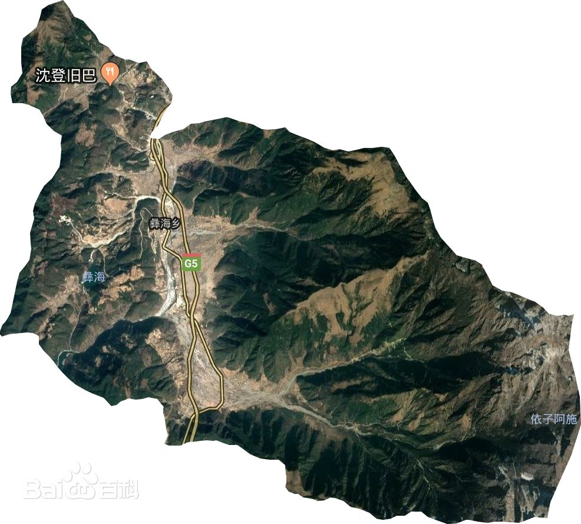
- 彝海镇地势东高西低、北高南低。
- 彝海镇属亚热带季风气候，其特点是降雨充沛、雨热同季、干湿季分明，冬春多大风，春多冰雹，春旱突出。多年平均气温11.8℃，1月平均气温2.4℃，极端最低气温-9℃（1964年2月4日）；7月平均气温19.9℃，极端最高气温29℃（1984年5月25日）。
- 彝海镇境内有一高山湖泊，1981年地名普查时以彝族聚居区而起名“彝海”，因此得名。

### 雅安市

#### 石棉县

栗子坪彝族乡
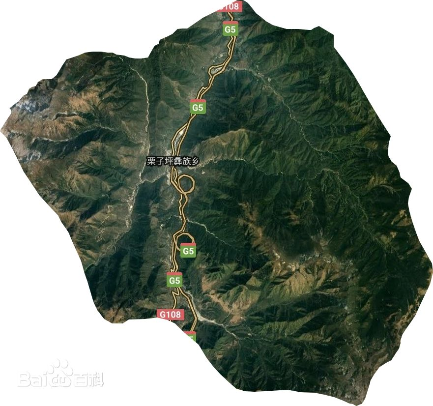
- 栗子坪彝族乡地处高中山，东、西部地势较高，境内最高点位于伊牛河南山，海拔4834米；最低点位于楠桠河谷地，海拔1600米。
- 栗子坪彝族乡属[亚热带季风气候](https://baike.baidu.com/item/%E4%BA%9A%E7%83%AD%E5%B8%A6%E5%AD%A3%E9%A3%8E%E6%B0%94%E5%80%99/875538?fromModule=lemma_inlink)为基带的山地气候，其特点是夏天多雨少酷热，冬天少雨无严塞，多年平均气温11.7℃，最低月均气温4℃，最高月均气温19℃，生长期年平均220天，无霜期年平均220天，0℃以上持续期320天，年平均降水日数为168天，降雨集中在每年的7—10月，9月最多。
- 栗子坪彝族乡，因此地原有一片李子树，后取其谐音得名。
- 看地图上的双环，应该是这一段最艰难的爬坡路段了。

擦罗乡
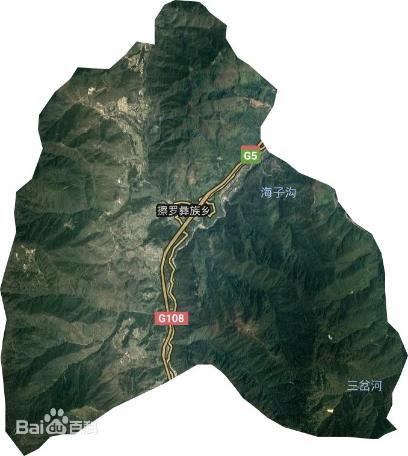
- 擦罗彝族乡地处高中山，地势南向北逐渐降低，境内最高点位于十大股，海拔2100米；最低点位于上里，海拔1500米。
- 擦罗彝族乡属亚热带季风气候为基带的山地气候，其特点是夏天多雨少酷热，冬天少雨无严寒，多年平均气温14.4℃，最低月均气温3.5℃，最高月均气温22℃，生长期年平均365天。
- 超市3个。
- 擦罗彝族乡，根据彝语鹿子聚集的地方译音得名。

石棉县
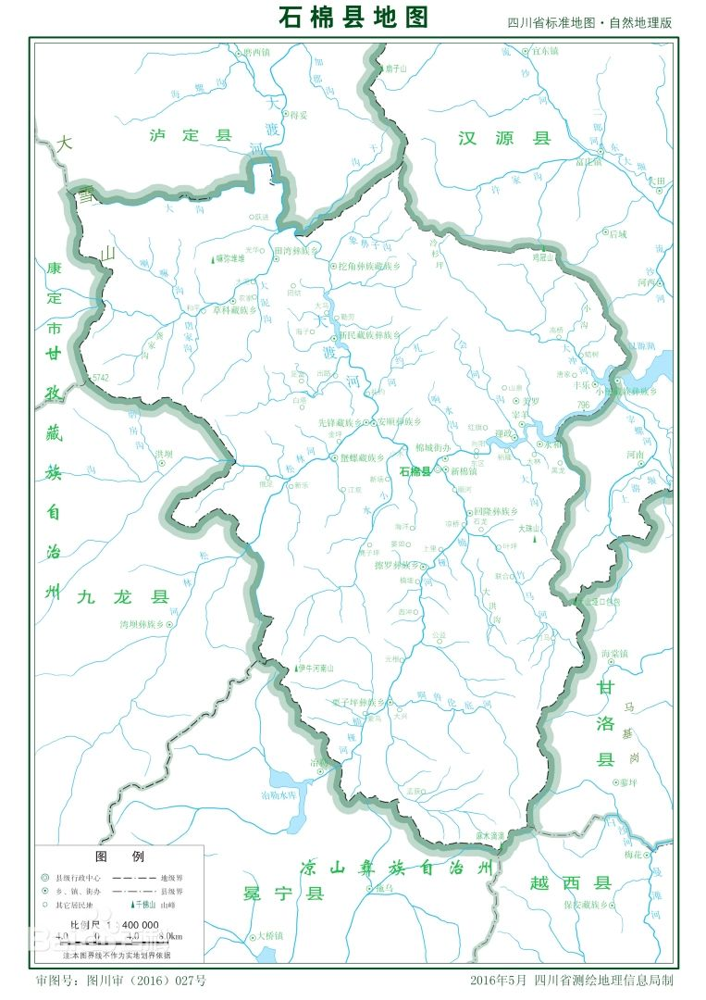
- 石棉县因境域富藏优质石棉而得名，是全国唯一以矿命名的县。
- 石棉县由于断层破坏和冰川、河流的下切和冲积，县境地貌在形态上极高山、高山、中山、低山、丘陵、河谷阶地、河谷平坝等种类齐全。以中山为主，高山次之。中山区（海拔1000~3500米），约占全县面积78%，高山区（海拔3500米以上）约占全县面积12%（包含5000米以上极高山），海拔1000米以下低山区约占8%（包含丘陵），河谷平坝约占2%。地形西南高、东北低，山脉多呈南北纵列。神仙梁子主峰海拔5793米，为雅安市最高点，丰乐河坝为全县海拔最低点。
- 石棉县属中纬度亚热带季风气候为基带的山地气候。受地形影响，气候垂直分布明显，大渡河谷对水汽来源和风速、风向影响较大，形成以下气候特征：夏雨集中、夜雨多、少暴风、无秋绵雨；冬春干旱、山风强烈，夏秋多雨；气温随高度降低、降水随高度增加变化显著。主要气象灾害有干旱、暴雨、洪涝、大风、冰雹、雷电。以县城为例：年平均气温17.4℃，最冷月为1月，平均气温8.4℃，最热月为7月，平均气温24.7℃，历年极端最高气温40.9℃（出现在2022年8月）。
- 石棉县境内水系是以大渡河为干流的混合水系，呈一海棠叶脉状分布。
- 王岗坪景区，位于石棉县挖角乡，距离石棉县城54千米，是距离成都最近的可以观看海拔7000米以上贡嘎群峰的四季景观地，是连接成都至康定的茶马古道，曾是汉代雅州第一“省会”——牦牛县古县址。2022年2月，被评为国家AAAA级旅游景区。

迎政乡
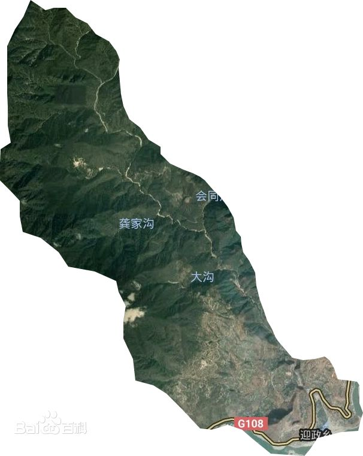
- 超市4个
- 迎政乡地处中低山，地势北高南低，境内最高点位于大坪山，海拔2822米；最低点位于八牌河沟，海拔860米，
- 迎政乡属[亚热带季风气候](https://baike.baidu.com/item/%E4%BA%9A%E7%83%AD%E5%B8%A6%E5%AD%A3%E9%A3%8E%E6%B0%94%E5%80%99/875538?fromModule=lemma_inlink)为基带的山地气候，其特点是雨大多集中在夏季，多夜雨，而冬春干燥，有强烈山风。多年平均气温17℃，无霜期年平均240天，年平均日照时数1245.6小时，年平均降水量777.4毫米。
- 迎政乡，取“人民喜迎新政府成立”之意得名。

丰乐乡
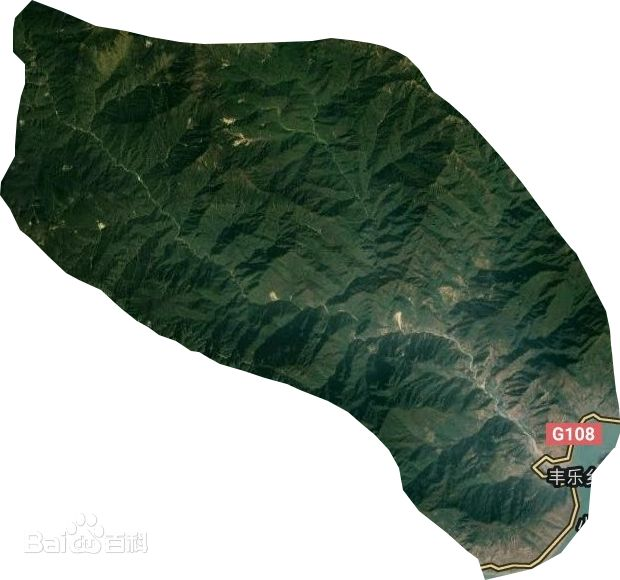
- 丰乐乡地处中高山，地势北、西部高，东、南部低。境内最高点位于黄草山，海拔3667米；最低点位于瀑布沟水电站湖面，海拔850米。
- 丰乐乡属[亚热带季风气候](https://baike.baidu.com/item/%E4%BA%9A%E7%83%AD%E5%B8%A6%E5%AD%A3%E9%A3%8E%E6%B0%94%E5%80%99/875538?fromModule=lemma_inlink)为基带的山地气候，其特点是夏天多雨少酷热，冬天少雨无严寒，多年平均气温17.6℃，最低月均气温8.2℃，最高月均气温25.4℃，生长期年平均359.7天，无霜期年平均326天，0℃以上持续期365天，年平均降水日数为186天，降雨集中在每年的6—9月，7月最多。
- 丰乐乡，取“五谷丰收，生活安乐”之意得名。

#### 汉源县

汉源县
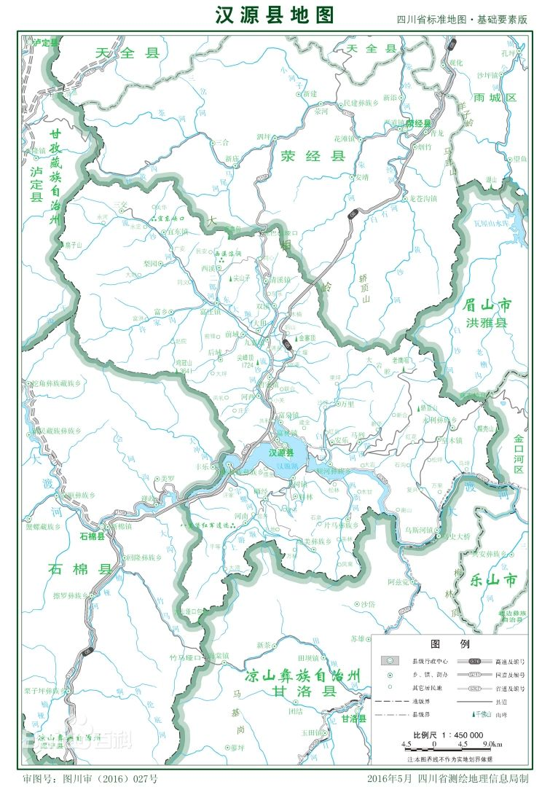
- 汉源县古名笮都，属蜀国。周慎靓王五年（公元前316年），秦灭蜀国设蜀郡，属蜀郡管辖。隋仁寿四年（604年），以汉源之名于今九襄镇置汉源县。清雍正七年（1729年），改称[清溪县](https://baike.baidu.com/item/%E6%B8%85%E6%BA%AA%E5%8E%BF/4701513?fromModule=lemma_inlink)。民国三年（1914年），因清溪县与贵州省的青溪县同名同音，复改名汉源县。1955年10月，属四川省雅安地区。2000年12月，雅安撤地设市，属四川省雅安市。 [1]汉源县文化底蕴深厚，汉文化与藏文化、中原文化与南诏文化在这里融汇，南丝绸之路、茶马古道是中国古代交通贸易的重要通道，乐西抗战公路被誉为“血肉铸成的长路”。汉源县旅游资源丰富，境内有国家AAAA级旅游景区花海果乡旅游景区、国家AAA级旅游景区月亮湾.金钟山景区、中国花椒博览园等。
- 汉源县地处横断山脉北段东缘，地形以山地为主，西北高东南低，海拔最高点4021米，位于富乡乡境内马鞍山，最低点550米，位于永利乡境内白熊沟与大渡河汇合处，最大相对高差3471米。东北缘为邛崃山余脉南支大相岭，西北缘为邛崃山余脉飞越岭，南面为大凉山群峰。大渡河横穿东西，流沙河纵贯南北，形成了四周高山环绕，中部河谷低平的地势。
- 汉源县属亚热带季风性湿润气候，冬暖夏凉，四季分明。高地寒冷，河谷炎热，雨量偏少且不均，气候垂直变化大，县城年平均气温17.9度，无霜期300天，日照时数1475.8小时，年活动积温5844.7度，年均降雨量741.8毫米。
- 汉源县境内有成昆铁路、成雅铁路，并建有[汉源站](https://baike.baidu.com/item/%E6%B1%89%E6%BA%90%E7%AB%99/8516247?fromModule=lemma_inlink)（乌斯河站）、[长河坝站](https://baike.baidu.com/item/%E9%95%BF%E6%B2%B3%E5%9D%9D%E7%AB%99/7268592?fromModule=lemma_inlink)两个火车站。
- 汉源县有国家AAAA级旅游景区1个（花海果乡旅游景区）。
- 汉源花椒、汉源金花梨、汉源樱桃酒。

富泉镇
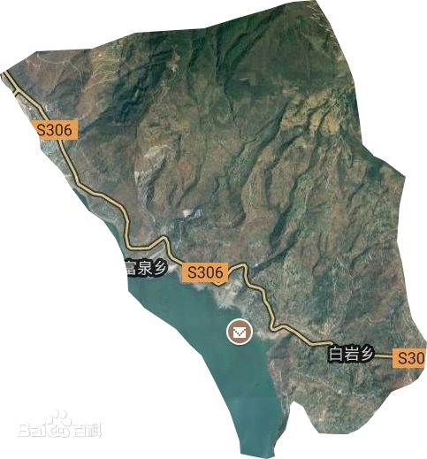
- 超市15个。
- 富泉镇属亚热带气候。
- 富泉镇，以泉多、水好而得名。

唐家镇
- 超市25个。
- 唐家镇地势东高西低，东北、东南高，西北、西南低，东面狭窄，略呈尖形，渐次向南北扩展，延伸至西面流沙河略呈弧形，东西长，南北短，状似树叶。主要山峰有龙顶山、曹家山、木叶岭等，境内最高点海拔2687米，最低点海拔840米。
- 唐家镇，因境域盛产甘蔗熬糖，糖、唐谐音，故名唐家。

九襄镇
- 超市142个。
- 九襄镇地形地貌境内最高点位于晒日坡，海拔3138米；最低点位于龙洞湾，海拔700米。
- 九襄镇属亚热带气候，其特点是四季分明，昼夜温差大，河谷炎热，春季干旱少雨，夏季炎热，秋季凉爽干燥，冬季干冷，多年平均气温16.7℃，无霜期年平均300天，年平均日照时数153.9小时，年平均降水量653.8毫米。
- 九襄镇“戊戌变法”时人口满5万成立自治会镇所，于是将周围诸乡并入，得九个半乡，因“乡”与“襄”同音，故名九襄。
- 九襄镇境内有一座石牌坊，它位于古代南方丝绸之路的官马大道上，[九襄石牌坊](https://baike.baidu.com/item/%E4%B9%9D%E8%A5%84%E7%9F%B3%E7%89%8C%E5%9D%8A/1043245?fromModule=lemma_inlink)建造于清朝道光二十九年，历时9年。整个牌坊融合我国古代戏曲的川剧艺术于一体，按“忠、孝、节、义”为主题雕成48本传统川剧戏曲，浮雕169幅，大小人物570余个，或独自一人，或群集于一，但皆自然真实，面目清晰，毫发毕现。整座石牌坊的建筑造型非常奇特，着重突出了本地的乡土人文和佛家文化思想的融合。

清溪镇
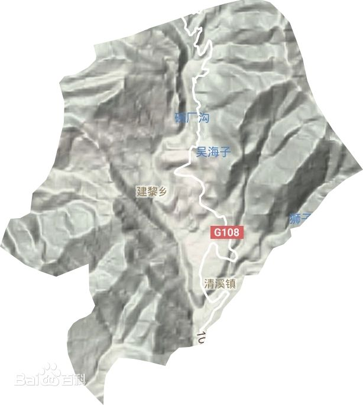
- 超市3个。
- 清溪镇地处大相岭山脉西南麓的高山缓坡台地，地势西北高、东南低。
- 清溪镇属亚热带季节气候，其特点是四季分明，昼夜温差大，河谷炎热，春季干旱少雨，夏季炎热，秋季凉爽干燥，冬季干冷，多年平均气温11.5℃，无霜期年平均150天，年平均日照时数1200小时，年平均降水量733.1毫米。

建黎乡
- 汉源县建黎乡位于大相岭支脉泥巴山南麓，属汉源最北端，地势西北高，东南低，海拔1700~2000米之间，乡域内坝、沟、岗、山多种地貌并存。

#### 荥经县

泗坪乡
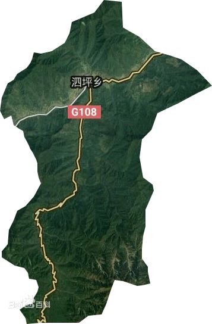

- 超市5个。
- 泗坪乡地势南高北低，三面环山，境内最高点海拔2940米，最低点海拔940米。
- 泗坪乡属亚热带季风气候，其特点是四季分明，雨热同季，光照充足，无霜期长，春季干旱多风，夏季雨量集中，秋季温和凉爽，冬季干冷少雪，多年平均气温13℃。
- 泗坪乡，因驻地有四块平地，缺少水故取名“泗坪”而得名。
- 感觉泥巴山最高处在这？

荥河镇
- 超市11个。
- 荥河镇地处荥经县北部中段，地势中间低，周围高，境内最高点位于大尖峰，海拔1832米；最低点位于孟家坝，海拔900米。
- 荥河镇属亚热带季风气候，其特点是四季分明，雨热同季，光照充足，无霜期长，春季干旱多风，夏季雨量集中，秋季温和凉爽，冬季干冷少雪，多年平均气温14℃，无霜期年平均192天，年平均日照时数943.01小时，年平均降水量1400毫米。
- 荥河镇，因驻地地处荥河北岸而得名。

民建乡
- 民建彝族乡地处四川盆地与青藏高原的过渡地带，属盆周山区，地势北高南低，境内最高点位于观望坪，海拔1500米；最低点位于竹阳村二组，海拔800米。
- 民建彝族乡属亚热带季风气候，其特点是冬无严寒，夏无酷暑，气候温和，四季分明，雨量充沛。多年平均气温15℃，1月平均气温5.3℃，极端最低气温-6.2℃（1991年12月28日）；7月平均气温24℃，极端最高气温34.4℃（2011年6月24日），无霜期年平均299天，年平均日照时数900小时，年平均降水量1232.9毫米。

花滩镇
- 花滩镇位于县城西部，108国道贯穿全境。

荥经县
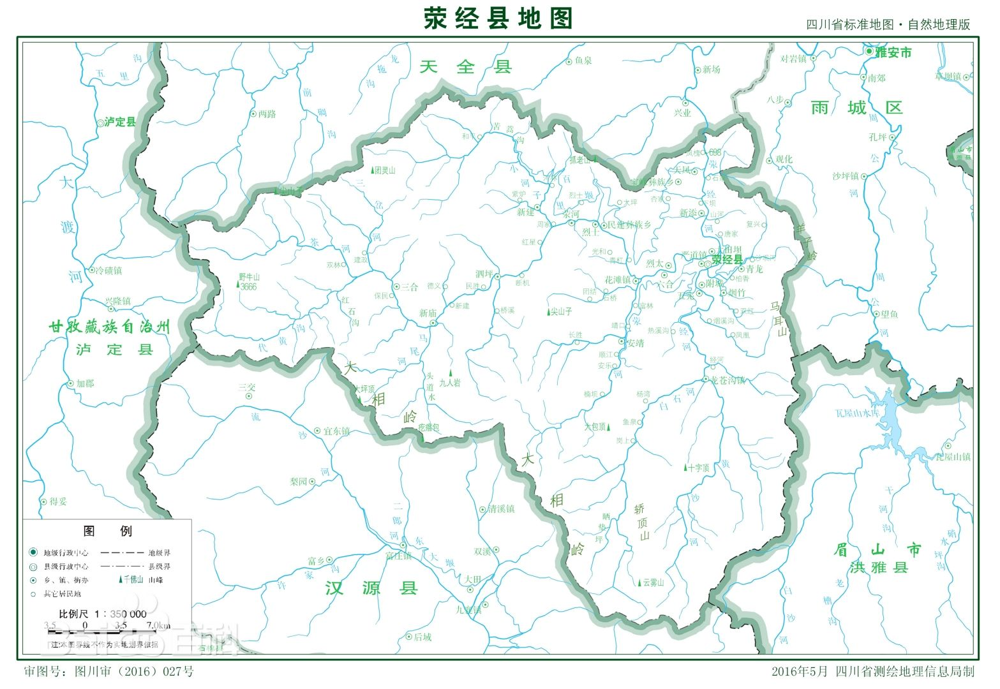
- 荥经县位于四川盆地与青藏高原的过渡地带，属盆周山区。地势西南高、东北低。县境内四面群山环抱，河流切割强烈，岭谷高低悬殊。全县最高处在西部牛背山，海拔3666米；最低处在新添镇荥经河岸，海拔700米；相对高差2996米。
- 荥经县境内有主要河流11条，连同支流、溪、沟34条，均属青衣江水系。
- 荥经县气候属亚热带湿润季风气候类型。气候特征：四季分明，气候温暖，雨量充沛，多夜雨。根据气象站（海拔高760米）资料，多年平均气温为12.4℃，大于等于10℃积温为3792℃，最热月7月均温为22℃，最冷1月均温为-7℃。年降水量1232.9毫米，相对湿度83%。因地形地貌的差异，境内不同海拔高度气候差异较大。一般海拔每上升100米，气温下降0.6℃左右，降水量山区与邛崃山、二郎山、雷波、屏山一线构成“华西雨屏”。因此，山区降水量远大于县城，根据观察测定，在区域内龙苍沟乡的一带（金山）年降雨量可达2603.1毫米。
- 国家一级图书馆：荥经县图书馆。 国家一级文化馆：荥经县文化馆。
- 荥经县因荥河、经河两条河汇合于县城而得名。
- 全国重点文物保护单位3处。
- 荥经棒棒鸡、荥经竹笋、荥经天麻。

青龙镇
- 青龙镇地势东南高、西北低。地形从东南至西北依次为高山、河谷、平坝、浅丘，呈马鞍状地形，境内最高点位于马耳山，海拔2474米；最低点位于柏香村一组海拔800米。
- 青龙镇属亚热带季风气候，其特点是冬无严寒，夏无酷暑，气候温和，四季分明，雨量充沛，多年平均气温14℃，1月平均气温5.3℃，极端最低气温-6.2℃（1991年12月28日）；7月平均气温24℃，极端最高气温34.4℃（2011年6月24日）。
- 青龙镇，因境内青龙嘴山而得名。

#### 雨城区

八步镇
- 超市1个。
- 八步镇地势西南高、东北低。境内最高点位于老君山主峰，海拔1742米；最低点位于枫木村一组，海拔851米。
- 八步镇，因当地人称此处一奇石为八步石而得名。

周公山镇
- 该镇地处周公山区域，地热水资源开发潜力大。

雅安市

#### 名山镇

永兴街道
- 2019年12月，撤销永兴镇，设立永兴街道

前进镇
- 前进镇于2019年12月经四川省人民政府批准设立，由原红岩乡和前进乡部分行政村合并而成。该镇以茶叶种植为基础产业，同步发展食用菌、生态旅游等多元业态

解放乡

### 成都市

#### 蒲江县

大兴镇
- 综合商店24个。

#### 新津区

宝墩镇
- 综合商店21个。
- 宝墩镇地处成都平原，地势平坦。境内最高点位于双石村3组，海拔479米；最低点位于迎先村10组，海拔455米。

新津区
- “五津”取于初唐诗人王勃名句“城阙辅三秦，风烟望五津”。并因其曾为县治所在地，县城故于1992年以五津命名。

花桥街道
- 综合商店27个。

花源街道
- 花源的”源”原为”园”，因境域曾为”明蜀王花园地”而得名。1996年建镇时，将”园”改为”源”。

#### 双流区

黄水镇
- 超市7个。
- 原黄水镇旧称黄水河，因杨柳河“水漱山石色异”得名。

黄甲街道

怡心街道
- 怡心街道主要由原公兴片区和协和片区组成，地名系源于华阳县[一心](https://baike.baidu.com/item/%E4%B8%80%E5%BF%83/3731799?fromModule=lemma_inlink)地区。怡心街道的名称取自于[天府怡心湖](https://baike.baidu.com/item/%E5%A4%A9%E5%BA%9C%E6%80%A1%E5%BF%83%E6%B9%96/58314525?fromModule=lemma_inlink)。

