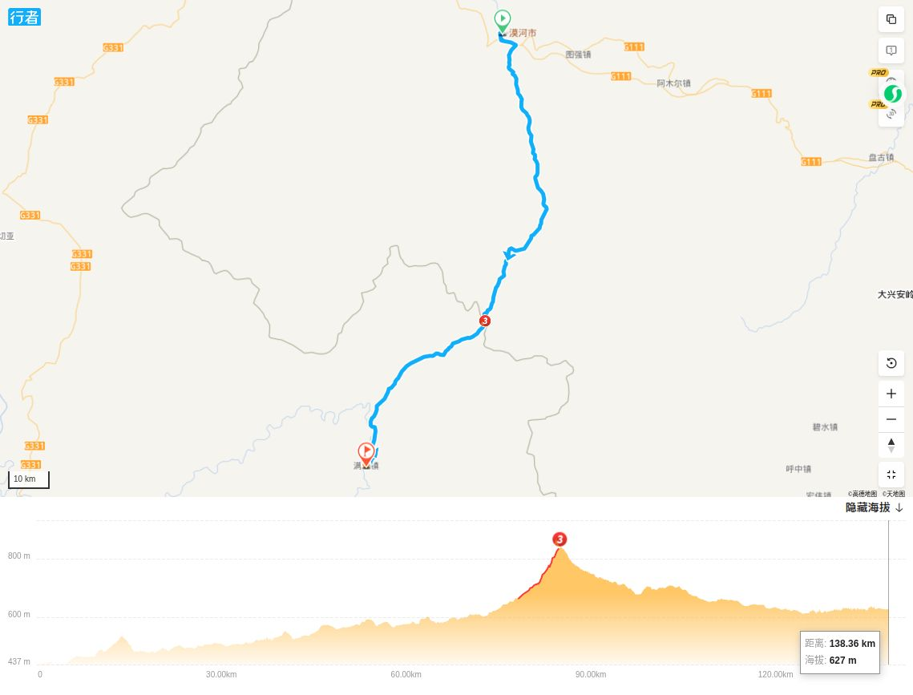
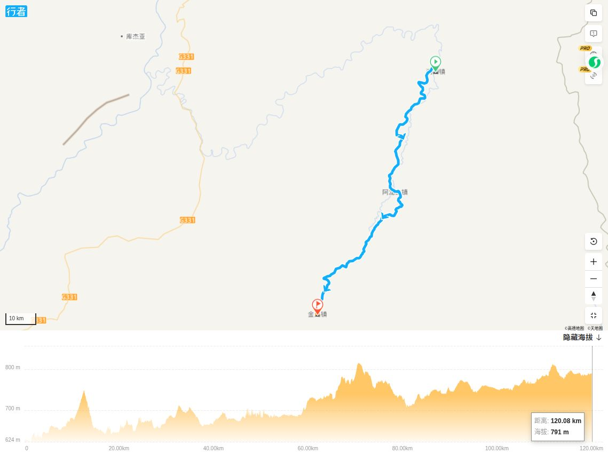
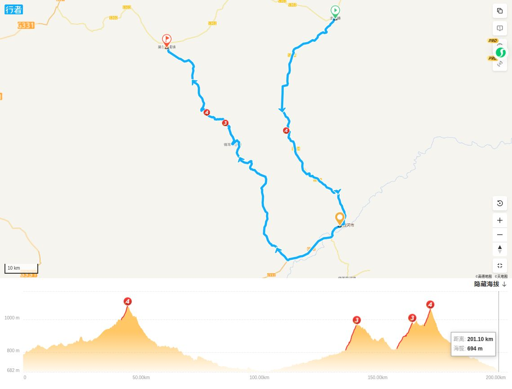
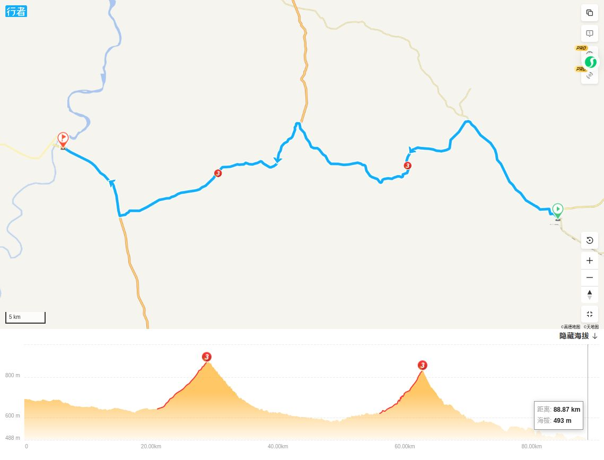
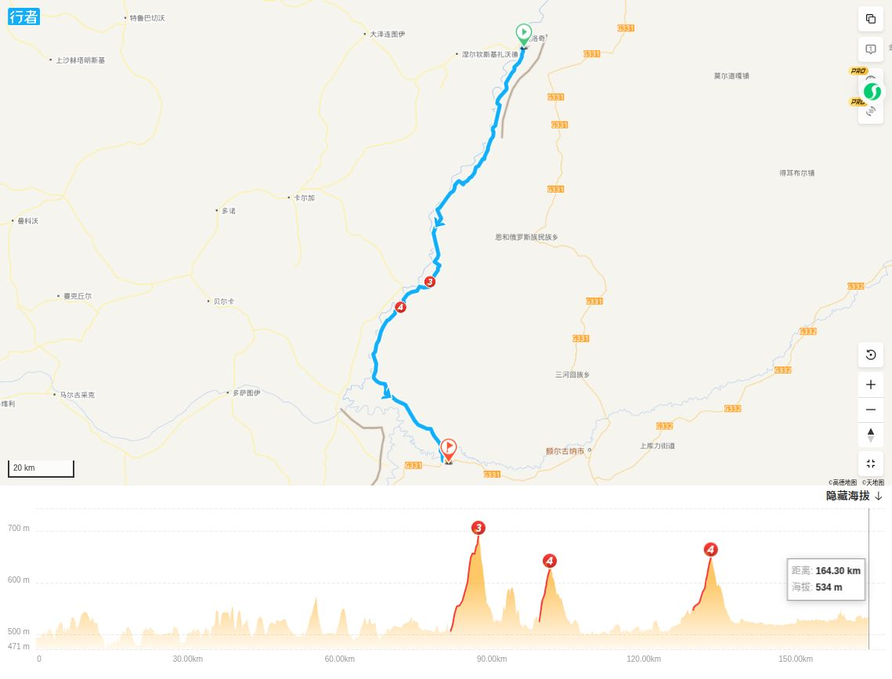
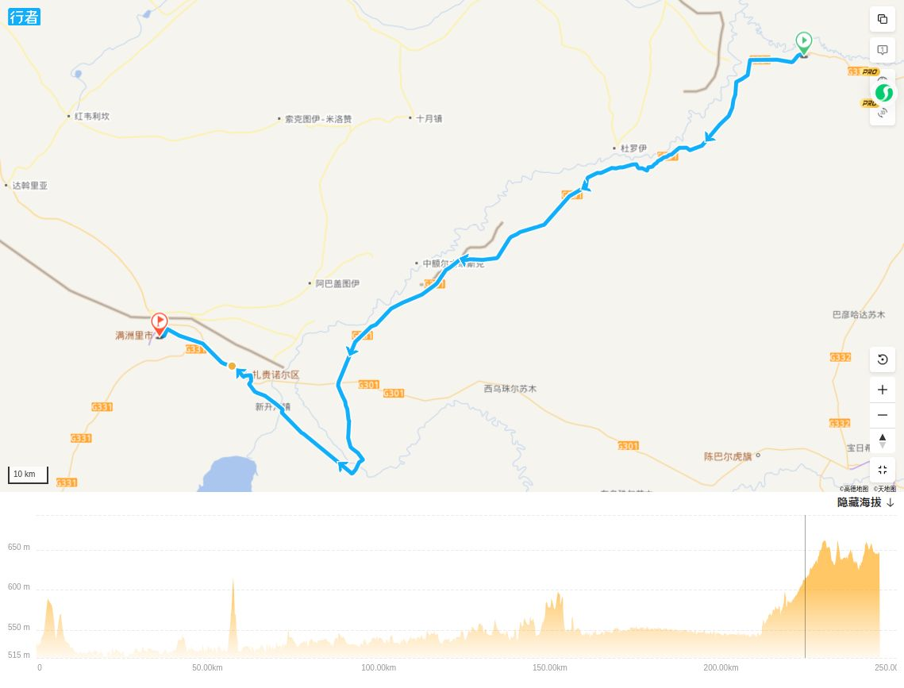

从漠河到满洲里的一条线路。与G331有部分重合。

连接了517的行者路书，看一下路线。

## 漠河到满归

基本沿S219和S204。140公里，路线有点长，不知道中间有没有住宿点。

快到满归时，中间有个ao鲁古雅乡，

## 满归至金山镇

120公里，中间至少可以看到一个镇，所以这段没什么问题。

## 金河镇到莫尔道嘎镇

不明白为什么要绕路，这一段200多公里，但看起来沿路有不少镇子。如果不绕路那就很近了。

## 莫尔道嘎至室韦

这一段90公里，看起来比较正常。

## 室韦至黑山头镇

这一段160多公里，而且好象有几个大坡，这必须要想法分两天了。看地图是沿着边界线走的，也就是沿着额尔古纳河右岸，一路上没有村镇，只有一些卡子，不知道能不能住人。如果不追求沿边的话，中间有几个乡镇，问题可能不大。

## 黑山头镇至满洲里

这一段240多公里，肯定无法一天完成。基本上是沿G331走的。中间看地图有186彩云河等景区，可能会有住宿，但都在两头。还需要详细了解。