策克（口岸）、额济纳旗、金塔、酒泉、肃南、祁连、海晏、湟源、西宁、平安、化隆、尖扎、同仁、泽库、河南、若尔盖、松潘、茂县、汶川、都江堰、郫都、成都、仁寿、井研、犍为、沐川、绥江、永善、大关、昭通、会泽、寻甸、嵩明、昆明、晋宁、玉溪、峨山、元江、墨江、宁洱、普洱、勐腊、磨憨（口岸）

## 里程表

|       | 海拔   | 间隔  | 合计里程 |
| ----- | ---- | --- | ---- |
| 广福    | 400  | 0   | 0    |
| 井研县   | 400  | 109 | 109  |
| 沐川县   | 400  | 101 | 210  |
| 五指峰隧道 | 900  | 29  | 239  |
| 绥江县   | 500  | 37  | 276  |
| 桧溪镇   | 400  | 58  | 334  |
| 永善县   | 800  | 41  | 375  |
| 务基镇   | 1400 | 32  | 407  |
| 马楠乡   | 1800 | 33  | 440  |
| 莲峰镇   | 2100 | 36  | 476  |
| 上高桥乡  | 1800 | 45  | 521  |
| 靖安镇   | 1900 | 13  | 534  |
| 昭通市   | 2000 | 30  | 564  |
| 桃源乡   | 2300 | 26  | 590  |
| 江底镇   | 1400 | 30  | 620  |
| 乐业镇   | 1800 | 50  | 670  |
| 者海镇   | 2100 | 27  | 697  |
| 雨碌乡   | 2100 | 24  | 721  |
| 待补镇   | 2400 | 31  | 752  |
| 驾车乡   | 2600 | 30  | 782  |
| 功山镇   | 1900 | 35  | 817  |
| 金所街道  | 2000 | 30  | 847  |
| 嵩明县   | 1900 | 28  | 875  |
| 官渡镇   | 1900 | 62  | 937  |

## 四川

### 成都市
#### 双流区
煎茶街道、绩田街道、

### 眉山市
#### 仁寿县
视高街道、文宫镇、大化镇、仁寿县、满兴镇、钟祥镇、慈航镇、

### 乐山市
#### 井研县
 一、基础概况

1. ‌**地理位置与区划**‌
    
    - 位于东经102°55′~104°00′、北纬28°25′~29°55′，总面积840平方公里3。
    - 辖14镇1街道、119个建制村（社区），总人口38万（截至2025年）9。
2. ‌**自然环境**‌
    
    - 属中亚热带湿润气候，冬无严寒、夏无酷暑，雨量充沛但分布不均3。

---

二、历史与文化

1. ‌**历史沿革**‌
    
    - 隋开皇十一年（591年）置县，古为蜀国属地，因盐井兴盛得名“井研”314。
    - 唐代盐业繁荣，茫溪河为重要盐业基地；宋代盐井扩产推动经济发展14。
2. ‌**文化遗产**‌
    
    - 保存雷畅故居（清代川西南最大民居群）、千佛岩唐代摩崖造像、汉代崖墓群等古迹13。
    - 亚洲第一大恐龙“井研马门溪龙”发掘地，化石现藏北京自然博物馆313。

---

三、经济发展

1. ‌**产业特色**‌
    
    - ‌**农业**‌：全国产粮大县、生猪调出大县、柑橘产业30强县，2024年培育国家级生猪核心育种场（年测定种猪4500头）911。
    - ‌**工业**‌：2025年实施“工业强县”攻坚行动，推进智能装备产业园建设612。
    - ‌**2024年经济数据**‌：GDP增长6.6%，固定资产投资增长7.1%12。
2. ‌**重点项目**‌
    
    - 2025年部署50项重点任务，涵盖资乐高速建设、茫溪河防洪治理、国企改制等领域512。

---

四、社会民生

1. ‌**教育成果**‌
    
    - 2025年高考特殊类上线率22.5%（231人），本科硬上线率61.5%（630人），井研中学600分以上特优生39人1。
    - 井研职中实现本科上线“零突破”1。
2. ‌**行政效能**‌
    
    - 县政府设28个职能机构，推行“井快办”政务改革，2025年目标GDP增长6.3%5。
    - 强化耕地保护（马踏片区永久基本农田12.18万亩）5。

---

五、文旅资源

- ‌**千佛古镇**‌：以唐代千佛岩为核心，整合雷畅故居、宋代邓若水遗址等资源，打造农旅融合示范区13。
- ‌**特产与美食**‌：井研台柚、马踏羊肉汤、大佛生态鱼等913。

- 集益镇
- 井研县
- 千佛镇
	- 千佛岩：位于千佛镇东砂岩石壁上，有佛龛若干，其中有大佛1尊，小佛1000尊。据清《光绪井研县志》记载：“东岩佛像长丈余，盖唐代伽兰也”，可知该摩崖造像建于唐代。传说该佛像与[乐山大佛](https://baike.baidu.com/item/%E4%B9%90%E5%B1%B1%E5%A4%A7%E4%BD%9B/142192?fromModule=lemma_inlink)同时建造。明代县人李如达有诗：“千佛岩头倚碧空，水光山色画图中。昙花遥映藤萝月，贝叶时翻杨柳风……”，可见当时此地礼佛之盛况。岩左侧有“聚仙洞”，籀文清晰可见，洞内泉水叮咚，四季不涸，又名“福泉”，岩上原建有福泉寺。
- 三江镇
	- 三江镇，因茫溪河、月波河、木瓜三河交汇于驻地集镇而得名。
	- 三江镇境内有三江宋塔十分有名，位于井研县城南13公里处的三江镇东头小山丘上，塔为密檐式砖木结构，塔身为须弥座四方形，通高28米，共13层。
- 马踏镇
	- 马踏镇，因镇人民政府驻马踏井而得名
- 王村镇

#### 五通桥区
五通桥，历史悠久，因盐而兴，有建制的历史2300多年。 [1]秦惠文王后元十四年（前312年），置[南安县](https://baike.baidu.com/item/%E5%8D%97%E5%AE%89%E5%8E%BF/22380723?fromModule=lemma_inlink)。1951年，析[犍为县](https://baike.baidu.com/item/%E7%8A%8D%E4%B8%BA%E5%8E%BF/296561?fromModule=lemma_inlink)第八区成立五通桥市。1964年，改为五通桥区。1985年，五通桥区改属乐山市。 [4]五通桥区花木科技园是四川乐山国家农业科技园区的重要组成部分。被农业部列为无规定动物疫病区缓冲区项目建设县，全国游泳之乡、长寿之乡。

- 金山镇
	- 镇名来历有两说：一是因附近山头光秃，秋草枯黄似金，故名金山；二是附近山头因盐业生产产生的煤渣二次燃烧火红似金色，故名金山 [3]。
- 五通桥区
	- 五通桥豆腐乳又称五通桥毛霉豆腐乳，得益于五通桥五通桥区特殊的地理气候条件产生的中国五通桥毛霉，五通桥豆腐乳香味浓郁、香气扑鼻、回味无穷。

#### 犍为县
- 寿保镇
	- 据传因场上长寿老人居多，并有百岁老人，当时的知县将场名更名为寿保场。
- 定文镇
	- 民国前名毛家寺，系毛氏族人所建寺庙，而得名毛家寺场。民国时期乡人认为毛家寺之名不雅，以本地曾出几位秀才而更名为定文场（另一种说法是取平定山下出文人之意）。
- 犍为县
	- 犍为地名较为独特，在《新华字典》里，对“犍”的唯一解释是：“犍[qián]为[wéi]，地名，在四川省。”犍为作为地名的出现，始于西汉。汉建元六年（前135年），设置犍为郡，领12县，县境属犍为郡南安县。北周保定三年（563年），置沉犀郡领武阳县，县境属沉犀郡武阳县。隋开皇三年（583年），废沉犀郡，改武阳县为犍为县。一直沿用至今。由此可见，犍为县因犍为郡而得名。
	- 嘉阳·桫椤湖景区位于四川省乐山市犍为县境内，核心区面积51平方千米，横跨芭沟镇、双溪镇、石溪镇三个行政区域。
	- [罗城古镇](https://baike.baidu.com/item/%E7%BD%97%E5%9F%8E%E5%8F%A4%E9%95%87/1246529?fromModule=lemma_inlink)始建于明末、成形于清代，坐落于椭圆形山丘顶上，呈东西向纺锤形布局，中间为全长209米的青石板人行道，两侧是被称为“凉厅子”的沿街长廊和穿斗木架结构民居，具有典型的西南集镇建筑风格。古镇布局呈船形，从空中俯看犹如“山顶一只船、云中一把梭”，被建筑界称作“东方诺亚方舟”，曾获四川十大古镇、省级文物保护单位、全省历史文化名镇、全省首批“历史文化名街”、天府旅游名镇等荣誉称号，是国家AAAA级旅游景区。
	- [世界茉莉博览园](https://baike.baidu.com/item/%E4%B8%96%E7%95%8C%E8%8C%89%E8%8E%89%E5%8D%9A%E8%A7%88%E5%9B%AD/60556029?fromModule=lemma_inlink)，为国家AAAA级旅游景区，核心区面积1300亩

#### 沐川县
- 富新镇
	- 镇域内G213国道贯穿双石村等重点区域
- 沐溪镇
	- 因有沐溪河流经境内而得名。
	- 超市217个。
	- 沐溪镇地处沐川县中部，东靠[大楠镇](https://baike.baidu.com/item/%E5%A4%A7%E6%A5%A0%E9%95%87/10238206?fromModule=lemma_inlink)，西界[武圣乡](https://baike.baidu.com/item/%E6%AD%A6%E5%9C%A3%E4%B9%A1/10235526?fromModule=lemma_inlink)，北连[富新镇](https://baike.baidu.com/item/%E5%AF%8C%E6%96%B0%E9%95%87/24207648?fromModule=lemma_inlink)。
	- 沐溪镇地势西南较高，东北略低。
	- 沐溪镇属亚热带湿润季风气候，全年平均气温17.3℃，年平均降水量900毫米
- 沐川县
	- 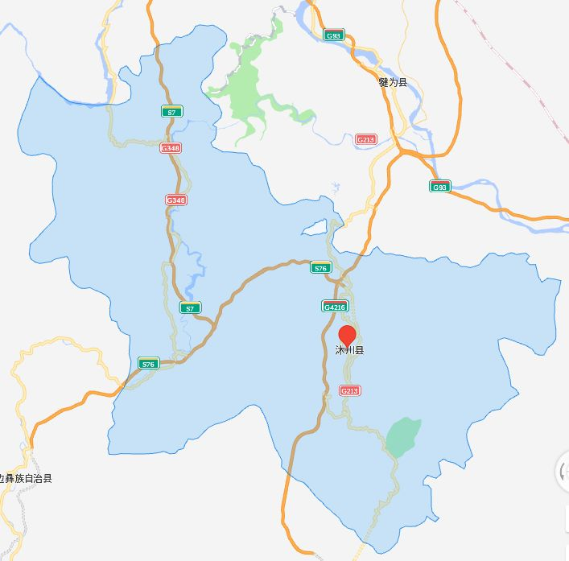
	- 四川省[乐山市](https://baike.baidu.com/item/%E4%B9%90%E5%B1%B1%E5%B8%82/2689579?fromModule=lemma_inlink)辖县，位于四川盆地西南边缘、乐山市南部，属[岷江](https://baike.baidu.com/item/%E5%B2%B7%E6%B1%9F/883255?fromModule=lemma_inlink)、[大渡河](https://baike.baidu.com/item/%E5%A4%A7%E6%B8%A1%E6%B2%B3/3380?fromModule=lemma_inlink)、[金沙江](https://baike.baidu.com/item/%E9%87%91%E6%B2%99%E6%B1%9F/461344?fromModule=lemma_inlink)之间的三角地带，东接[宜宾市](https://baike.baidu.com/item/%E5%AE%9C%E5%AE%BE%E5%B8%82/13827162?fromModule=lemma_inlink)，南连[屏山县](https://baike.baidu.com/item/%E5%B1%8F%E5%B1%B1%E5%8E%BF/1305566?fromModule=lemma_inlink)，西与[马边彝族自治县](https://baike.baidu.com/item/%E9%A9%AC%E8%BE%B9%E5%BD%9D%E6%97%8F%E8%87%AA%E6%B2%BB%E5%8E%BF/8745900?fromModule=lemma_inlink)、[峨边县](https://baike.baidu.com/item/%E5%B3%A8%E8%BE%B9%E5%8E%BF/10063584?fromModule=lemma_inlink)为邻，北和[沙湾区](https://baike.baidu.com/item/%E6%B2%99%E6%B9%BE%E5%8C%BA/7262078?fromModule=lemma_inlink)、[犍为县](https://baike.baidu.com/item/%E7%8A%8D%E4%B8%BA%E5%8E%BF/296561?fromModule=lemma_inlink)接壤。
	- 千佛岩摩崖造像，位于沐川县利店镇隆兴村，造像修建于明万历年间，分布在长33米，宽26米，距地表2米的岩壁上，共有86龛，600多尊造像。
	- 沐川草龙
	- 桃源山居是[国家AAAA级旅游景区](https://baike.baidu.com/item/%E5%9B%BD%E5%AE%B6AAAA%E7%BA%A7%E6%97%85%E6%B8%B8%E6%99%AF%E5%8C%BA/7574615?fromModule=lemma_inlink)，位于[沐溪镇](https://baike.baidu.com/item/%E6%B2%90%E6%BA%AA%E9%95%87/8521521?fromModule=lemma_inlink)三溪村，与城区隔河（沐溪河）相望。
	- 沐川县地势西南向东北倾斜，依次形成山、丘、坝三种地貌。县境内最高点位于利店镇境内的西密山，海拔1900.60米；最低点在箭板镇龙溪河岷江入口处，海拔306米。相对高差达1594.60米。地形以山地为主，山地占总面积的97%，在河流两岸，有少量平坝，为主要农耕区。
- 永福镇
	- 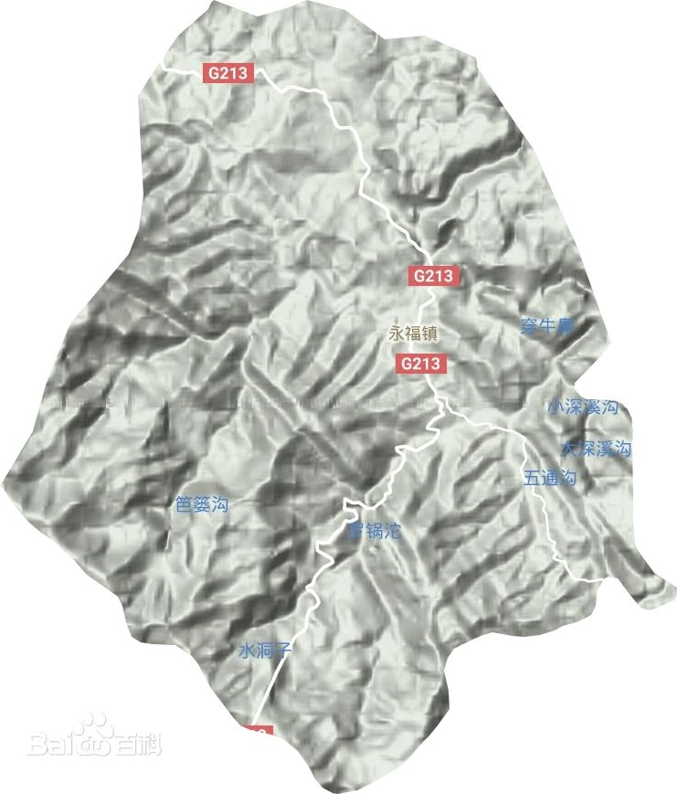
	- 永福镇地势西南高、东部低，境内山脉系五指山系，境内最高点位于南端的楠木村包儿山，海拔1794米；最低点穿牛鼻位于同溪、楠溪交汇处，海拔444米 [1]。
	- 超市21个。

### 宜宾市
#### 屏山县
出五指山峰隧道后进入屏山县。五指山隧道长4公里。地图显示有个大坡，但估计没有体现出隧道。

中都镇
- G213在镇边上过。
- 超市29个。

新市镇
- 新市镇属亚热带季风气候，其特点是四季温和、雨热同季、雨量充沛、无霜期长。春季干旱少雨，夏季雨量集中，秋季温和凉爽，冬季干冷少雪。多年平均气温16.4℃，1月平均气温6.6℃，极端最低气温1.8℃（1991年12月28日）；7月平均气温27.3℃。
- 超市35个。

## 云南

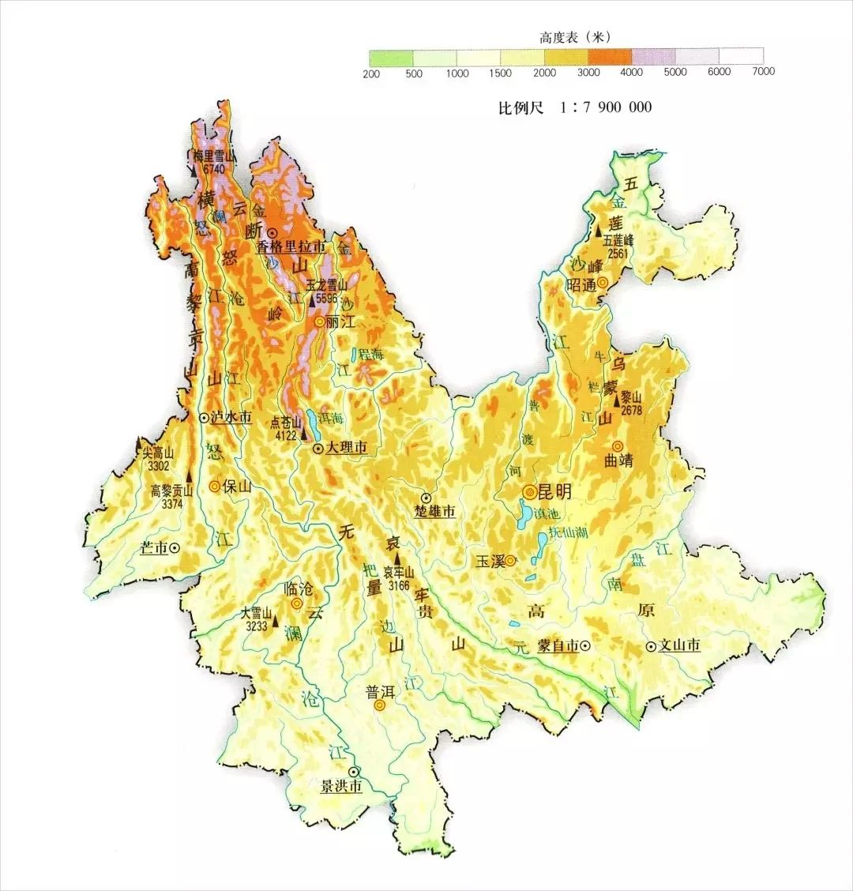

### 昭通市

#### 绥江县
- 南岸镇
	- 隶属于[云南省](https://baike.baidu.com/item/%E4%BA%91%E5%8D%97%E7%9C%81/18664752?fromModule=lemma_inlink)昭通市绥江县，地处[绥江县](https://baike.baidu.com/item/%E7%BB%A5%E6%B1%9F%E5%8E%BF/8606950?fromModule=lemma_inlink)西部，川滇两省交会处，东接中城镇大沙、农业，东南连绍廷，南与[永善县](https://baike.baidu.com/item/%E6%B0%B8%E5%96%84%E5%8E%BF/8607699?fromModule=lemma_inlink)青胜乡相邻，西北与[四川省](https://baike.baidu.com/item/%E5%9B%9B%E5%B7%9D%E7%9C%81/15626925?fromModule=lemma_inlink)宜宾市屏山县新市镇、[凉山彝族自治州](https://baike.baidu.com/item/%E5%87%89%E5%B1%B1%E5%BD%9D%E6%97%8F%E8%87%AA%E6%B2%BB%E5%B7%9E/2721144?fromModule=lemma_inlink)雷波县柑子乡隔江相望。
	- 超市6个。
	- 南岸镇地处金沙江河谷地带，地势南高北低。最高点位于团结粱子，海拔1801米；最低点位于胜利村大鹿溪金沙江岸，海拔330米。
	- 南岸镇多年平均气温17.2℃，1月平均气温6.8℃，7月平均气温26.5℃。
	- 元至元十三年（1276年），马湖蛮归附，设马湖府于夷都溪口，濒临马湖江（金沙江）南岸，镇由此得名。
- 绥江县
	- 绥江县，隶属[云南省](https://baike.baidu.com/item/%E4%BA%91%E5%8D%97%E7%9C%81/18664752?fromModule=lemma_inlink)[昭通市](https://baike.baidu.com/item/%E6%98%AD%E9%80%9A%E5%B8%82/2506155?fromModule=lemma_inlink)。位于[云贵高原](https://baike.baidu.com/item/%E4%BA%91%E8%B4%B5%E9%AB%98%E5%8E%9F/206171?fromModule=lemma_inlink)滇东北部边缘，东接[水富市](https://baike.baidu.com/item/%E6%B0%B4%E5%AF%8C%E5%B8%82/22861958?fromModule=lemma_inlink)，南连[盐津县](https://baike.baidu.com/item/%E7%9B%90%E6%B4%A5%E5%8E%BF/8505877?fromModule=lemma_inlink)，西与[永善县](https://baike.baidu.com/item/%E6%B0%B8%E5%96%84%E5%8E%BF/8607699?fromModule=lemma_inlink)接壤，西北和北部隔[金沙江](https://baike.baidu.com/item/%E9%87%91%E6%B2%99%E6%B1%9F/461344?fromModule=lemma_inlink)与四川[雷波县](https://baike.baidu.com/item/%E9%9B%B7%E6%B3%A2%E5%8E%BF/6861686?fromModule=lemma_inlink)、[屏山县](https://baike.baidu.com/item/%E5%B1%8F%E5%B1%B1%E5%8E%BF/1305566?fromModule=lemma_inlink)相邻，总面积761平方公里。
	- 地处四川盆地向云贵高原过渡地带，位于滇东北高原边缘，金沙江南岸斜坡上，属中山山原地貌，地势南高北低，相对高差1754米。
	- 绥江半边红李子，因果实向阳面呈紫红色，背面绿色，故名“半边红”。

#### 永善县
- 桧溪镇
	- 桧溪镇，隶属于[云南省](https://baike.baidu.com/item/%E4%BA%91%E5%8D%97%E7%9C%81/18664752?fromModule=lemma_inlink)昭通市永善县，地处[永善县](https://baike.baidu.com/item/%E6%B0%B8%E5%96%84%E5%8E%BF/8607699?fromModule=lemma_inlink)东北部，东与细沙乡相连，南与团结乡毗邻，西与四川省渡口、谷米两乡隔[金沙江](https://baike.baidu.com/item/%E9%87%91%E6%B2%99%E6%B1%9F/461344?fromModule=lemma_inlink)相望，北与[青胜乡](https://baike.baidu.com/item/%E9%9D%92%E8%83%9C%E4%B9%A1/4029927?fromModule=lemma_inlink)接壤。
	- 超市8个。
	- 最高点位于城墙岩，海拔2402米；最低点位于红石盘，海拔350米。
	- 多年平均气温16.8℃，1月平均气温6℃，极端最低气温2℃；7月平均气温34℃，极端最高气温38℃
	- 超市8个。
	- 桧溪镇因流经小镇的小溪长满桧树得名桧溪。
- 渡口镇
- 永善县
	- 中国第三、世界第四大水电站 [15]溪洛渡水电站所在地。
	- 1727年云贵总督[鄂尔泰](https://baike.baidu.com/item/%E9%84%82%E5%B0%94%E6%B3%B0/0?fromModule=lemma_inlink)剿平米贴，并由朝庭钦命县名为“永善”，意为永远服从管教。
	- 永善县境内重峦叠嶂，峰高谷深，地势南高北低，海拔悬殊，伍寨乡大坪子最高海拔3199.5米，青胜乡民胜村倒犁子金沙江出境处最低海拔320米。
- 务基镇
	- 务基镇，隶属于[云南省](https://baike.baidu.com/item/%E4%BA%91%E5%8D%97%E7%9C%81/18664752?fromModule=lemma_inlink)[昭通市](https://baike.baidu.com/item/%E6%98%AD%E9%80%9A%E5%B8%82/2506155?fromModule=lemma_inlink)永善县，地处[永善县](https://baike.baidu.com/item/%E6%B0%B8%E5%96%84%E5%8E%BF/8607699?fromModule=lemma_inlink)县城的西部，东接[溪洛渡镇](https://baike.baidu.com/item/%E6%BA%AA%E6%B4%9B%E6%B8%A1%E9%95%87/3971800?fromModule=lemma_inlink)，南连[黄华镇](https://baike.baidu.com/item/%E9%BB%84%E5%8D%8E%E9%95%87/1250057?fromModule=lemma_inlink)，西北与[四川](https://baike.baidu.com/item/%E5%9B%9B%E5%B7%9D/212569?fromModule=lemma_inlink)[凉山彝族自治州](https://baike.baidu.com/item/%E5%87%89%E5%B1%B1%E5%BD%9D%E6%97%8F%E8%87%AA%E6%B2%BB%E5%B7%9E/2721144?fromModule=lemma_inlink)雷波县隔江相望。
	- 超市43个。
	- 务基镇多年平均气温14℃，极端最低气温-7.0℃（1994年12月8日）；7月平均气温17.6℃，极端最高气温37.0℃。
	- 务基镇原为彝族土目乌鸡驻地，后雅化为务基。
- 莲峰镇
	- 隶属于[云南省](https://baike.baidu.com/item/%E4%BA%91%E5%8D%97%E7%9C%81/18664752?fromModule=lemma_inlink)昭通市永善县，地处[永善县](https://baike.baidu.com/item/%E6%B0%B8%E5%96%84%E5%8E%BF/8607699?fromModule=lemma_inlink)西南部，东与墨翰乡接壤，南接茂林、大兴镇，西邻[黄华镇](https://baike.baidu.com/item/%E9%BB%84%E5%8D%8E%E9%95%87/24890?fromModule=lemma_inlink)并与四川[凉山彝族自治州](https://baike.baidu.com/item/%E5%87%89%E5%B1%B1%E5%BD%9D%E6%97%8F%E8%87%AA%E6%B2%BB%E5%B7%9E/2721144?fromModule=lemma_inlink)金阳县隔江相望，北与水竹乡交界。
	- 超市52个
	- 莲峰镇多年平均气温12.1℃，1月平均气温1.2℃，7月平均气温25.1℃，最低月均气温-1.8℃（2008年12月），最高月均气温26.8℃（2011年7月）
	- 莲峰镇因镇人民政府驻地背靠五莲锋，山峰突兀，五峰并峙，形似五瓣莲花初绽，故名莲峰。

#### 大关县
- 上高桥乡
	- 超市17个。
	- 上高桥回族彝族苗族乡属山地地貌，最高点位于大寨村牛角湾子，海拔2648米；最低点位于龙堡村大石板，海拔1221米，平均海拔2121.9米。
	- 上高桥回族彝族苗族乡多年平均气温2℃，年平均降水量1200毫米，年积雪3个月。降雨集中在每年的6~8月。
- 靖安镇
	- 隶属于云南省昭通市[大关县](https://baike.baidu.com/item/%E5%A4%A7%E5%85%B3%E5%8E%BF/8606931?fromModule=lemma_inlink)， [8]位于[昭阳区](https://baike.baidu.com/item/%E6%98%AD%E9%98%B3%E5%8C%BA/1199914?fromModule=lemma_inlink)、大关县、[永善县](https://baike.baidu.com/item/%E6%B0%B8%E5%96%84%E5%8E%BF/8607699?fromModule=lemma_inlink)三县区结合部，东与昭阳区[盘河乡](https://baike.baidu.com/item/%E7%9B%98%E6%B2%B3%E4%B9%A1/736092?fromModule=lemma_inlink)接壤，南与昭阳区[青岗岭回族彝族乡](https://baike.baidu.com/item/%E9%9D%92%E5%B2%97%E5%B2%AD%E5%9B%9E%E6%97%8F%E5%BD%9D%E6%97%8F%E4%B9%A1/4763803?fromModule=lemma_inlink)毗邻，西与昭阳区[洒渔乡](https://baike.baidu.com/item/%E6%B4%92%E6%B8%94%E4%B9%A1/6844010?fromModule=lemma_inlink)相连，北与大关县[高桥乡](https://baike.baidu.com/item/%E9%AB%98%E6%A1%A5%E4%B9%A1/3567455?fromModule=lemma_inlink)、永善县[茂林镇](https://baike.baidu.com/item/%E8%8C%82%E6%9E%97%E9%95%87/16137933?fromModule=lemma_inlink)交界。
	- 超市15家。
	- 靖安镇多年平均气温10℃
	- 靖安镇原名小堡子，为古代驻兵地，后因匪患频繁，取“绥靖安宁”之意得名靖安。

#### 昭阳区
- 青岗岭乡
	- 青岗岭回族彝族乡，隶属于[云南省](https://baike.baidu.com/item/%E4%BA%91%E5%8D%97%E7%9C%81/18664752?fromModule=lemma_inlink)昭通市昭阳区，地处昭阳城区北部，东南与[北闸街道](https://baike.baidu.com/item/%E5%8C%97%E9%97%B8%E8%A1%97%E9%81%93/57256178?fromModule=lemma_inlink)、旧圃镇接壤，西与[洒渔镇](https://baike.baidu.com/item/%E6%B4%92%E6%B8%94%E9%95%87/58499846?fromModule=lemma_inlink)相连，北与[靖安镇](https://baike.baidu.com/item/%E9%9D%96%E5%AE%89%E9%95%87/53989454?fromModule=lemma_inlink)接界。
	- 超市30个。
	- 青岗岭回族彝族乡地处二半山区，东、南、西三面群山环绕，中部为坝子，地势平坦；山区沟谷纵横，山大坡陡。最高点位于火石地，海拔2800米；最低点位于大营，海拔1860米。

#### 昭通市
- 昭通，古称“乌蒙”，来自人名，后成为地名。自秦开“五尺道”，汉筑“南夷道”之后，西汉置朱提县，蜀汉置朱提郡，唐设乌蒙府。清雍正九年（1731年），云贵总督鄂尔泰上疏称：“乌者黑也，蒙者不通也；乌则昭之，蒙则通之”，建议将乌蒙改为昭通，昭通的名字便由此而来。
- 昭通是云、贵、川三省的文化交流的中心和物资集散地，是长江经济带等国家重大战略的交汇节点，是云南连接长江经济带和成渝双城经济圈的重要通道。
- 秦汉间为[夜郎国](https://baike.baidu.com/item/%E5%A4%9C%E9%83%8E%E5%9B%BD/2560850?fromModule=lemma_inlink)地。
- 市境内中心城市年平均气温在11.7℃-20.9℃之间，年平均日照1273.3小时。最冷气温出现在1月，月平均气温在1℃~12℃之间，最热温度出现在7月，月平均气温在20℃~27℃之间。
- 昭通市博物馆。
- 水富港跃升为千万吨级枢纽港口，3000吨级船舶可沿长江直达上海。
- 昭通是云贵川三省的重要门户，素有“鸡鸣三省”之称。
- 汉代和两晋时期，人们把今乌蒙山、五莲峰一带的文化称之为“朱提文化”。

永丰镇
	- 超市58个。
	- 永丰镇地处昭通坝子之南，地势南高北低，中部及北部地平缓，东部多为缓坡山头。
	- 永丰镇年平均气温12℃，无霜期年均225天，年均降雨量750毫米。
	- 永丰镇因辖区内永丰水库而得名，意为“永保丰收”。

#### 鲁甸县

- 桃源回族乡
	- 隶属于[云南省](https://baike.baidu.com/item/%E4%BA%91%E5%8D%97%E7%9C%81/18664752?fromModule=lemma_inlink)昭通市鲁甸县，地处[鲁甸县](https://baike.baidu.com/item/%E9%B2%81%E7%94%B8%E5%8E%BF/8505860?fromModule=lemma_inlink)东部，东与昭阳区永丰镇为邻，南接江底镇，西与[文屏镇](https://baike.baidu.com/item/%E6%96%87%E5%B1%8F%E9%95%87/9827945?fromModule=lemma_inlink)接壤，北与[茨院回族乡](https://baike.baidu.com/item/%E8%8C%A8%E9%99%A2%E5%9B%9E%E6%97%8F%E4%B9%A1/9828104?fromModule=lemma_inlink)相连。
	- 超市2个。
	- 桃源回族乡境内最高点位于东南小黑山，海拔2475米；最低点位于桃源河入昭阳区处，海拔1900米。
	- 清雍正初年改土归流，回、汉民族相继迁入，因有一片桃树林，故称桃园，后演称桃源。
	- [拖姑清真寺](https://baike.baidu.com/item/%E6%8B%96%E5%A7%91%E6%B8%85%E7%9C%9F%E5%AF%BA/1614564?fromModule=lemma_inlink)位于昭通市鲁甸县城东部约10公里的桃源回族乡拖姑村，始建于雍正八年（1730年），寺四周良田环绕，河堤蜿蜒，树木成荫，田外山丘环抱，环境幽静，是云南省五大古寺之一。
- 江底镇
	- 隶属于[云南省](https://baike.baidu.com/item/%E4%BA%91%E5%8D%97%E7%9C%81/18664752?fromModule=lemma_inlink)昭通市鲁甸县，地处[鲁甸县](https://baike.baidu.com/item/%E9%B2%81%E7%94%B8%E5%8E%BF/8505860?fromModule=lemma_inlink)东南部，东与[贵州省](https://baike.baidu.com/item/%E8%B4%B5%E5%B7%9E%E7%9C%81/20475641?fromModule=lemma_inlink)毕节市[威宁彝族回族苗族自治县](https://baike.baidu.com/item/%E5%A8%81%E5%AE%81%E5%BD%9D%E6%97%8F%E5%9B%9E%E6%97%8F%E8%8B%97%E6%97%8F%E8%87%AA%E6%B2%BB%E5%8E%BF/10536903?fromModule=lemma_inlink)江畔乡毗邻，南与[云南省](https://baike.baidu.com/item/%E4%BA%91%E5%8D%97%E7%9C%81/18664752?fromModule=lemma_inlink)曲靖市会泽县梨园乡隔牛栏江相望，西与火德红镇接壤，北与文屏镇、[桃源回族乡](https://baike.baidu.com/item/%E6%A1%83%E6%BA%90%E5%9B%9E%E6%97%8F%E4%B9%A1/9828078?fromModule=lemma_inlink)相连。
	- 江底镇地处乌蒙山系与五莲峰山系西南交会地带。地势北高南低、东西对峙、中部突起。北部属高二半山区，占总面积的三分之二，海拔2100米以上。境内最高峰大黑山位于东部，海拔2717米；最低点位于江底村，海拔1298米。
	- 江底镇多年平均气温11.5℃，主要经济作物为油料作物、烤烟、蔬菜。无霜期年平均200天，年平均降水量约1100毫米。海拔2100米以下，年平均气温15℃
	- 江底镇原称大水井乡。清雍正八年（1730年），当地住民在该地一泉水处修一较大水井，故名大水井。2006年，人民政府搬迁江底村潘寨后改为江底。

### 曲靖市

#### 会泽县
- 迤车镇
	- 迤（yí）车镇位于[会泽县](https://baike.baidu.com/item/%E4%BC%9A%E6%B3%BD%E5%8E%BF/704089?fromModule=lemma_inlink)北部，东邻[马路乡](https://baike.baidu.com/item/%E9%A9%AC%E8%B7%AF%E4%B9%A1/1437155?fromModule=lemma_inlink)，南接[乐业镇](https://baike.baidu.com/item/%E4%B9%90%E4%B8%9A%E9%95%87/699970?fromModule=lemma_inlink)，西邻[纸厂乡](https://baike.baidu.com/item/%E7%BA%B8%E5%8E%82%E4%B9%A1/5228017?fromModule=lemma_inlink)和[昭通市](https://baike.baidu.com/item/%E6%98%AD%E9%80%9A%E5%B8%82/2506155?fromModule=lemma_inlink)[巧家县](https://baike.baidu.com/item/%E5%B7%A7%E5%AE%B6%E5%8E%BF/8607681?fromModule=lemma_inlink)，北与[昭通市](https://baike.baidu.com/item/%E6%98%AD%E9%80%9A%E5%B8%82/2506155?fromModule=lemma_inlink)[鲁甸县](https://baike.baidu.com/item/%E9%B2%81%E7%94%B8%E5%8E%BF/8505860?fromModule=lemma_inlink)和[贵州](https://baike.baidu.com/item/%E8%B4%B5%E5%B7%9E/37015?fromModule=lemma_inlink)省隔江相望，处于两省（[云南](https://baike.baidu.com/item/%E4%BA%91%E5%8D%97/206207?fromModule=lemma_inlink)、[贵州](https://baike.baidu.com/item/%E8%B4%B5%E5%B7%9E/37015?fromModule=lemma_inlink)）四县（[会泽](https://baike.baidu.com/item/%E4%BC%9A%E6%B3%BD/7902079?fromModule=lemma_inlink)、[巧家](https://baike.baidu.com/item/%E5%B7%A7%E5%AE%B6/764393?fromModule=lemma_inlink)、[鲁甸](https://baike.baidu.com/item/%E9%B2%81%E7%94%B8/8502438?fromModule=lemma_inlink)、[威宁](https://baike.baidu.com/item/%E5%A8%81%E5%AE%81/5856245?fromModule=lemma_inlink)）的交界处，距[会泽县](https://baike.baidu.com/item/%E4%BC%9A%E6%B3%BD%E5%8E%BF/0?fromModule=lemma_inlink)城54公里，距[昭通市](https://baike.baidu.com/item/%E6%98%AD%E9%80%9A%E5%B8%82/2506155?fromModule=lemma_inlink)76公里，有[会泽](https://baike.baidu.com/item/%E4%BC%9A%E6%B3%BD/7902079?fromModule=lemma_inlink)“北大门”之称。
	- 迤车一名为彝语，“迤”为水，“扯”为谷，意思是种谷的好地方。
	- 迤车镇属乌蒙山区，形成了西南高，东北低的地形，最高的是阮家屋基背后仙人脚迹山，海拔2772米。最低的阿都的卡子河，海拔1605米。
	- 迤车镇境内年平均降雨量789毫米，年平均气温14.4℃，立体气候明显。
	- 迤车镇镇内国道213线穿境而过，全长600米、高165米的亚洲第一公路钢构高架桥横跨牛栏江。
- 乐业镇
	- 云南省曲靖市会泽县下辖镇，地处会泽县中部偏北，东连[者海镇](https://baike.baidu.com/item/%E8%80%85%E6%B5%B7%E9%95%87/4671410?fromModule=lemma_inlink)、[矿山镇](https://baike.baidu.com/item/%E7%9F%BF%E5%B1%B1%E9%95%87/4109523?fromModule=lemma_inlink)、[火红乡](https://baike.baidu.com/item/%E7%81%AB%E7%BA%A2%E4%B9%A1/4539714?fromModule=lemma_inlink)，南与[金钟镇](https://baike.baidu.com/item/%E9%87%91%E9%92%9F%E9%95%87/3298799?fromModule=lemma_inlink)相连，西邻[迤车镇](https://baike.baidu.com/item/%E8%BF%A4%E8%BD%A6%E9%95%87/2134066?fromModule=lemma_inlink)、[大桥乡](https://baike.baidu.com/item/%E5%A4%A7%E6%A1%A5%E4%B9%A1/5202643?fromModule=lemma_inlink)，北与马路乡接壤。
	- 超市12个。
	- 乐业镇地处乌蒙山区，地势南高北低。境内山高谷深，山峦起伏，呈西高东低走势，地势高低差异较大。全境地形为一条南北走向的槽子。
	- 乐业镇属亚热带季风气候。其特点是春季温暖，干燥少雨；夏无酷暑，雨量集中；秋季温凉，天高气爽；冬无严寒，日照充足。多年平均气温13.6℃，最热月7月平均气温19.9℃，最冷月1月平均气温5.5℃。
- 者海镇
	- 云南省曲靖市会泽县辖镇，地处会泽县东南部，东邻[大井镇](https://baike.baidu.com/item/%E5%A4%A7%E4%BA%95%E9%95%87/8906287?fromModule=lemma_inlink)，南接[新街乡](https://baike.baidu.com/item/%E6%96%B0%E8%A1%97%E4%B9%A1/9551731?fromModule=lemma_inlink)、[雨碌乡](https://baike.baidu.com/item/%E9%9B%A8%E7%A2%8C%E4%B9%A1/3767286?fromModule=lemma_inlink)，西连[乐业镇](https://baike.baidu.com/item/%E4%B9%90%E4%B8%9A%E9%95%87/699970?fromModule=lemma_inlink)、[金钟镇](https://baike.baidu.com/item/%E9%87%91%E9%92%9F%E9%95%87/8799?fromModule=lemma_inlink)，北与[矿山镇](https://baike.baidu.com/item/%E7%9F%BF%E5%B1%B1%E9%95%87/4109523?fromModule=lemma_inlink)接壤。 [2]辖区总面积365平方千米。
	- 超市26个。
	- 者海镇地形为坝区、半山区、山区阶梯状分布。
	- 者海镇多年平均气温12.6℃，极端最高气温31.4℃。
	- 者海镇因坝子中有湖，名者家海而得名。
- 雨碌乡
	- 云南省曲靖市会泽县辖乡，地处会泽县城东南部，东、东南与[宣威市](https://baike.baidu.com/item/%E5%AE%A3%E5%A8%81%E5%B8%82/10165889?fromModule=lemma_inlink)、大井乡接壤，南接[鲁纳乡](https://baike.baidu.com/item/%E9%B2%81%E7%BA%B3%E4%B9%A1/4889328?fromModule=lemma_inlink)，西南接[待补镇](https://baike.baidu.com/item/%E5%BE%85%E8%A1%A5%E9%95%87/4540185?fromModule=lemma_inlink)，西连[新街乡](https://baike.baidu.com/item/%E6%96%B0%E8%A1%97%E4%B9%A1/9551731?fromModule=lemma_inlink)，北、东北与[者海镇](https://baike.baidu.com/item/%E8%80%85%E6%B5%B7%E9%95%87/4671410?fromModule=lemma_inlink)相连。
	- 超市10个。
	- 雨碌乡地势由东北走向西南，地形呈“三架梁子，两条槽子”，即阳山梁子、陡红梁子、迤车河梁子和雨碌槽子、牛栏江槽子。
	- 雨碌乡属亚温带气候，多年平均气温12.7℃。
	- 雨碌乡因彝语音译而得名，为小龙潭之意。
	- 雨碌乡有世界最窄的“会泽大地缝”，全长10公里
- 待补镇
	- 待补镇，云南省曲靖市会泽县下辖镇，地处会泽县南部，东接[鲁纳乡](https://baike.baidu.com/item/%E9%B2%81%E7%BA%B3%E4%B9%A1/4889328?fromModule=lemma_inlink)，南连[驾车乡](https://baike.baidu.com/item/%E9%A9%BE%E8%BD%A6%E4%B9%A1/5486363?fromModule=lemma_inlink)，西邻昆明市[东川区](https://baike.baidu.com/item/%E4%B8%9C%E5%B7%9D%E5%8C%BA/4701546?fromModule=lemma_inlink)，北与[金钟镇](https://baike.baidu.com/item/%E9%87%91%E9%92%9F%E9%95%87/3298799?fromModule=lemma_inlink)接壤。距县城28千米。
	- 超市6个。
	- 待补镇地处驾车梁子北端，地形分为山地、坝子、河谷，最大坝子是野马川，地势西南高东北低。
	- 待补镇多年年平均气温11.8℃。
	- 待补镇因彝语音译而得名。
- 驾车乡
	- 云南省曲靖市会泽县辖乡，地处会泽县西南部，东连[田坝乡](https://baike.baidu.com/item/%E7%94%B0%E5%9D%9D%E4%B9%A1/14583756?fromModule=lemma_inlink)，南接[寻甸县](https://baike.baidu.com/item/%E5%AF%BB%E7%94%B8%E5%8E%BF/5616967?fromModule=lemma_inlink)[功山镇](https://baike.baidu.com/item/%E5%8A%9F%E5%B1%B1%E9%95%87/6626062?fromModule=lemma_inlink)，西邻[东川区](https://baike.baidu.com/item/%E4%B8%9C%E5%B7%9D%E5%8C%BA/4701546?fromModule=lemma_inlink)，北依[待补镇](https://baike.baidu.com/item/%E5%BE%85%E8%A1%A5%E9%95%87/4540185?fromModule=lemma_inlink)，东北与上村乡接壤。
	- 超市3个。
	- 驾车乡境内山高谷深，地势西高东低，南北起伏，呈阶梯状递降，属典型的喀斯特地貌。
	- 驾车乡属高寒山区，地势起伏平缓，气候阴凉、潮湿。多年平均气温10.2℃，无霜期年平均170天
	- 驾车乡因彝语音译得名。“驾车”系彝语，为“驾车湾”的简写。“车”读音（ju），系彝语“纳吉乐”的谐音，“纳”为黑彝，“吉乐”为狼，打狼的地方，全意为“彝族打狼、狩猎的地方”。后演变为今天人们所称的驾车（che）。

### 昆明市

#### 录甸县
- 功山镇
	- 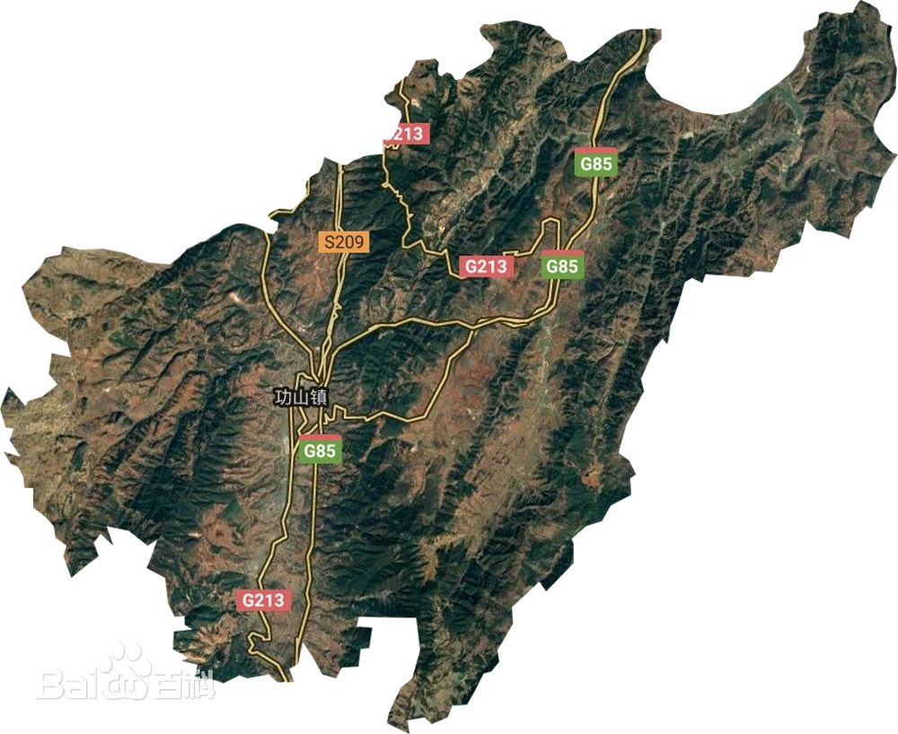
	- 隶属于云南省昆明市寻甸回族彝族自治县，地处[寻甸回族彝族自治县](https://baike.baidu.com/item/%E5%AF%BB%E7%94%B8%E5%9B%9E%E6%97%8F%E5%BD%9D%E6%97%8F%E8%87%AA%E6%B2%BB%E5%8E%BF/10539204?fromModule=lemma_inlink)北部，东接[河口镇](https://baike.baidu.com/item/%E6%B2%B3%E5%8F%A3%E9%95%87/58275480?fromModule=lemma_inlink)，南连[仁德街道](https://baike.baidu.com/item/%E4%BB%81%E5%BE%B7%E8%A1%97%E9%81%93/24484460?fromModule=lemma_inlink)，西依[甸沙乡](https://baike.baidu.com/item/%E7%94%B8%E6%B2%99%E4%B9%A1/6146178?fromModule=lemma_inlink)、[金源乡](https://baike.baidu.com/item/%E9%87%91%E6%BA%90%E4%B9%A1/6627407?fromModule=lemma_inlink)，北邻[东川区](https://baike.baidu.com/item/%E4%B8%9C%E5%B7%9D%E5%8C%BA/4701546?fromModule=lemma_inlink)、[会泽县](https://baike.baidu.com/item/%E4%BC%9A%E6%B3%BD%E5%8E%BF/704089?fromModule=lemma_inlink)，距寻甸回族彝族自治县城区26千米。
	- 超市54个。
	- 功山镇地处[滇东](https://baike.baidu.com/item/%E6%BB%87%E4%B8%9C/54558244?fromModule=lemma_inlink)高原，地势东南低、西北高，地形以[山地](https://baike.baidu.com/item/%E5%B1%B1%E5%9C%B0/1230947?fromModule=lemma_inlink)、[坝子](https://baike.baidu.com/item/%E5%9D%9D%E5%AD%90/5079090?fromModule=lemma_inlink)为主。
	- 功山镇属[亚热带季风气候](https://baike.baidu.com/item/%E4%BA%9A%E7%83%AD%E5%B8%A6%E5%AD%A3%E9%A3%8E%E6%B0%94%E5%80%99/875538?fromModule=lemma_inlink)，其特点是四季温差小，气候温和，雨热同季，光照充足，无霜期长，河谷区与高山区气候差别较大，干湿季分明，冬春干旱夏秋多雨；多年平均[气温](https://baike.baidu.com/item/%E6%B0%94%E6%B8%A9/1699232?fromModule=lemma_inlink)14.5℃，1月平均气温6.8℃，极端最低气温-4℃；7月平均气温21℃，极端最高气温30℃。
	- 功山镇因田坝上有一石山，中有一空洞，而得名“空山”。清雍正八年（1730年），以谐音改名为“功山”。
- 羊街镇
	- 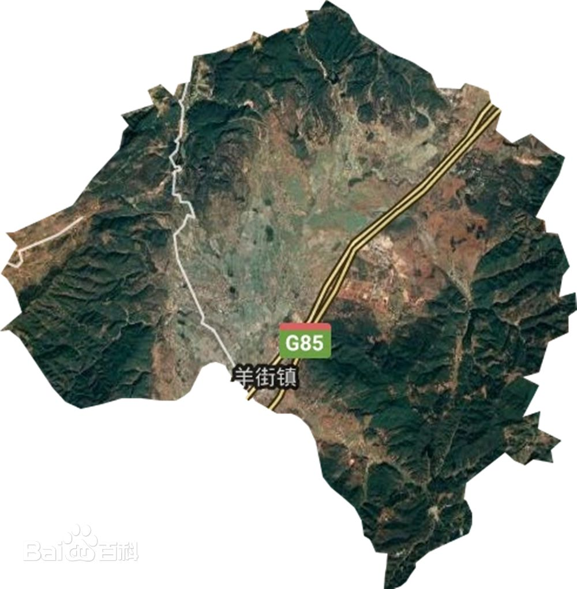
	- 隶属于[云南省](https://baike.baidu.com/item/%E4%BA%91%E5%8D%97%E7%9C%81/18664752?fromModule=lemma_inlink)[昆明市](https://baike.baidu.com/item/%E6%98%86%E6%98%8E%E5%B8%82/406229?fromModule=lemma_inlink)寻甸回族彝族自治县，地处[寻甸回族彝族自治县](https://baike.baidu.com/item/%E5%AF%BB%E7%94%B8%E5%9B%9E%E6%97%8F%E5%BD%9D%E6%97%8F%E8%87%AA%E6%B2%BB%E5%8E%BF/10539204?fromModule=lemma_inlink)南部，东、北接[仁德街道](https://baike.baidu.com/item/%E4%BB%81%E5%BE%B7%E8%A1%97%E9%81%93/24484460?fromModule=lemma_inlink)，南与[嵩明县](https://baike.baidu.com/item/%E5%B5%A9%E6%98%8E%E5%8E%BF/1166204?fromModule=lemma_inlink)交界，西与[先锋镇](https://baike.baidu.com/item/%E5%85%88%E9%94%8B%E9%95%87/58275436?fromModule=lemma_inlink)毗邻。
	- 超市115个。
	- 羊街镇地处小江断裂带，地势略为平缓，属[喀斯特地貌](https://baike.baidu.com/item/%E5%96%80%E6%96%AF%E7%89%B9%E5%9C%B0%E8%B2%8C/153617?fromModule=lemma_inlink)。
	- 羊街镇属[亚热带季风气候](https://baike.baidu.com/item/%E4%BA%9A%E7%83%AD%E5%B8%A6%E5%AD%A3%E9%A3%8E%E6%B0%94%E5%80%99/875538?fromModule=lemma_inlink)，其特点是冬无严寒，夏无酷暑，冬春较干燥；多年平均[气温](https://baike.baidu.com/item/%E6%B0%94%E6%B8%A9/1699232?fromModule=lemma_inlink)14.4℃；
	- 羊街镇因该地每逢属羊日进行集市贸易而得名。
#### 嵩明县
- 嵩明县
	- 云南省昆明市辖县，位于[云南省](https://baike.baidu.com/item/%E4%BA%91%E5%8D%97%E7%9C%81/18664752?fromModule=lemma_inlink)中部、[昆明市](https://baike.baidu.com/item/%E6%98%86%E6%98%8E%E5%B8%82/406229?fromModule=lemma_inlink)东北部。东与曲靖市[马龙区](https://baike.baidu.com/item/%E9%A9%AC%E9%BE%99%E5%8C%BA/22463360?fromModule=lemma_inlink)接壤，南与[宜良县](https://baike.baidu.com/item/%E5%AE%9C%E8%89%AF%E5%8E%BF/1166189?fromModule=lemma_inlink)、[官渡区](https://baike.baidu.com/item/%E5%AE%98%E6%B8%A1%E5%8C%BA/1166083?fromModule=lemma_inlink)为邻，西靠[盘龙区](https://baike.baidu.com/item/%E7%9B%98%E9%BE%99%E5%8C%BA/8751082?fromModule=lemma_inlink)，北连[寻甸县](https://baike.baidu.com/item/%E5%AF%BB%E7%94%B8%E5%8E%BF/5616967?fromModule=lemma_inlink)。
	- 嵩明县地处云贵高原西缘，山多地少。67%为山区及丘陵地，面积909平方千米；33%为坝区，其中嵩明坝子面积414平方千米，系云南第七大平坝。地势由西北向东南倾斜，山川多循北南方向展布，系云贵高原的山岳河谷地带。
	- 嵩明县地处内陆，云贵高原面缘，属北亚热带季风气候，夏无酷暑，冬无严寒，四季如春，多年平均气温14℃左右，极端最高气温35.7℃，极端最低气温-15.9℃。
- 杨林镇
	- 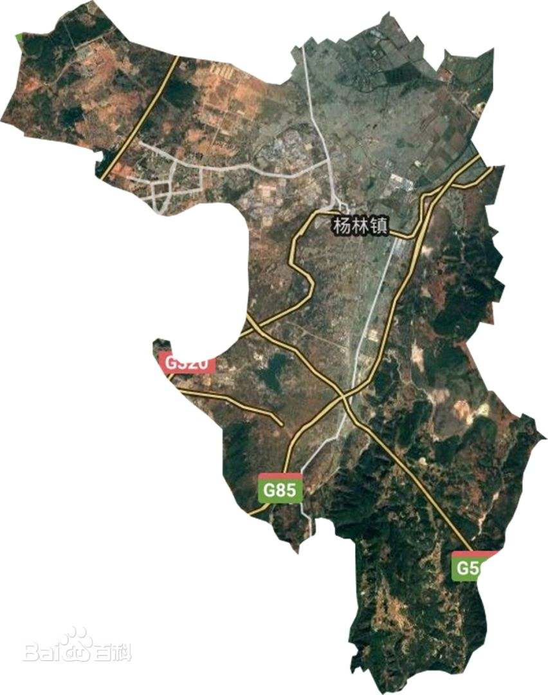
	- 属于云南省昆明市嵩明县，地处[嵩明县](https://baike.baidu.com/item/%E5%B5%A9%E6%98%8E%E5%8E%BF/1166204?fromModule=lemma_inlink)境南部，东邻[牛栏江镇](https://baike.baidu.com/item/%E7%89%9B%E6%A0%8F%E6%B1%9F%E9%95%87/6748325?fromModule=lemma_inlink)，南接[宜良县](https://baike.baidu.com/item/%E5%AE%9C%E8%89%AF%E5%8E%BF/1166189?fromModule=lemma_inlink)，西与昆明市[官渡区](https://baike.baidu.com/item/%E5%AE%98%E6%B8%A1%E5%8C%BA/1166083?fromModule=lemma_inlink)相连，北与[嵩阳街道](https://baike.baidu.com/item/%E5%B5%A9%E9%98%B3%E8%A1%97%E9%81%93/24465833?fromModule=lemma_inlink)相接，距嵩明县城12千米。
	- 超市42个。
	- 杨林镇地势由东南向西北倾斜。
	- 杨林镇属亚热带和暖温带混合型气候，其特点是冬暖夏凉，四季如春；多年平均气温14.1℃，1月平均气温5℃，极端最低气温-2℃（1983年1月8日）；7月平均气温24℃，极端最高气温30℃（2011年7月12日）；最低月均气温5℃，最高月均气温24℃；平均气温年较差26℃，最大日较差13℃。
	- 杨林镇古称羊林，以村后鹿元山东麓有石如羊而得名。元至元二年（1265年），改羊林为杨林。

#### 官渡区
- 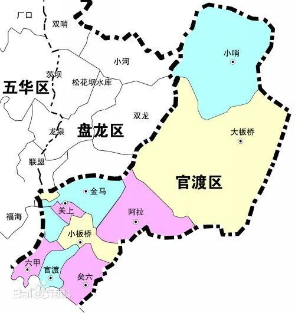
- “官渡“系指官渡古镇曾为滇池古渡口，因此而得名。
- 官渡区属北纬低纬度亚热带-高原山地季风气候，由于受印度洋[西南暖湿气流](https://baike.baidu.com/item/%E8%A5%BF%E5%8D%97%E6%9A%96%E6%B9%BF%E6%B0%94%E6%B5%81/0?fromModule=lemma_inlink)的影响，日照长、霜期短、年平均气温15℃，年均日照2200小时左右。
- [昆明火车站](https://baike.baidu.com/item/%E6%98%86%E6%98%8E%E7%81%AB%E8%BD%A6%E7%AB%99/8076523?fromModule=lemma_inlink)位于官渡区辖区内，贵昆、成昆、南昆、昆河铁路等主要铁路穿境而过。
- [昆明长水国际机场](https://baike.baidu.com/item/%E6%98%86%E6%98%8E%E9%95%BF%E6%B0%B4%E5%9B%BD%E9%99%85%E6%9C%BA%E5%9C%BA/0?fromModule=lemma_inlink)位于云南省昆明市官渡区[长水街道](https://baike.baidu.com/item/%E9%95%BF%E6%B0%B4%E8%A1%97%E9%81%93/62670763?fromModule=lemma_inlink)。
- 官渡饵块
- [官渡粑粑](https://baike.baidu.com/item/%E5%AE%98%E6%B8%A1%E7%B2%91%E7%B2%91/0?fromModule=lemma_inlink)又称乔麦粑粑。传统官渡粑粑是逢年过节或农闲时节，官渡人在自己家里烧起松毛火，用家里新鲜磨的小麦面粉发酵，约需3至4小时，发酵后加入少许碱面揉至表面光滑，每个重约二公两，食用时口感香、脆、甜、蓬松又有嚼头，且带有松毛的清香味。
- [官渡古镇](https://baike.baidu.com/item/%E5%AE%98%E6%B8%A1%E5%8F%A4%E9%95%87/0?fromModule=lemma_inlink)，入选云南省十大旅游名镇

#### 呈贡区
- “呈贡”为[彝语](https://baike.baidu.com/item/%E5%BD%9D%E8%AF%AD/9266945?fromModule=lemma_inlink)地名“柴谷”的译音，意为盛产稻谷的海湾坝子。呈贡是古滇文明的发源地，3万年前，“昆明人”就在呈贡龙潭山一带繁衍生息。春秋战国时期，呈贡属于古滇国的中心区。
- 呈贡区交通便利，沪昆、云桂等高铁及泛亚铁路的起点站昆明新南站落户呈贡，昆明南站是“一带一路”倡议规划中辐射东南亚、南亚的重要基础设施。
- 呈贡区内主要旅游景区（点）有斗南花市景区、昆明市呈贡区三台山公园景区、斗南花卉特色小镇、云上云特色小镇、花都海洋世界、七彩云南第壹城、第七街区、张天虚故居、冰心默庐、大古城魁阁、文庙等。
- 大部分海拔1910~2000米，相对高差不足100米，多低山与浅丘分布。
- 呈贡豌豆粉

#### 晋宁区
- 古滇都邑，郑和故里，为世界四大磷都之一。
- 连续两次获得“中国避暑休闲十佳县”荣誉称号。
- 东西横距66千米，南北纵距33千米，
- 属滇中高原浅割的中山地带，地势南高北低。
- 晋宁区属低纬度高原北亚热带季风气候区，冬无严寒，夏无酷暑，四季如春，干湿季分明。春冬有时干旱，稍有低温；夏秋潮湿，无高温酷热现象。
- 年平均气温14.8℃，最冷月（1月）的平均气温7.9℃，最热月（7月）的平均气温为19.6℃，年较差11.9℃。
- 晋宁区主要旅游景点有[盘龙寺](https://baike.baidu.com/item/%E7%9B%98%E9%BE%99%E5%AF%BA/22544?fromModule=lemma_inlink)、普照寺、宝泉寺、[郑和公园](https://baike.baidu.com/item/%E9%83%91%E5%92%8C%E5%85%AC%E5%9B%AD/15863529?fromModule=lemma_inlink)、[石寨山古墓群](https://baike.baidu.com/item/%E7%9F%B3%E5%AF%A8%E5%B1%B1%E5%8F%A4%E5%A2%93%E7%BE%A4/6213263?fromModule=lemma_inlink)、[梅树村自然保护区](https://baike.baidu.com/item/%E6%A2%85%E6%A0%91%E6%9D%91%E8%87%AA%E7%84%B6%E4%BF%9D%E6%8A%A4%E5%8C%BA/89847?fromModule=lemma_inlink)、核桃园“彝家乐”生态旅游景区、和璟苑湿地公园、大河河口湿地等。

上蒜镇
- 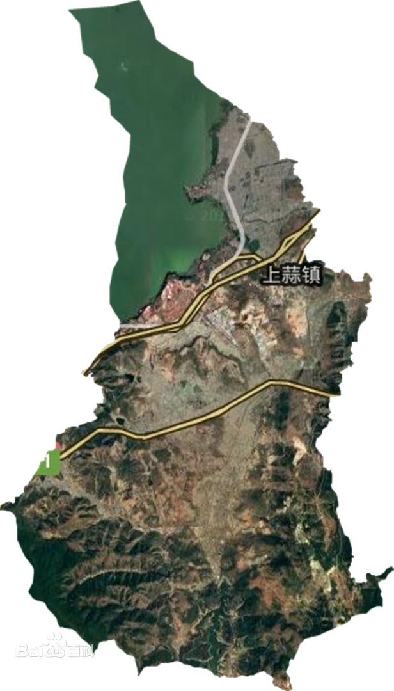
- 超市50个。
- 距晋宁区城15千米。
- 上蒜镇地势南高北低，逐渐倾斜，略呈长方形；西、南、中部形成一狭长的谷地和小盆地。
- 上蒜镇气候冬无严寒，夏无酷暑，四季如春，干温季分明，春冬有时干旱，稍有低温；夏秋潮湿，无高温酷热现象；多年平均气温14.6℃，年平均日照时数2279.2小时。
- 上蒜镇因镇人民政府原驻地为上蒜村而得名；上蒜村因曾盛产大蒜而得名。
- 上蒜镇古迹有唐末的摩崖石刻石将军；元代摩崖观音洞壁画等；石寨山出土了铜鼓、铜管、葫芦笙、钢编钟和双人舞、四人舞、八人舞的铜饰品。1956年，在石寨山第二次发掘出土了金质“[滇王之印](https://baike.baidu.com/item/%E6%BB%87%E7%8E%8B%E4%B9%8B%E5%8D%B0/601249?fromModule=lemma_inlink)”，与马迁《史记》中关于汉帝赐滇王金印的历史证载相吻合。

宝峰街道
- 现已形成以多肉植物、月季种植为核心的特色农业产业体系。

### 玉溪市

#### 红塔区
北城街道
	- 北距省会昆明80千米
	- 北城街道地势自西北向南倾斜，地形属中低山区，北部坝区逐渐缩小，向山地过渡。
	- 北城街道因辖区在中古城（今红塔区州城）之北得名，又名北古城，简称北城。

红塔区
	- 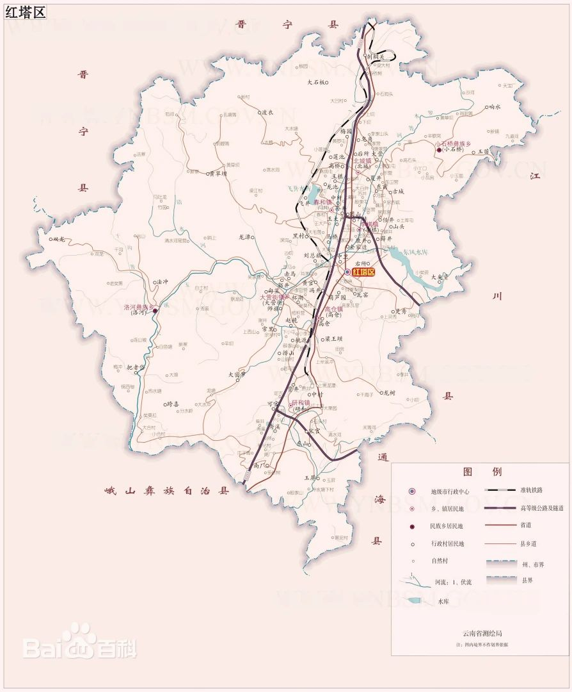
	- 213国道和1993年建成的与全国联网的[昆玉铁路](https://baike.baidu.com/item/%E6%98%86%E7%8E%89%E9%93%81%E8%B7%AF/384868?fromModule=lemma_inlink)纵贯南北，形成云南省南北[交通枢纽](https://baike.baidu.com/item/%E4%BA%A4%E9%80%9A%E6%9E%A2%E7%BA%BD/4713356?fromModule=lemma_inlink)。在历史上，玉溪市红塔区被称为“省会屏藩”，是通往[滇南](https://baike.baidu.com/item/%E6%BB%87%E5%8D%97/15533367?fromModule=lemma_inlink)和[东南亚](https://baike.baidu.com/item/%E4%B8%9C%E5%8D%97%E4%BA%9A/390261?fromModule=lemma_inlink)邻国的重要通道。
	- 红塔区境四面环山，东有龙马山屏障，南有凤凰山拱卫，西有高鲁山雄峙，北有大黑山横亘。市区中心——州城，海拔1630米，境内最高点（高鲁山）海拔2614米，最低点（玉溪与通海交界处的曲江河滩）海拔1502米。
	- 红塔区为中亚热带半湿润冷冬高原季风气候，冬无严寒，夏无酷暑，气候宜人。
	- 烤烟品质优良，被誉为“云烟之乡”。上千亩的酸角基地建设，被称为酸角之乡。

研和街道
	- 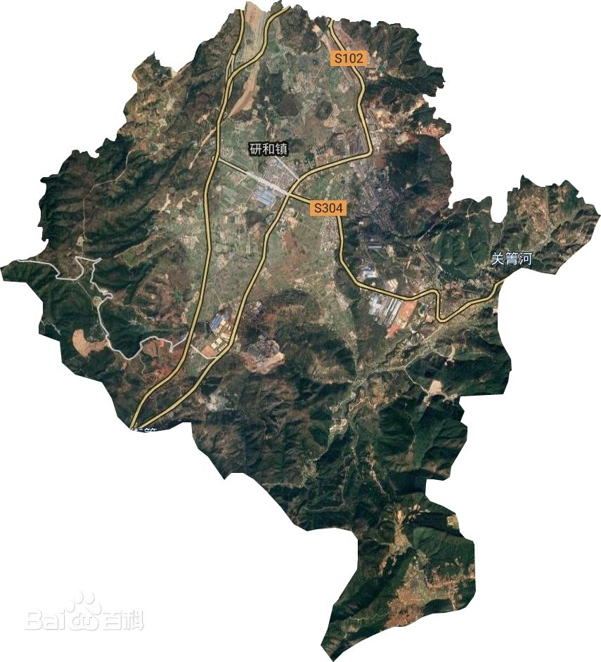
	- 因研和街位于清水河东，故称“岩河地”。江浙人移居后，因“岩”与“研”、“河”与“和”谐音，“岩河”逐渐为“研和”所取代，街道由此得名。

#### 峨山彝族自治县

峨山县
- 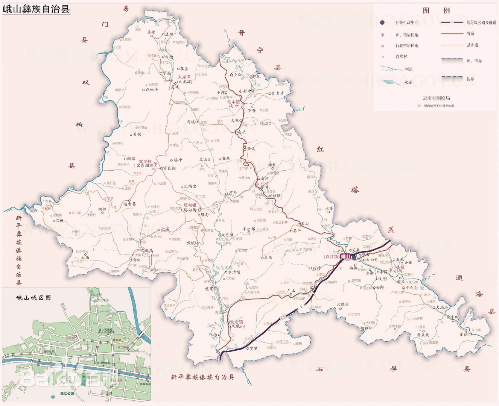
- 县城设于双江街道，距[玉溪市](https://baike.baidu.com/item/%E7%8E%89%E6%BA%AA%E5%B8%82/744471?fromModule=lemma_inlink)24千米，距[昆明市](https://baike.baidu.com/item/%E6%98%86%E6%98%8E%E5%B8%82/406229?fromModule=lemma_inlink)116千米
- 成立于1951年5月12日，是中华人民共和国第一个彝族自治县，也是[云南省](https://baike.baidu.com/item/%E4%BA%91%E5%8D%97%E7%9C%81/18664752?fromModule=lemma_inlink)第一个实行民族区域自治的县。
- 峨山县属中亚热带半湿润凉冬高原季风气候区，气候温和，日照充足。夏无酷暑，冬无严寒，温差立体分布。年平均日照为2286.9小时，日照率为52%。
- 峨山县属高原地貌形态，地形东部狭长，西部较宽。境内[海拔](https://baike.baidu.com/item/%E6%B5%B7%E6%8B%94/5754?fromModule=lemma_inlink)2000以上的高山有60多座。
- 天子山温泉景区，位于小街街道年景村境内，属低矿化度淡泉水，是峨山县重点开发旅游区。

化念镇
- 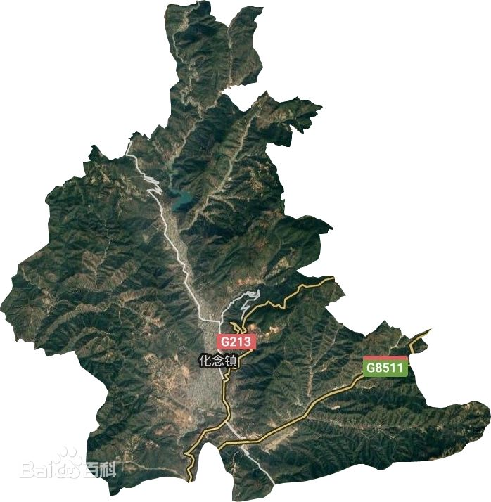
- 超市5个。
- 化念镇境内属高山丘陵、河谷盆地相间的地形，地势东北高、西南低，化念河与罗里河穿境而过，形成典型的高原河谷冲积热坝。

#### 新平彝族傣族自治县
扬武镇
- 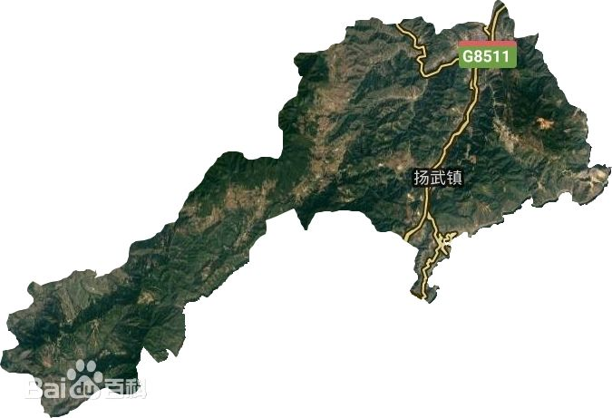
- 超市58个。
- 扬武镇属亚热带垂直立体气候，其特点是海拔差异大，使高山地区气候呈水平的带状分布，多年平均气温19.3℃，1月平均气温10.6℃，极端最低气温3.2℃（2011年1月12日）；7月平均气温23.4℃，极端最高气温32.2℃（2011年7月30日），最低月均气温9.4℃（2011年1月），最高月均气温28.0℃（2011年6月），平均气温年较差17.4℃，最大日较差12.1℃（2011年1月8日）。无霜期平均为300天，最长达351天，最短达249天。年平均日照时数2230小时。
- 扬武镇域呈狭长形，东有鲁奎山、西有磨盘山，森林覆盖率56.04%，最高点鲁魁山，海拔2389米，最低点玉租河，海拔510米。
- 据传天启、崇祯年间，一卢姓大户因失意于仕途，搬迁到此地东南面山上隐居，在山上建起“卢家花园”，以养虎为乐，后人就把这个地方取名“养虎坝”，后“养虎”谐音为“扬武”而得名。

#### 元江哈尼族彝族傣族自治县

甘庄街道
- 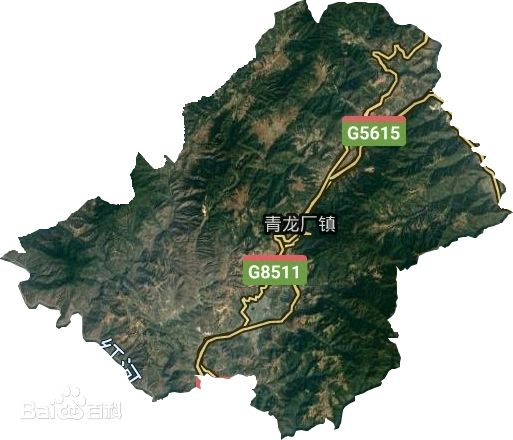
- 甘庄街道境内地势中部和北部偏高，西南和东南偏低。地形分为新平磨盘山山脉和甘庄、甘坝两个小盆地境内最高点位于西北面的大黑山主峰，海拔2117米；最低点西位于东南醇西拉河末段河谷地，海拔452米。
- 甘庄街道多年平均气温19℃，1月平均气温14℃，极端最低气温-0.9℃（1983年12月28日），7月平均气温25.9℃，年平均降水量1100毫米，年平均降水日数为115天。

元江县
- 东与[石屏县](https://baike.baidu.com/item/%E7%9F%B3%E5%B1%8F%E5%8E%BF/1201811?fromModule=lemma_inlink)毗邻，南与[红河县](https://baike.baidu.com/item/%E7%BA%A2%E6%B2%B3%E5%8E%BF/743812?fromModule=lemma_inlink)相连，西与[墨江哈尼族自治县](https://baike.baidu.com/item/%E5%A2%A8%E6%B1%9F%E5%93%88%E5%B0%BC%E6%97%8F%E8%87%AA%E6%B2%BB%E5%8E%BF/10538160?fromModule=lemma_inlink)接壤，北与[新平县](https://baike.baidu.com/item/%E6%96%B0%E5%B9%B3%E5%8E%BF/3536786?fromModule=lemma_inlink)紧邻。
- 最高点海拔（阿波列山）为2580米，最低点海拔（小河垤）为327米，相对高差达2253米。 [4]山区面积2766.54平方千米，占总面积的96.8%，坝区面积91.46平方千米（元江坝、甘庄坝、因远坝），占总面积的3.2%。
- 县境内各地年平均气温12℃－24℃，最冷月平均气温7℃－17℃，最热月平均气温16℃－29℃，极端最低气温-0.1℃－-7℃，极端最高气温28℃－42.5℃，大于等于10度年积温4000－8700度。无霜期200－364天，年平均降水量770－2400mm，雨季平均于5月16日开始，10月22日终止。
- 元江哈尼族彝族傣族自治县跨五个气候类型，即热带、亚热带、北温带、南温带、寒带。形成了“一山分四季，隔里不同天”“山顶穿棉衣，山腰穿夹衣，山脚穿单衣”独特现象。
- 元江彩色膏林、哈尼云海梯田

因远镇
- 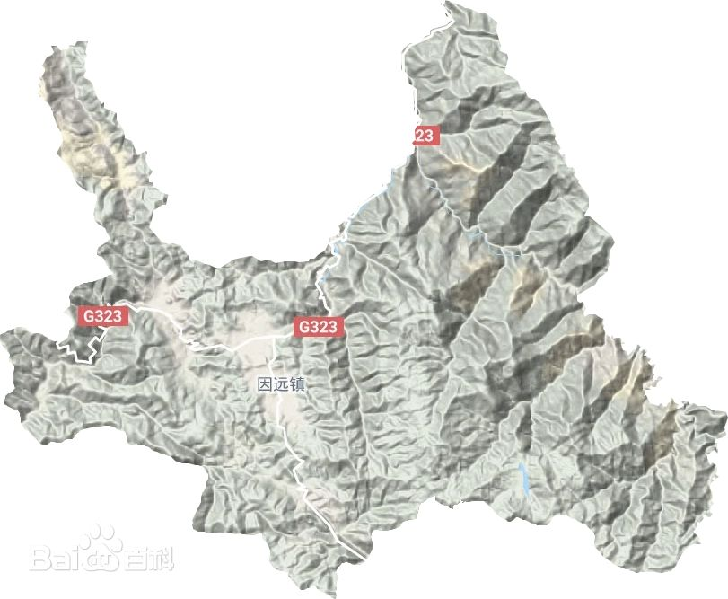
- 超市12个。
- 因远镇地势东南面偏高而东北面偏低。东西狭长，向北延伸呈凹形，地形为山地，境内山脉属南北走向的哀牢山余脉。
- 因远镇多年平均气温16.6℃，1月平均气温11℃，极端最低气温-4.1℃（1983年12月28日）；7月平均气温19.9℃，极端最高气温34℃（2005年5月27日），年平均降水量1200毫米，降雨集中在每年的5—10月。
- 因远镇已形成由公路构成的交通运输网络。213国道过境，境内长46千米。
- 因远镇因宋大理时的因远部得名。

### 普洱市
#### 墨江哈尼族自治县
墨江县
- 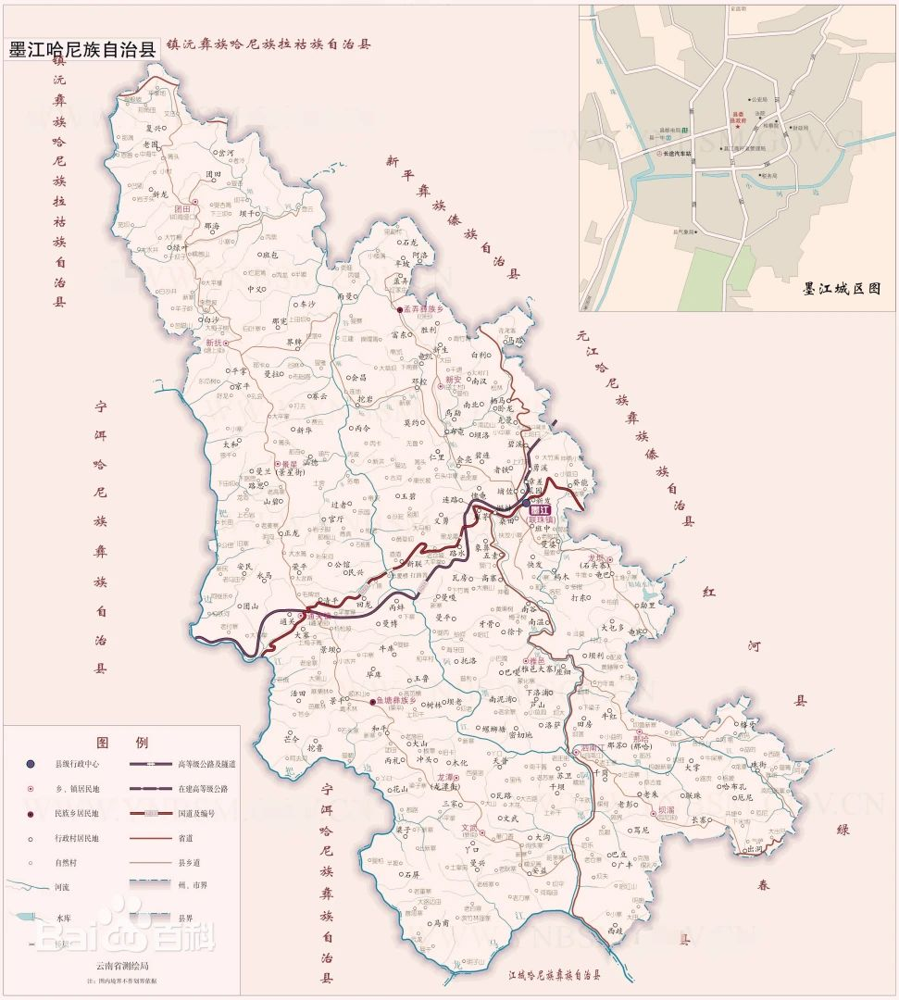
- 东及东南与[红河哈尼族彝族自治州](https://baike.baidu.com/item/%E7%BA%A2%E6%B2%B3%E5%93%88%E5%B0%BC%E6%97%8F%E5%BD%9D%E6%97%8F%E8%87%AA%E6%B2%BB%E5%B7%9E/2522812?fromModule=lemma_inlink)[红河县](https://baike.baidu.com/item/%E7%BA%A2%E6%B2%B3%E5%8E%BF/743812?fromModule=lemma_inlink)、[绿春县](https://baike.baidu.com/item/%E7%BB%BF%E6%98%A5%E5%8E%BF/1206990?fromModule=lemma_inlink)接壤，南与[江城哈尼族彝族自治县](https://baike.baidu.com/item/%E6%B1%9F%E5%9F%8E%E5%93%88%E5%B0%BC%E6%97%8F%E5%BD%9D%E6%97%8F%E8%87%AA%E6%B2%BB%E5%8E%BF/10538098?fromModule=lemma_inlink)为邻，西与[宁洱哈尼族彝族自治县](https://baike.baidu.com/item/%E5%AE%81%E6%B4%B1%E5%93%88%E5%B0%BC%E6%97%8F%E5%BD%9D%E6%97%8F%E8%87%AA%E6%B2%BB%E5%8E%BF/1288500?fromModule=lemma_inlink)隔把边江相望，西北与[镇沅彝族哈尼族拉祜族自治县](https://baike.baidu.com/item/%E9%95%87%E6%B2%85%E5%BD%9D%E6%97%8F%E5%93%88%E5%B0%BC%E6%97%8F%E6%8B%89%E7%A5%9C%E6%97%8F%E8%87%AA%E6%B2%BB%E5%8E%BF/10538234?fromModule=lemma_inlink)连接，北及东北与[玉溪市](https://baike.baidu.com/item/%E7%8E%89%E6%BA%AA%E5%B8%82/744471?fromModule=lemma_inlink)[新平彝族傣族自治县](https://baike.baidu.com/item/%E6%96%B0%E5%B9%B3%E5%BD%9D%E6%97%8F%E5%82%A3%E6%97%8F%E8%87%AA%E6%B2%BB%E5%8E%BF/8751804?fromModule=lemma_inlink)、[元江哈尼族彝族傣族自治县](https://baike.baidu.com/item/%E5%85%83%E6%B1%9F%E5%93%88%E5%B0%BC%E6%97%8F%E5%BD%9D%E6%97%8F%E5%82%A3%E6%97%8F%E8%87%AA%E6%B2%BB%E5%8E%BF/8751753?fromModule=lemma_inlink)交界。全县总面积5312平方千米，东西最宽横距65.5千米，南北最大纵距120.8千米。
- 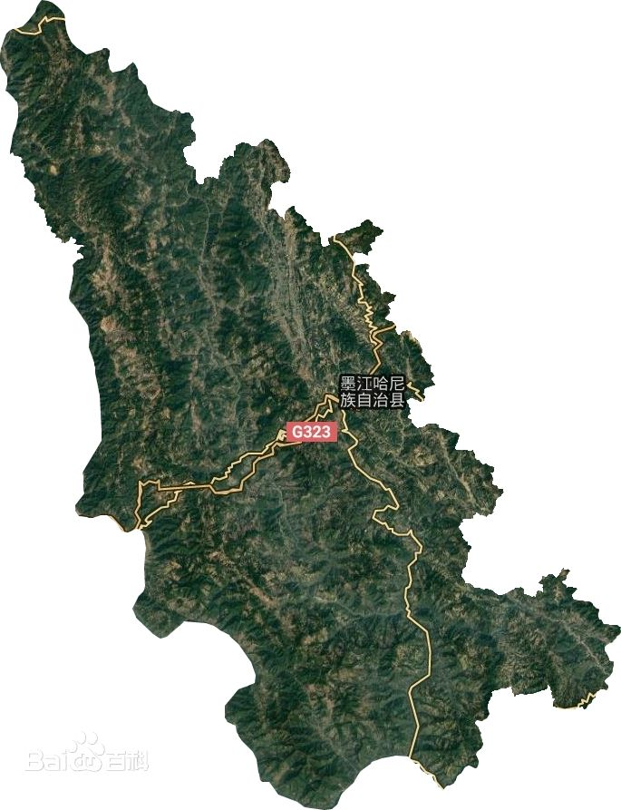
- 地势自西北向东南倾斜。
- 墨江哈尼族自治县处于低纬度高海拔地区，全县2/3的地域在北回归线以南，1/3的地域在北回归线以北，属南亚热带半湿润山地季风气候，四季冷暖不太分明，有四季如春之称，干湿季明显。一年中最高29℃，最低10℃，平均为19℃。
- 墨江有345天为春秋季，20天夏季，无冬季。墨江县雨量充沛、干湿季节分明。
- 墨江哈尼族自治县原名他郎，民国四年（1915年）改称墨江县，以纵贯县内阿墨江得名，寓意“流墨成江”。
- 北回归线标志园，始建于1993年，总占地面积202.6亩，由回归之门、太阳之路、天文馆、月亮广场等15个景点组成。

通关镇
- 超市6个。
- 隶属于云南省普洱市墨江哈尼族自治县，地处[墨江哈尼族自治县](https://baike.baidu.com/item/%E5%A2%A8%E6%B1%9F%E5%93%88%E5%B0%BC%E6%97%8F%E8%87%AA%E6%B2%BB%E5%8E%BF/10538160?fromModule=lemma_inlink)西部，东与[联珠镇](https://baike.baidu.com/item/%E8%81%94%E7%8F%A0%E9%95%87/4864474?fromModule=lemma_inlink)相邻，南与[鱼塘镇](https://baike.baidu.com/item/%E9%B1%BC%E5%A1%98%E9%95%87/58258710?fromModule=lemma_inlink)接壤，西与[宁洱哈尼族彝族自治县](https://baike.baidu.com/item/%E5%AE%81%E6%B4%B1%E5%93%88%E5%B0%BC%E6%97%8F%E5%BD%9D%E6%97%8F%E8%87%AA%E6%B2%BB%E5%8E%BF/1288500?fromModule=lemma_inlink)隔把边江相望，北与[景星镇](https://baike.baidu.com/item/%E6%99%AF%E6%98%9F%E9%95%87/58258764?fromModule=lemma_inlink)相连。
- 通关镇地形北宽南窄，东西两面低，形似一个“蘑菇”，最高点大丫口后山位于活田村，海拔1973.9米；最低点“阿墨江岸”位于境内东南部，海拔615米。
- 213国道，境内长49千米，东接联珠，西达宁洱。
- 通关镇因地处交通要道，是内地通往边疆的门户，战略位置十分重要，史称“军事要塞通关哨”，故此得名。

#### 宁洱哈尼族彝族自治县
磨黑镇
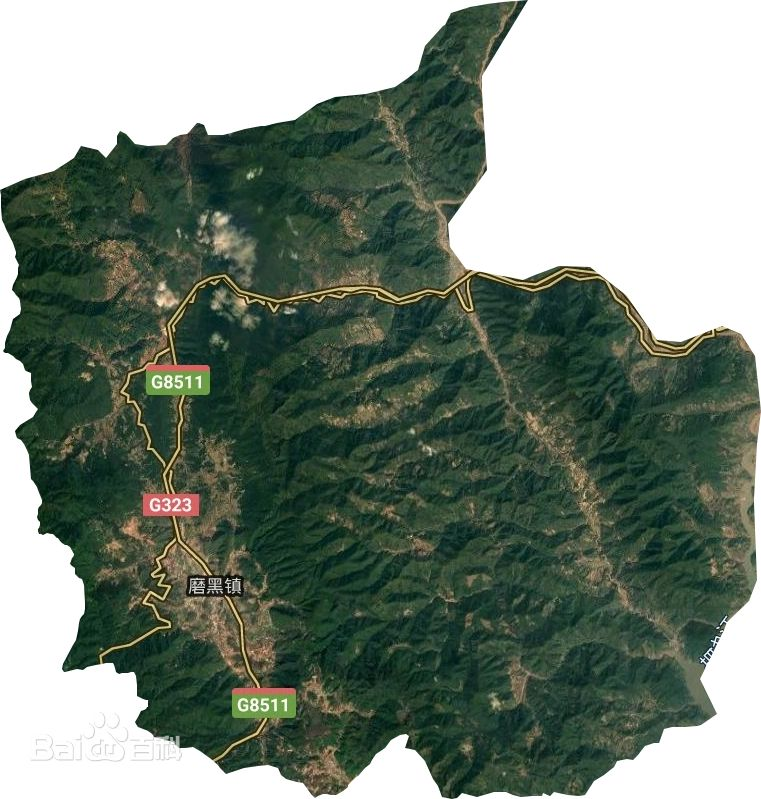
- 隶属于云南省普洱市[宁洱哈尼族彝族自治县](https://baike.baidu.com/item/%E5%AE%81%E6%B4%B1%E5%93%88%E5%B0%BC%E6%97%8F%E5%BD%9D%E6%97%8F%E8%87%AA%E6%B2%BB%E5%8E%BF/1288500?fromModule=lemma_inlink)，地处宁洱哈尼族彝族自治县东北部，东隔把边江与[墨江县](https://baike.baidu.com/item/%E5%A2%A8%E6%B1%9F%E5%8E%BF/5460991?fromModule=lemma_inlink)通关镇相望，南接[勐先镇](https://baike.baidu.com/item/%E5%8B%90%E5%85%88%E9%95%87/20607277?fromModule=lemma_inlink)、普义乡，西接[宁洱镇](https://baike.baidu.com/item/%E5%AE%81%E6%B4%B1%E9%95%87/6811653?fromModule=lemma_inlink)，北与德安乡毗邻。
- 超市20个。
- 磨黑镇地势北高南低，地形以山地、河谷为主。在海拔786米（嘎拉河口）—2271.6米（百草梁子）之间，平均海拔1372.4米。
- 磨黑镇属亚热带高原性季风气候，其特点是气候温和，冬无严寒，夏无酷暑，四季如春。年平均气温21.6℃。
- “磨黑”为傣语，磨为井，黑为盐，意为盐井。

宁洱县
- 宁洱哈尼族彝族自治县是中华人民共和国[云南省](https://baike.baidu.com/item/%E4%BA%91%E5%8D%97%E7%9C%81/18664752?fromModule=lemma_inlink)[普洱市](https://baike.baidu.com/item/%E6%99%AE%E6%B4%B1%E5%B8%82/0?fromModule=lemma_inlink)下辖县之一，位于云南省南部，[普洱市](https://baike.baidu.com/item/%E6%99%AE%E6%B4%B1%E5%B8%82/1287464?fromModule=lemma_inlink)中部，为滇南要冲，与思茅、墨江、江城、景谷、镇沅五个区（县）山水相连，北距离省会昆明市370公里，南距离市政府驻地思茅区33公里。
- 宁洱县全境皆山，地貌纵横交错，地质构造属喀斯特地貌。 [1]宁洱县地处横断山脉南段。东西遥对的把边江和小黑江沿县界呈帚状向南扩展，无量山脉纵穿南北，形成分水岭。地势北高南低，境内海拔差距大，平均每公里海拔高度下降22米。
- 宁洱县属南亚热带山地季风气候，兼有热带、中亚热带、南温带等气候类型。年平均气温18.2℃，最热月（6月）平均气温22℃，最冷月（1月）平均气温12℃，无霜期334天，年均降雨量1414.9毫米，5月至10月为雨季。年平均日照时数1921.2小时。
- 2021年12月3日，宁洱火车站开通运营，结束了宁洱县不通火车历史。
- 西岭温泉古为“普阳八景”之一，位于县城7公里处的阳广河头，温泉水质清澈见底，潭底数十眼突泉喷涌而出，水含硫磺，可治皮肤病，浴后周身舒爽。分为攀龙温泉和大自然温泉，不分冬夏水温约30℃—32℃。

同心镇
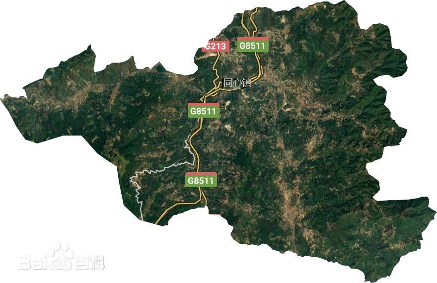
- 隶属于云南省普洱市宁洱哈尼族彝族自治县，地处[宁洱哈尼族彝族自治县](https://baike.baidu.com/item/%E5%AE%81%E6%B4%B1%E5%93%88%E5%B0%BC%E6%97%8F%E5%BD%9D%E6%97%8F%E8%87%AA%E6%B2%BB%E5%8E%BF/1288500?fromModule=lemma_inlink)南部，东接[勐先镇](https://baike.baidu.com/item/%E5%8B%90%E5%85%88%E9%95%87/20607277?fromModule=lemma_inlink)，西南和南面为[思茅区](https://baike.baidu.com/item/%E6%80%9D%E8%8C%85%E5%8C%BA/6058452?fromModule=lemma_inlink)云仙彝族乡和[南屏镇](https://baike.baidu.com/item/%E5%8D%97%E5%B1%8F%E9%95%87/1888365?fromModule=lemma_inlink)，西北与[德化镇](https://baike.baidu.com/item/%E5%BE%B7%E5%8C%96%E9%95%87/20603962?fromModule=lemma_inlink)相连，北连[宁洱镇](https://baike.baidu.com/item/%E5%AE%81%E6%B4%B1%E9%95%87/6811653?fromModule=lemma_inlink)， [3]行政区域面积333.65平方千米。
- 超市19个。
- 同心镇境内地形东西宽，南北窄，呈长方形状，东部山高谷深；西部峡谷低凹，呈掌状分布；北部群山交错。最高点位于会连村大庙山，海拔2080.5米；最低点位于漫海河与思茅河交汇处，海拔896米，相对高差1184.5米。
- 同心镇属亚热带高原性季风气候，其特点是降雨集中，干湿分明，光照条件好，年终积温高。多年平均气温16.5℃，极端最高气温33.8℃，极端最低气温-2.3℃，年均日照时数1921小时。

#### 思茅区
- 隶属于[云南省](https://baike.baidu.com/item/%E4%BA%91%E5%8D%97%E7%9C%81/18664752?fromModule=lemma_inlink)[普洱市](https://baike.baidu.com/item/%E6%99%AE%E6%B4%B1%E5%B8%82/0?fromModule=lemma_inlink)，位于[云南](https://baike.baidu.com/item/%E4%BA%91%E5%8D%97/206207?fromModule=lemma_inlink)省南部、[普洱市](https://baike.baidu.com/item/%E6%99%AE%E6%B4%B1%E5%B8%82/1287464?fromModule=lemma_inlink)中南部、[澜沧江](https://baike.baidu.com/item/%E6%BE%9C%E6%B2%A7%E6%B1%9F/430813?fromModule=lemma_inlink)中下游，位于北纬22°27′－23°06′、东经100°19′－101°27′之间，东连[江城县](https://baike.baidu.com/item/%E6%B1%9F%E5%9F%8E%E5%8E%BF/0?fromModule=lemma_inlink)，西接[澜沧县](https://baike.baidu.com/item/%E6%BE%9C%E6%B2%A7%E5%8E%BF/10459257?fromModule=lemma_inlink)和[景谷傣族彝族自治县](https://baike.baidu.com/item/%E6%99%AF%E8%B0%B7%E5%82%A3%E6%97%8F%E5%BD%9D%E6%97%8F%E8%87%AA%E6%B2%BB%E5%8E%BF/8751487?fromModule=lemma_inlink)，南邻[西双版纳傣族自治州](https://baike.baidu.com/item/%E8%A5%BF%E5%8F%8C%E7%89%88%E7%BA%B3%E5%82%A3%E6%97%8F%E8%87%AA%E6%B2%BB%E5%B7%9E/5622791?fromModule=lemma_inlink)，北临[宁洱县](https://baike.baidu.com/item/%E5%AE%81%E6%B4%B1%E5%8E%BF/3523644?fromModule=lemma_inlink)，总面积3928平方千米。截至2024年，思茅区下辖1个街道、4个镇、2个乡。东西长118千米，南北宽72千米。
- 思茅区是历史上的[茶马古道](https://baike.baidu.com/item/%E8%8C%B6%E9%A9%AC%E5%8F%A4%E9%81%93/18157?fromModule=lemma_inlink)—[南方丝绸之路](https://baike.baidu.com/item/%E5%8D%97%E6%96%B9%E4%B8%9D%E7%BB%B8%E4%B9%8B%E8%B7%AF/3397701?fromModule=lemma_inlink)的起点，为云南三大海关重镇之一，曾有“东南亚陆路码头”和“银思茅”之称。思茅区是中国面向东南亚、南亚开放的重要交通枢纽和黄金前沿。
- [大理](https://baike.baidu.com/item/%E5%A4%A7%E7%90%86/6358212?fromModule=lemma_inlink)时为“思摩部”，[元代](https://baike.baidu.com/item/%E5%85%83%E4%BB%A3/0?fromModule=lemma_inlink)称“思么”，明代叫“思毛”。[清](https://baike.baidu.com/item/%E6%B8%85/10030559?fromModule=lemma_inlink)[雍正](https://baike.baidu.com/item/%E9%9B%8D%E6%AD%A3/130080?fromModule=lemma_inlink)十三年（公元1735年），设立“思茅厅”，隶属[普洱](https://baike.baidu.com/item/%E6%99%AE%E6%B4%B1/0?fromModule=lemma_inlink)府。
- 思茅区属低纬高原南亚热带季风气候区，境内立体气候明显，有北热带、南亚热带、中亚热带和北亚热带4个不同的气候类型，具有低纬、高温、多雨、湿润、静风的特点。冬无严寒，夏无酷暑。思茅区多年（1981～2010年）平均气温18.9℃，多年平均降雨量1487.5毫米。

南屏镇
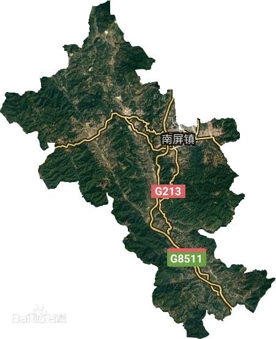
- 超市209个。
- 南屏镇地处[思茅区](https://baike.baidu.com/item/%E6%80%9D%E8%8C%85%E5%8C%BA/6058452?fromModule=lemma_inlink)中南部，东与[倚象镇](https://baike.baidu.com/item/%E5%80%9A%E8%B1%A1%E9%95%87/10830584?fromModule=lemma_inlink)接壤，南与西双版纳州[景洪市](https://baike.baidu.com/item/%E6%99%AF%E6%B4%AA%E5%B8%82/2278149?fromModule=lemma_inlink)普文镇相连，西到南邦河与[云仙乡](https://baike.baidu.com/item/%E4%BA%91%E4%BB%99%E4%B9%A1/4675483?fromModule=lemma_inlink)、六顺镇接界，北与[思茅街道](https://baike.baidu.com/item/%E6%80%9D%E8%8C%85%E8%A1%97%E9%81%93/50102470?fromModule=lemma_inlink)毗邻。
- 南屏镇境内地形东西窄，南北宽，地势北高南低。最高点为大黑山，海拔1661米；最低点为大开河，海拔926米。
- 南屏镇因位于镇区南部的玉屏山得名。

### 西双阪纳

#### 景洪市
普文镇
- 普文镇面积为521平方公里 [21-22]，镇中心位于东经101°23′，北纬22°33′，地处西双版纳景洪最北部，东接勐旺乡，南连大渡岗乡，西靠景讷乡，北临普洱市[南屏镇](https://baike.baidu.com/item/%E5%8D%97%E5%B1%8F%E9%95%87/1888365?fromModule=lemma_inlink)，距景洪市97公里，距[普洱](https://baike.baidu.com/item/%E6%99%AE%E6%B4%B1/10847?fromModule=lemma_inlink)（原思茅）市34公里，距[昆明市](https://baike.baidu.com/item/%E6%98%86%E6%98%8E%E5%B8%82/0?fromModule=lemma_inlink)530公里，素有“版纳北大门”之称。
- 普文镇属北[亚热带](https://baike.baidu.com/item/%E4%BA%9A%E7%83%AD%E5%B8%A6/0?fromModule=lemma_inlink)高原季风气候，年平均气温20.2℃，历年最高气温39℃，年平均降雨量1675.6毫米，全年日照时数1990小时，基本常年无霜，冬无严寒，夏无酷暑，夏长冬短，盛行东南风。
- 普文镇小粒咖啡产业发展起源于19世纪90年代中期，在云南省小粒咖啡产区中占有一席之地。

大渡岗乡
- 大渡岗农场和大渡岗乡共有的7万多亩茶园现已被世界纪录认证机构认证为世界最大万亩连片茶园。

勐养镇
- 勐养镇地处[景洪市](https://baike.baidu.com/item/%E6%99%AF%E6%B4%AA%E5%B8%82/0?fromModule=lemma_inlink)中北部，镇中心位于东经100°53′42″，北纬22°5′30″，距[景洪市](https://baike.baidu.com/item/%E6%99%AF%E6%B4%AA%E5%B8%82/0?fromModule=lemma_inlink)政府驻地15公里。东与基诺族乡和[勐腊县](https://baike.baidu.com/item/%E5%8B%90%E8%85%8A%E5%8E%BF/0?fromModule=lemma_inlink)[象明乡](https://baike.baidu.com/item/%E8%B1%A1%E6%98%8E%E4%B9%A1/0?fromModule=lemma_inlink)毗连，南靠允景洪街道，北壤[景讷乡](https://baike.baidu.com/item/%E6%99%AF%E8%AE%B7%E4%B9%A1/0?fromModule=lemma_inlink)、[大渡岗乡](https://baike.baidu.com/item/%E5%A4%A7%E6%B8%A1%E5%B2%97%E4%B9%A1/0?fromModule=lemma_inlink)，西与[勐海县](https://baike.baidu.com/item/%E5%8B%90%E6%B5%B7%E5%8E%BF/0?fromModule=lemma_inlink)[勐宋乡](https://baike.baidu.com/item/%E5%8B%90%E5%AE%8B%E4%B9%A1/0?fromModule=lemma_inlink)隔江相望。
- 勐养镇土地面积720.08平方千米，平均海拔745米，全镇最高海拔1633米，最低海拔550米。
- 勐养镇属亚热带气候类型，年平均气温20.5摄氏度，最高气温38.9摄氏度，最低气温1.4摄氏度，年平均降雨量1600毫米。

基诺族乡
- 基诺山基诺族乡是中国最后一个被确认的[民族](https://baike.baidu.com/item/%E6%B0%91%E6%97%8F/0?fromModule=lemma_inlink)——基诺族的主要聚居地，位于西双版纳州景洪市东北部，距市区24公里，人口1万余人，基诺族占97%。
- 基诺乡土地总面积622.9平方公里，年平均气温18℃—20℃，年平均日照数1852.14小时，年降雨量1100毫米，最高海拔1691米，最低海拔550米。
- 基诺族自称“基诺”，“基”为舅舅，“诺”为后边，意为尊敬舅舅的民族，他称“攸乐”。

#### 勐腊县
勐仓镇
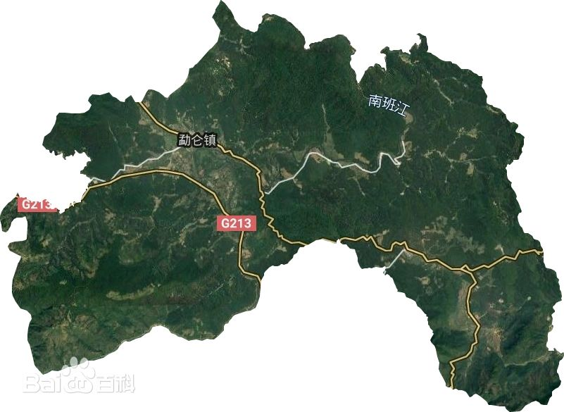
- 超市14个。
- 勐仑镇地处[勐腊县](https://baike.baidu.com/item/%E5%8B%90%E8%85%8A%E5%8E%BF/1208263?fromModule=lemma_inlink)西北部，东连[易武乡](https://baike.baidu.com/item/%E6%98%93%E6%AD%A6%E4%B9%A1/4100943?fromModule=lemma_inlink)，南接[关累镇](https://baike.baidu.com/item/%E5%85%B3%E7%B4%AF%E9%95%87/6751564?fromModule=lemma_inlink)，西与景洪市[勐罕镇](https://baike.baidu.com/item/%E5%8B%90%E7%BD%95%E9%95%87/10828725?fromModule=lemma_inlink)、[基诺山基诺族乡](https://baike.baidu.com/item/%E5%9F%BA%E8%AF%BA%E5%B1%B1%E5%9F%BA%E8%AF%BA%E6%97%8F%E4%B9%A1/6738986?fromModule=lemma_inlink)毗邻，北与[象明彝族乡](https://baike.baidu.com/item/%E8%B1%A1%E6%98%8E%E5%BD%9D%E6%97%8F%E4%B9%A1/4234632?fromModule=lemma_inlink)交界， [2]行政区域面积327.87平方千米。
- 勐仑镇地处澜沧江大断裂带以东，无量山脉尾梢，基诺山系罗梭江侵蚀的峡谷盆地。地形为中间河谷平坝，四周群山环绕。
- 勐仑镇属亚热带雨林季风气候，其特点是四季如春，全年无霜。多年平均气温在21.5℃，年平均降水量1600毫米。
- 勐仑为傣语地名，意为柔软的地方。

勐腊县
- 勐腊县位于[云南省](https://baike.baidu.com/item/%E4%BA%91%E5%8D%97%E7%9C%81/18664752?fromModule=lemma_inlink)南部、[西双版纳傣族自治州](https://baike.baidu.com/item/%E8%A5%BF%E5%8F%8C%E7%89%88%E7%BA%B3%E5%82%A3%E6%97%8F%E8%87%AA%E6%B2%BB%E5%B7%9E/5622791?fromModule=lemma_inlink)东南部，介于北纬21°08′—22°25′、东经100°50′—101°06′之间，东、南、西南三面与[老挝人民民主共和国](https://baike.baidu.com/item/%E8%80%81%E6%8C%9D%E4%BA%BA%E6%B0%91%E6%B0%91%E4%B8%BB%E5%85%B1%E5%92%8C%E5%9B%BD/1554696?fromModule=lemma_inlink)相连，西北与[缅甸联邦共和国](https://baike.baidu.com/item/%E7%BC%85%E7%94%B8%E8%81%94%E9%82%A6%E5%85%B1%E5%92%8C%E5%9B%BD/7807097?fromModule=lemma_inlink)隔[澜沧江](https://baike.baidu.com/item/%E6%BE%9C%E6%B2%A7%E6%B1%9F/430813?fromModule=lemma_inlink)相望，北与普洱市[江城哈尼族彝族自治县](https://baike.baidu.com/item/%E6%B1%9F%E5%9F%8E%E5%93%88%E5%B0%BC%E6%97%8F%E5%BD%9D%E6%97%8F%E8%87%AA%E6%B2%BB%E5%8E%BF/10538098?fromModule=lemma_inlink)毗邻，国境线长740.8千米，全县总面积6860.76平方千米。
- 勐腊县属浸蚀山地，系[横断山](https://baike.baidu.com/item/%E6%A8%AA%E6%96%AD%E5%B1%B1/9433443?fromModule=lemma_inlink)纵谷南段，无量山南延尾梢。地势北高南低，由东北向西南呈梯状下降。由于受构造作用控制，形成较多南北走向的山岭和盆地，形成北部中山山原，中部[岩溶景观](https://baike.baidu.com/item/%E5%B2%A9%E6%BA%B6%E6%99%AF%E8%A7%82/4183244?fromModule=lemma_inlink)，南部宽谷盆地。平均海拔1000米。其中，山地占95.6%，山间盆地（坝子）占4.4%。
- 勐腊县地处北回归线以南，属亚热带季风气候，终年暖热，冬无严寒，夏无酷暑。县内平均气温22℃。
- “勐腊”系傣语，“勐”意为平坝或地区，“腊”意为“茶”“茶水”，即“献茶水之地”。传说释迦牟尼巡游到此时，人们向他敬献很多茶水，佛祖把喝不完的倒在河里，此河名“南腊河”，即“茶水河”，“勐腊”因此得名。
- 中国科学院西双版纳热带植物园
- 西双版纳望天树景区
- 勐远仙境。
- [西双版纳空中走廊](https://baike.baidu.com/item/%E8%A5%BF%E5%8F%8C%E7%89%88%E7%BA%B3%E7%A9%BA%E4%B8%AD%E8%B5%B0%E5%BB%8A/0?fromModule=lemma_inlink)景区位于云南省西双版纳州勐腊县境内，是地球上北纬21度唯一的一片绿洲，是热带雨林国家公园的核心景区。

磨憨镇
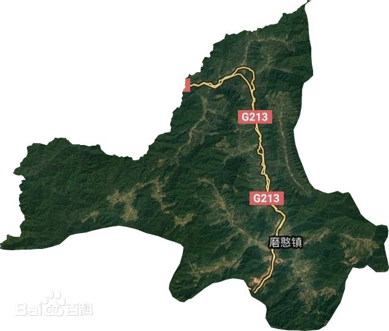
- 磨憨镇，地处[勐腊县](https://baike.baidu.com/item/%E5%8B%90%E8%85%8A%E5%8E%BF/1208263?fromModule=lemma_inlink)东南部，东、南与[老挝](https://baike.baidu.com/item/%E8%80%81%E6%8C%9D/209879?fromModule=lemma_inlink)接壤，西邻[勐满镇](https://baike.baidu.com/item/%E5%8B%90%E6%BB%A1%E9%95%87/65290?fromModule=lemma_inlink)，北接[勐腊镇](https://baike.baidu.com/item/%E5%8B%90%E8%85%8A%E9%95%87/4234750?fromModule=lemma_inlink)， [3]行政区域面积755.32平方千米。
- 磨憨镇地处澜沧江大断裂带以东，无量山南延之尾梢不发寨山系地势东南部高，西南部和北部低。地形为低中山和矮丘陵峡谷地带，沟谷纵横。主要山脉有董宗保、宗恩、白石岩等。境内最高峰位于董宗保，海拔1674米；最低海拔点曼粉村河边，海拔650米。
- 磨憨镇属亚热带季风气候，其特点是热量丰富，夏无酷暑，冬无严寒，降水充沛，旱雨季分明。多年平均气温21℃。1月平均气温12.7℃，极端最低气温8.9℃（1973年1月15日）；7月平均气温31.6℃，极端最高气温36.8℃（2011年6月23日）。最低月均气温11.8℃（1973年1月），最高月均气温29.6℃（2011年6月）。
- 磨憨为傣语地名，磨即盐井，憨即富裕。磨憨意为富裕盐井。