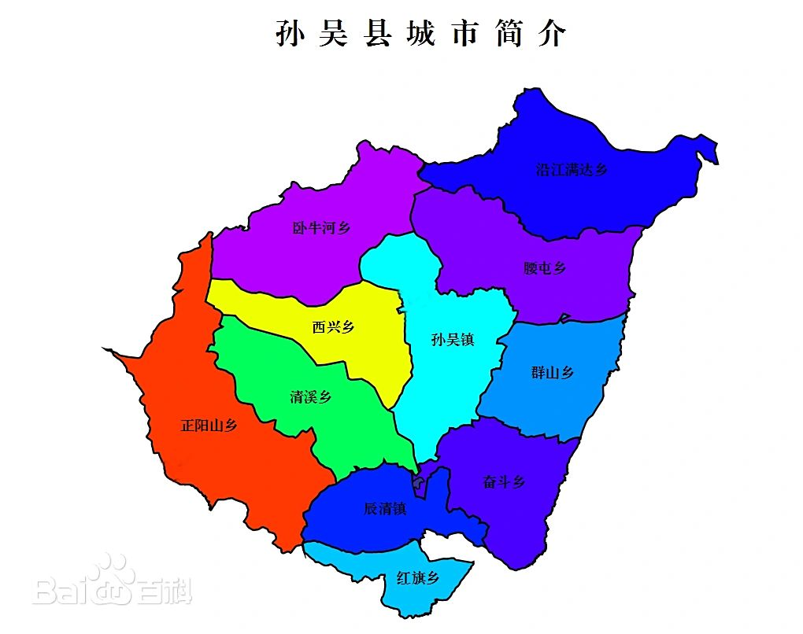

## 内蒙

### 满洲里市
满洲里市，内蒙古自治区[呼伦贝尔市](https://baike.baidu.com/item/%E5%91%BC%E4%BC%A6%E8%B4%9D%E5%B0%94%E5%B8%82/3408979?fromModule=lemma_inlink)代管[县级市](https://baike.baidu.com/item/%E5%8E%BF%E7%BA%A7%E5%B8%82/1659674?fromModule=lemma_inlink)，位于[内蒙古自治区](https://baike.baidu.com/item/%E5%86%85%E8%92%99%E5%8F%A4%E8%87%AA%E6%B2%BB%E5%8C%BA/49872215?fromModule=lemma_inlink)东北部、[呼伦贝尔市](https://baike.baidu.com/item/%E5%91%BC%E4%BC%A6%E8%B4%9D%E5%B0%94%E5%B8%82/3408979?fromModule=lemma_inlink)西北部，地处[呼伦贝尔高原](https://baike.baidu.com/item/%E5%91%BC%E4%BC%A6%E8%B4%9D%E5%B0%94%E9%AB%98%E5%8E%9F/7652262?fromModule=lemma_inlink)和[大兴安岭](https://baike.baidu.com/item/%E5%A4%A7%E5%85%B4%E5%AE%89%E5%B2%AD/563782?fromModule=lemma_inlink)边缘过渡地带， [8]属温带半干旱大陆性气候， [9]北与[俄罗斯联邦](https://baike.baidu.com/item/%E4%BF%84%E7%BD%97%E6%96%AF%E8%81%94%E9%82%A6/421807?fromModule=lemma_inlink)接壤，是中国最大的陆路口岸城市，毗邻2个旗，总面积465.5平方千米 [7]。截至2024年，满洲里市辖5个街道、1个镇，另辖4个乡级单位。 [5]截至2024年，满洲里市户籍人口88842人。 [33]

清光绪二十七年（1901年），中东铁路西部线建立火车站，因从俄国进入中国东北地区（当时惯称“满洲”）的首站，故名“满洲里站”，俄语为“满洲里亚”，音译成汉语变成了“满洲里”。民国三十年（1941年）1月，改为满洲里市。2001年10月，满洲里市由呼伦贝尔市代管。2013年，呼伦贝尔市扎赉诺尔区由满洲里市代管。 [12]2023年3月，扎赉诺尔区由呼伦贝尔市直接管理。 [32]主要景点有[中俄边境旅游区](https://baike.baidu.com/item/%E4%B8%AD%E4%BF%84%E8%BE%B9%E5%A2%83%E6%97%85%E6%B8%B8%E5%8C%BA/20786184?fromModule=lemma_inlink)、[猛犸旅游区](https://baike.baidu.com/item/%E7%8C%9B%E7%8A%B8%E6%97%85%E6%B8%B8%E5%8C%BA/17513272?fromModule=lemma_inlink)、[中俄互市贸易旅游区](https://baike.baidu.com/item/%E4%B8%AD%E4%BF%84%E4%BA%92%E5%B8%82%E8%B4%B8%E6%98%93%E6%97%85%E6%B8%B8%E5%8C%BA/12769185?fromModule=lemma_inlink)、[满洲里套娃景区](https://baike.baidu.com/item/%E6%BB%A1%E6%B4%B2%E9%87%8C%E5%A5%97%E5%A8%83%E6%99%AF%E5%8C%BA/20464062?fromModule=lemma_inlink)等。

东西最长50公里，南北最宽34公里，总面积465.5平方千米。

满洲里市境内设有[满洲里西郊国际机场](https://baike.baidu.com/item/%E6%BB%A1%E6%B4%B2%E9%87%8C%E8%A5%BF%E9%83%8A%E5%9B%BD%E9%99%85%E6%9C%BA%E5%9C%BA/4748767?fromModule=lemma_inlink)。

铁路：满洲里市境内设有[满洲里站](https://baike.baidu.com/item/%E6%BB%A1%E6%B4%B2%E9%87%8C%E7%AB%99/7603460?fromModule=lemma_inlink)、[扎赉诺尔西站](https://baike.baidu.com/item/%E6%89%8E%E8%B5%89%E8%AF%BA%E5%B0%94%E8%A5%BF%E7%AB%99/10572893?fromModule=lemma_inlink)、[扎赉诺尔站](https://baike.baidu.com/item/%E6%89%8E%E8%B5%89%E8%AF%BA%E5%B0%94%E7%AB%99/10572904?fromModule=lemma_inlink)。

### 新巴尔虎左旗
新巴尔虎左旗地处呼伦贝尔草原西南腹地、大兴安岭北麓，地势自东南向西北逐降低，海拔高度560—800米。东南部为山地丘陵（海拔高度900—1573米），中部为高平原，北部海拉尔河一带为低山丘陵，南部为大兴安岭北麓山林区（多山，最高处为乌尔根乌拉山，海拔1573米）。

新巴尔虎左旗属典型的寒温带大陆性季风气候，冬季寒冷漫长，夏季温暖短促，春秋凉爽多风，年平均气温-0.3℃，年降水量为268毫米，蒸发量为1650毫米，无霜期90—110天。

诺干湖旅游度假区位于内蒙古自治区呼伦贝尔市[新巴尔虎左旗](https://baike.baidu.com/item/%E6%96%B0%E5%B7%B4%E5%B0%94%E8%99%8E%E5%B7%A6%E6%97%97/1951924?fromModule=lemma_inlink)[乌布尔宝力格苏木](https://baike.baidu.com/item/%E4%B9%8C%E5%B8%83%E5%B0%94%E5%AE%9D%E5%8A%9B%E6%A0%BC%E8%8B%8F%E6%9C%A8/3069957?fromModule=lemma_inlink)诺干诺尔嘎查西三公里处，地处是中、俄、蒙国际“金三角”。两伊公路从湖距海拉尔162公里，南距阿尔山120公里。

### 陈巴尔虎

陈巴尔虎旗，隶属于内蒙古自治区呼伦贝尔市，位于[内蒙古自治区](https://baike.baidu.com/item/%E5%86%85%E8%92%99%E5%8F%A4%E8%87%AA%E6%B2%BB%E5%8C%BA/49872215?fromModule=lemma_inlink)东北部、[呼伦贝尔市](https://baike.baidu.com/item/%E5%91%BC%E4%BC%A6%E8%B4%9D%E5%B0%94%E5%B8%82/3408979?fromModule=lemma_inlink)西北部，地处大兴安岭西部末端向呼伦贝尔高平原过渡地带，属温带大陆性气候，毗邻5个旗、区（市），总面积17458平方千米。

陈巴尔虎旗位于内蒙古自治区东北部、呼伦贝尔市西北部，介于北纬48°48′—50°12′、东经118°22′—121°02′之间，毗邻5个旗、区（市），东部和东北部分别与[牙克石市](https://baike.baidu.com/item/%E7%89%99%E5%85%8B%E7%9F%B3%E5%B8%82/3335322?fromModule=lemma_inlink)、[额尔古纳市](https://baike.baidu.com/item/%E9%A2%9D%E5%B0%94%E5%8F%A4%E7%BA%B3%E5%B8%82/7611588?fromModule=lemma_inlink)接壤，东南与[海拉尔区](https://baike.baidu.com/item/%E6%B5%B7%E6%8B%89%E5%B0%94%E5%8C%BA/4881964?fromModule=lemma_inlink)毗邻，南边接着[鄂温克族自治旗](https://baike.baidu.com/item/%E9%84%82%E6%B8%A9%E5%85%8B%E6%97%8F%E8%87%AA%E6%B2%BB%E6%97%97/1952070?fromModule=lemma_inlink)，西与[新巴尔虎左旗](https://baike.baidu.com/item/%E6%96%B0%E5%B7%B4%E5%B0%94%E8%99%8E%E5%B7%A6%E6%97%97/1951924?fromModule=lemma_inlink)交接，西北与[俄罗斯联邦](https://baike.baidu.com/item/%E4%BF%84%E7%BD%97%E6%96%AF%E8%81%94%E9%82%A6/421807?fromModule=lemma_inlink)隔[额尔古纳河](https://baike.baidu.com/item/%E9%A2%9D%E5%B0%94%E5%8F%A4%E7%BA%B3%E6%B2%B3/579235?fromModule=lemma_inlink)相望，中俄边境线总长206.7千米。全旗总面积为17458平方千米，南北最长距离约135.2千米，东西最长距离约180.7千米。

陈巴尔虎旗地处大兴安岭西部末端向呼伦贝尔高平原过渡地带，地势由东北向西南逐渐降低，东半部为大兴安岭中低山丘陵，西半部为波状起伏的高平原（海拔为600—700米左右）。

陈巴尔虎旗地处中纬度，属温带大陆性气候，平均降水量320毫米。

### 额尔古纳市

额尔古纳市（Ergun City），内蒙古自治区辖县级市，由呼伦贝尔市代管，位于[内蒙古自治区](https://baike.baidu.com/item/%E5%86%85%E8%92%99%E5%8F%A4%E8%87%AA%E6%B2%BB%E5%8C%BA/49872215?fromModule=lemma_inlink)东北部、[呼伦贝尔市](https://baike.baidu.com/item/%E5%91%BC%E4%BC%A6%E8%B4%9D%E5%B0%94%E5%B8%82/3408979?fromModule=lemma_inlink)北部，是内蒙古自治区纬度最高的地区，地处[大兴安岭](https://baike.baidu.com/item/%E5%A4%A7%E5%85%B4%E5%AE%89%E5%B2%AD/563782?fromModule=lemma_inlink)西北麓、[呼伦贝尔草原](https://baike.baidu.com/item/%E5%91%BC%E4%BC%A6%E8%B4%9D%E5%B0%94%E8%8D%89%E5%8E%9F/569951?fromModule=lemma_inlink)东北端，西部及北部隔[额尔古纳河](https://baike.baidu.com/item/%E9%A2%9D%E5%B0%94%E5%8F%A4%E7%BA%B3%E6%B2%B3/579235?fromModule=lemma_inlink)与[俄罗斯联邦](https://baike.baidu.com/item/%E4%BF%84%E7%BD%97%E6%96%AF%E8%81%94%E9%82%A6/421807?fromModule=lemma_inlink)相望，属寒温带大陆性气候 [9]，毗邻4个旗、县（市），总面积28444.64平方千米，边境线长671.4千米 [15]。其中，南北最长距离约600千米，东西宽（最窄处）约50千米。

额尔古纳市位于内蒙古自治区大兴安岭西北麓，属于寒温带大陆性气候，四季分明、气候凉爽，年平均气温在-2.0℃—-3.0℃之间，年降雨量为200—280毫米，日照时间为2500—3000小时。

莫尔道嘎国家森林公园

## 黑龙江
---
### 漠河市
漠河市（Mohe City），中国[黑龙江省](https://baike.baidu.com/item/%E9%BB%91%E9%BE%99%E6%B1%9F%E7%9C%81/129397?fromModule=lemma_inlink)[大兴安岭地区](https://baike.baidu.com/item/%E5%A4%A7%E5%85%B4%E5%AE%89%E5%B2%AD%E5%9C%B0%E5%8C%BA/2921262?fromModule=lemma_inlink)辖县级市，地处黑龙江省西北部，大兴安岭山脉北麓 [46]，与俄罗斯外贝加尔边疆区、阿穆尔州隔江相望，边境线长242千米，总面积18428平方千米，辖6镇7个行政村。 [1]漠河方言多为北方话，属北方方言系统。 [49]截至2023年末，漠河市总人口61035人。边境线长242千米，总面积18427平方千米。

其中[北极村](https://baike.baidu.com/item/%E5%8C%97%E6%9E%81%E6%9D%91/78083?fromModule=lemma_inlink)是中国大陆最北端的临江小镇，是全国观赏北极光和白夜奇景的最佳之处，

G331边防公路（[丹东—阿勒泰公路](https://baike.baidu.com/item/%E4%B8%B9%E4%B8%9C%E2%80%94%E9%98%BF%E5%8B%92%E6%B3%B0%E5%85%AC%E8%B7%AF/53448785?fromModule=lemma_inlink)）途经漠河市，2023年被评为2023“中国之路”十大自驾精品线路。

2023年12月，[漠河火车站](https://baike.baidu.com/item/%E6%BC%A0%E6%B2%B3%E7%81%AB%E8%BD%A6%E7%AB%99/5441201?fromModule=lemma_inlink)日均发运旅客达1584人，至12月28日，月发运旅客已超过4.4万人，同比2022年增幅达734.6%。

[漠河机场](https://baike.baidu.com/item/%E6%BC%A0%E6%B2%B3%E6%9C%BA%E5%9C%BA/3711147?fromModule=lemma_inlink)是中国位置最北、纬度最高的民用机场。

漠河市最低气温-53℃（2023年1月22日07时漠河市阿木尔镇）。 [37]各月平均气温在0℃以下的月份长达8个月之久。气温年较差为49.3℃。平均无霜期为86.2天。年平均降水量为460.8毫米，全年降水量70%以上集中在7月份。5—6月份为旱季，7—8月份为汛期。
### 塔河县

塔河县，隶属于[黑龙江省](https://baike.baidu.com/item/%E9%BB%91%E9%BE%99%E6%B1%9F%E7%9C%81/129397?fromModule=lemma_inlink)[大兴安岭地区](https://baike.baidu.com/item/%E5%A4%A7%E5%85%B4%E5%AE%89%E5%B2%AD%E5%9C%B0%E5%8C%BA/2921262?fromModule=lemma_inlink)。 [1] [26]地处黑龙江省北部、[伊勒呼里山](https://baike.baidu.com/item/%E4%BC%8A%E5%8B%92%E5%91%BC%E9%87%8C%E5%B1%B1/0?fromModule=lemma_inlink)北麓，是中国最北部的两个县份之一，东邻[呼玛县](https://baike.baidu.com/item/%E5%91%BC%E7%8E%9B%E5%8E%BF/10493022?fromModule=lemma_inlink)，西接漠河市，南靠[新林区](https://baike.baidu.com/item/%E6%96%B0%E6%9E%97%E5%8C%BA/2354249?fromModule=lemma_inlink)、[呼中区](https://baike.baidu.com/item/%E5%91%BC%E4%B8%AD%E5%8C%BA/2354551?fromModule=lemma_inlink)，北以[黑龙江](https://baike.baidu.com/item/%E9%BB%91%E9%BE%99%E6%B1%9F/7351?fromModule=lemma_inlink)主航道中心线为界与[俄罗斯](https://baike.baidu.com/item/%E4%BF%84%E7%BD%97%E6%96%AF/125568?fromModule=lemma_inlink)隔江相望，边境线长173千米。塔河县总面积14420平方公里，辖5个镇、 [25]1个乡、1个民族乡。

[嫩林铁路](https://baike.baidu.com/item/%E5%AB%A9%E6%9E%97%E9%93%81%E8%B7%AF/0?fromModule=lemma_inlink)、[塔韩铁路](https://baike.baidu.com/item/%E5%A1%94%E9%9F%A9%E9%93%81%E8%B7%AF/0?fromModule=lemma_inlink)两条铁路在塔河交汇贯通，境内总长206公里，设有[塔河站](https://baike.baidu.com/item/%E5%A1%94%E6%B2%B3%E7%AB%99/10901131?fromModule=lemma_inlink)现为[三等站](https://baike.baidu.com/item/%E4%B8%89%E7%AD%89%E7%AB%99/0?fromModule=lemma_inlink)，其中嫩林铁路线自南向西北经塔河、绣峰、瓦拉干、盘古4镇进入漠河市境内。

### 呼玛县
呼玛县，隶属[黑龙江省](https://baike.baidu.com/item/%E9%BB%91%E9%BE%99%E6%B1%9F%E7%9C%81/129397?fromModule=lemma_inlink)[大兴安岭地区](https://baike.baidu.com/item/%E5%A4%A7%E5%85%B4%E5%AE%89%E5%B2%AD%E5%9C%B0%E5%8C%BA/2921262?fromModule=lemma_inlink)。位于大兴安岭东麓，黑龙江上游西南岸。西部和北部与[新林区](https://baike.baidu.com/item/%E6%96%B0%E6%9E%97%E5%8C%BA/2354249?fromModule=lemma_inlink)、[塔河县](https://baike.baidu.com/item/%E5%A1%94%E6%B2%B3%E5%8E%BF/10493061?fromModule=lemma_inlink)毗邻，南部与[黑河市](https://baike.baidu.com/item/%E9%BB%91%E6%B2%B3%E5%B8%82/0?fromModule=lemma_inlink)[爱辉区](https://baike.baidu.com/item/%E7%88%B1%E8%BE%89%E5%8C%BA/0?fromModule=lemma_inlink)、[嫩江市](https://baike.baidu.com/item/%E5%AB%A9%E6%B1%9F%E5%B8%82/22023447?fromModule=lemma_inlink)接壤，东部与俄罗斯施马诺夫斯克市、斯沃搏德内市和马格达加奇区隔江相望。对俄边境线长达371公里，占到大兴安岭地区对俄边境总长的近二分之一，也是黑龙江省对俄边境线最长的县份。

呼玛县，地势西北高、东南低，西北部属低山丘陵区，东南部属漫岗平原区。地貌标高143-788米，平均海拔350米（系黄海高程）。属多山区，辖区内深山地约占全县总面积的83.8%，丘陵地约占全县总面积的5.4%，平原约占全县总面积的9.9%，河流湖泊等约占全县总面积的0.9%。

呼玛县，属寒温带大陆性季风气候，冬季严寒而漫长，极端最代低气温-50.2℃，夏季炎热多雨且短暂，年降雨量300至500毫米之间，极端最高气温38℃，年平均气温-2℃。积雪覆盖期长达150[余天](https://baike.baidu.com/item/%E4%BD%99%E5%A4%A9/0?fromModule=lemma_inlink)，无霜期80至110天，结冰区期每年7个月左右。

呼玛县交通以公路为主，境内黑（黑河）呼（呼玛）、呼（呼玛）塔（塔河）两条公路是县内货运输主干线。铁路终止于县[韩家园镇](https://baike.baidu.com/item/%E9%9F%A9%E5%AE%B6%E5%9B%AD%E9%95%87/0?fromModule=lemma_inlink)，距县城[呼玛镇](https://baike.baidu.com/item/%E5%91%BC%E7%8E%9B%E9%95%87/0?fromModule=lemma_inlink)百余公里。黑龙江在[明水](https://baike.baidu.com/item/%E6%98%8E%E6%B0%B4/0?fromModule=lemma_inlink)期客货航运便利，发展水运事业潜力很大。加上呼（呼玛）加（[加格达奇](https://baike.baidu.com/item/%E5%8A%A0%E6%A0%BC%E8%BE%BE%E5%A5%87/0?fromModule=lemma_inlink)）客运线的开通和以县城为中心通往兴隆、新街基、韩家园、鸥浦的县乡公路网。

---
### 爱辉区
爱辉区，隶属于黑龙江省黑河市，位于[黑龙江省](https://baike.baidu.com/item/%E9%BB%91%E9%BE%99%E6%B1%9F%E7%9C%81/129397?fromModule=lemma_inlink)东北部、[黑河市](https://baike.baidu.com/item/%E9%BB%91%E6%B2%B3%E5%B8%82/2019094?fromModule=lemma_inlink)东部，地处大兴安岭东部、小兴安岭西北部的低山丘陵地带， [29]属寒温带大陆性季风气候，总面积14446平方千米。 [28]截至2023年6月，爱辉区辖4个街道、4个镇、7个乡，另辖23个乡级单位。 [18]截至2023年末，爱辉区总人口184140人。南北纵距174千米，东西横距130千米。

爱辉区地处大兴安岭东部、小兴安岭西北部的低山丘陵地带，西部为低山丘陵，东部为丘陵和黑河盆地。

爱辉区地处中高纬度，属寒温带大陆性季风气候，横跨四、五、六三个积温带。年平均气温1.8℃，年降水量498.1毫米，日照时数为2400.4小时，年≥10℃的活动积温为2378.6，全年优良天气350天以上。

[瑷珲历史陈列馆](https://baike.baidu.com/item/%E7%91%B7%E7%8F%B2%E5%8E%86%E5%8F%B2%E9%99%88%E5%88%97%E9%A6%86/511316?fromModule=lemma_inlink)，坐落于黑龙江中游右岸、瑗珲新城遗址内，是中国唯一一处以全面反映中俄东部领土演变历史为基本陈列内容的专题性遗址博物馆。
### 孙吴县
孙吴县，隶属黑龙江省黑河市，位于[黑龙江省](https://baike.baidu.com/item/%E9%BB%91%E9%BE%99%E6%B1%9F%E7%9C%81/129397?fromModule=lemma_inlink)北部、黑河市中部，地处[小兴安岭](https://baike.baidu.com/item/%E5%B0%8F%E5%85%B4%E5%AE%89%E5%B2%AD/0?fromModule=lemma_inlink)北麓。北邻[爱辉区](https://baike.baidu.com/item/%E7%88%B1%E8%BE%89%E5%8C%BA/0?fromModule=lemma_inlink)，南邻[五大连池](https://baike.baidu.com/item/%E4%BA%94%E5%A4%A7%E8%BF%9E%E6%B1%A0/7713161?fromModule=lemma_inlink)市，西邻嫩江市，东邻[逊克县](https://baike.baidu.com/item/%E9%80%8A%E5%85%8B%E5%8E%BF/2789921?fromModule=lemma_inlink)，距黑河市区106公里，是黑河市重要的交通枢纽。边境线长35公里，与[俄罗斯](https://baike.baidu.com/item/%E4%BF%84%E7%BD%97%E6%96%AF/125568?fromModule=lemma_inlink)[阿穆尔州](https://baike.baidu.com/item/%E9%98%BF%E7%A9%86%E5%B0%94%E5%B7%9E/0?fromModule=lemma_inlink)的[康斯坦丁诺夫卡](https://baike.baidu.com/item/%E5%BA%B7%E6%96%AF%E5%9D%A6%E4%B8%81%E8%AF%BA%E5%A4%AB%E5%8D%A1/0?fromModule=lemma_inlink)区隔[黑龙江](https://baike.baidu.com/item/%E9%BB%91%E9%BE%99%E6%B1%9F/1046993?fromModule=lemma_inlink)相望。根据第七次人口普查数据，截至2020年11月1日零时，常住人口为73387人。 [13]总面积4447.7平方公里 [2]，

孙吴县属于低山丘陵区，海拔在110—755米之间，地势南部和西部高，北部和东部低，由西南向东北逐渐倾斜。地貌分区较明显，西部为低山沟谷区，中部为丘陵河谷地区，东北部为沿江平原。

孙吴县地处中高纬度，属[寒温带](https://baike.baidu.com/item/%E5%AF%92%E6%B8%A9%E5%B8%A6/7774391?fromModule=lemma_inlink)[大陆性季风气候](https://baike.baidu.com/item/%E5%A4%A7%E9%99%86%E6%80%A7%E5%AD%A3%E9%A3%8E%E6%B0%94%E5%80%99/15606019?fromModule=lemma_inlink)，横跨四、五、六三个积温带，年平均气温为-0.6℃，平均日照2551.5小时，平均降雨量400—650毫米，平均降雪期为215天，有效积温在1800℃—2200℃之间，无霜期为80—120天，大于等于5级风平均日数为103.1天，风能资源丰富。 [36]春季风大，极易发生干旱；夏季受东南季风控制，温和多雨；秋季降雨急剧，常有早霜危害；冬季受蒙古高压冷空气影响，漫长而寒冷。

国道2条123.053公里。其中：丹东至阿勒公路35.7公里，黑河至大连87.353公路公里。
### 逊克县

逊克县，隶属于黑龙江省[黑河市](https://baike.baidu.com/item/%E9%BB%91%E6%B2%B3%E5%B8%82/0?fromModule=lemma_inlink)，位于黑龙江省北部边疆，[小兴安岭](https://baike.baidu.com/item/%E5%B0%8F%E5%85%B4%E5%AE%89%E5%B2%AD/0?fromModule=lemma_inlink)中段北麓，[黑龙江](https://baike.baidu.com/item/%E9%BB%91%E9%BE%99%E6%B1%9F/1046993?fromModule=lemma_inlink)中游右岸，边境线135千米，面积17344平方千米，截至2022年10月，逊克县下辖3个镇、6个乡。 [2]2021年，逊克县户籍人口93546人（含逊克农场）。

逊克县属[寒温带](https://baike.baidu.com/item/%E5%AF%92%E6%B8%A9%E5%B8%A6/0?fromModule=lemma_inlink)大陆性季风气候，年日照时数2600小时左右，[有效积温](https://baike.baidu.com/item/%E6%9C%89%E6%95%88%E7%A7%AF%E6%B8%A9/0?fromModule=lemma_inlink)1700度--2300度，年平均气温0.5度，年降水量650毫米。无霜期：沿江区125天，南部山区95天。

---
### 嘉荫县

嘉荫县，隶属于[黑龙江省](https://baike.baidu.com/item/%E9%BB%91%E9%BE%99%E6%B1%9F%E7%9C%81/129397?fromModule=lemma_inlink)[伊春市](https://baike.baidu.com/item/%E4%BC%8A%E6%98%A5%E5%B8%82/2921756?fromModule=lemma_inlink)，位于伊春市北部，黑龙江中游右岸，小兴安岭北麓东段。位于北纬48°8′30″至49°26′5″，东经129°9′45″至130°50′之间。总面积6739平方千米。 [40]嘉荫县东南接[萝北县](https://baike.baidu.com/item/%E8%90%9D%E5%8C%97%E5%8E%BF/8747819?fromModule=lemma_inlink)，南与[鹤岗市](https://baike.baidu.com/item/%E9%B9%A4%E5%B2%97%E5%B8%82/2518670?fromModule=lemma_inlink)，西南与[伊春](https://baike.baidu.com/item/%E4%BC%8A%E6%98%A5/80673?fromModule=lemma_inlink)[丰林县](https://baike.baidu.com/item/%E4%B8%B0%E6%9E%97%E5%8E%BF/23618171?fromModule=lemma_inlink)、[汤旺县](https://baike.baidu.com/item/%E6%B1%A4%E6%97%BA%E5%8E%BF/23617824?fromModule=lemma_inlink)相邻，西连[逊克县](https://baike.baidu.com/item/%E9%80%8A%E5%85%8B%E5%8E%BF/2789921?fromModule=lemma_inlink)。 [1-2]嘉荫县辖地自西北向东南呈狭长地段，由于小兴安岭自西南来横贯全境，北麓如鸡爪状向黑龙江岸延伸，所以全境地势西南高，东北低。 [3]嘉荫县属于温带大陆性季风气候区北部，一年四季的气候差异大 [4]。截至2018年，嘉荫县下辖4镇、5乡 [5]。县政府驻朝阳镇。 [1]根据第七次人口普查数据，截至2020年11月1日零时，嘉荫县常住人口为56523人。

---
### 萝北县
萝北县，黑龙江省鹤岗市辖县，位于[黑龙江省](https://baike.baidu.com/item/%E9%BB%91%E9%BE%99%E6%B1%9F%E7%9C%81/129397?fromModule=lemma_inlink)东北部、[鹤岗市](https://baike.baidu.com/item/%E9%B9%A4%E5%B2%97%E5%B8%82/2518670?fromModule=lemma_inlink)中部，地处[小兴安岭](https://baike.baidu.com/item/%E5%B0%8F%E5%85%B4%E5%AE%89%E5%B2%AD/568160?fromModule=lemma_inlink)南麓与[三江平原](https://baike.baidu.com/item/%E4%B8%89%E6%B1%9F%E5%B9%B3%E5%8E%9F/343963?fromModule=lemma_inlink)交汇处，属寒温带大陆性季风气候，总面积6784平方千米。 [17]截至2024年8月，萝北县辖6个镇、2个乡。 [24]截至2023年末，萝北县户籍人口203637人。

萝北县属寒温带大陆性季风气候，特点是日照充足，雨热同季，降水适度，无霜期短。全年平均气温2.9℃，极端最高气温39℃，极端最低气温零下41.4℃。无霜期年平均133天。全年日照平均为2627.8小时，降水量年平均579毫米，多集中在七、八、九三个月份，属北方长日照区域，气候温暖，热量充足，雨量充沛。

[名山风景区](https://baike.baidu.com/item/%E5%90%8D%E5%B1%B1%E9%A3%8E%E6%99%AF%E5%8C%BA/7721250?fromModule=lemma_inlink)，位于鹤岗市萝北县北部的黑龙江畔，与俄罗斯阿穆尔捷特隔江相望，有名山岛、名山沿江公园、犹太风情旅游服务区等景区，为[国家AAAA级旅游景区](https://baike.baidu.com/item/%E5%9B%BD%E5%AE%B6AAAA%E7%BA%A7%E6%97%85%E6%B8%B8%E6%99%AF%E5%8C%BA/7574615?fromModule=lemma_inlink)。
### 绥滨县
绥滨县，隶属于黑龙江省[鹤岗市](https://baike.baidu.com/item/%E9%B9%A4%E5%B2%97%E5%B8%82/2518670?fromModule=lemma_inlink)，因地处边境，又濒松花江，乃取“绥靖”（安抚）和“滨江”之意。绥滨县北以[黑龙江](https://baike.baidu.com/item/%E9%BB%91%E9%BE%99%E6%B1%9F/1046993?fromModule=lemma_inlink)主航道为界与俄罗斯隔江相望，东、南依[松花江](https://baike.baidu.com/item/%E6%9D%BE%E8%8A%B1%E6%B1%9F/29902?fromModule=lemma_inlink)与[同江市](https://baike.baidu.com/item/%E5%90%8C%E6%B1%9F%E5%B8%82/5253576?fromModule=lemma_inlink)、[富锦市](https://baike.baidu.com/item/%E5%AF%8C%E9%94%A6%E5%B8%82/5253649?fromModule=lemma_inlink)带水相连，西与[萝北县](https://baike.baidu.com/item/%E8%90%9D%E5%8C%97%E5%8E%BF/8747819?fromModule=lemma_inlink)接壤。截至2019年末，绥滨县辖3镇、6乡、2林场、3农场、1种畜场、1良种场，总面积3344平方公里。 [1]截至2023年末，绥滨县户籍总人口170714人，比上年减少512人。

绥滨县属寒温带大陆性气候，四季特点明显：冬季气候寒冷干燥，持续时间较长，夏季温暖湿润，时间较短，春秋两季寒温交替，气候多变。全县多年平均气温3.4℃；多年平均大于等于10℃，活动积温在2630.2℃；多年平均无霜期为140天；多年平均降水量512.4毫米；多年平均日照时数为2664.6小时；主导风向为西风。

---
### 同江市
同江市，[黑龙江省](https://baike.baidu.com/item/%E9%BB%91%E9%BE%99%E6%B1%9F%E7%9C%81/129397?fromModule=lemma_inlink)辖县级市，由[佳木斯市](https://baike.baidu.com/item/%E4%BD%B3%E6%9C%A8%E6%96%AF%E5%B8%82/2921720?fromModule=lemma_inlink)代管，地处[黑龙江省](https://baike.baidu.com/item/%E9%BB%91%E9%BE%99%E6%B1%9F%E7%9C%81/129397?fromModule=lemma_inlink)东北部[松花江](https://baike.baidu.com/item/%E6%9D%BE%E8%8A%B1%E6%B1%9F/29902?fromModule=lemma_inlink)与黑龙江两江交汇处南岸，东接抚远，南与[富锦市](https://baike.baidu.com/item/%E5%AF%8C%E9%94%A6%E5%B8%82/5253649?fromModule=lemma_inlink)、[饶河县](https://baike.baidu.com/item/%E9%A5%B6%E6%B2%B3%E5%8E%BF/5252732?fromModule=lemma_inlink)为邻，西临松花江与[绥滨县](https://baike.baidu.com/item/%E7%BB%A5%E6%BB%A8%E5%8E%BF/2353573?fromModule=lemma_inlink)相连，北隔黑龙江与[俄罗斯](https://baike.baidu.com/item/%E4%BF%84%E7%BD%97%E6%96%AF/125568?fromModule=lemma_inlink)[犹太自治州](https://baike.baidu.com/item/%E7%8A%B9%E5%A4%AA%E8%87%AA%E6%B2%BB%E5%B7%9E/3635654?fromModule=lemma_inlink)相望，边境线长170千米。总面积6229平方千米。 [13]截至2023年6月，同江市辖2个街道、6个镇、4个乡。 [24]截至2023年末，同江市户籍人口为171895人。

同江市位于中温带湿润气候区，属于大陆性季风气候，四季差别明显。冬季严寒漫长，多西北风，气候干燥；夏季短暂，温热多雨，多偏南风，雨水集中，气候较为湿润；春、秋季节由于冬夏季风交替，气候多变，多大风天气。年平均气温4.5度，最冷月（一月）平均气温-15.6度，极端最低气温-27.5度；最热月（七月）平均气温23度，极端最高气温32.1度。年平均降水量709.3毫米，年平均日照时数3504.7小时，无霜期148天。

“同三”公路（同江到三亚）是贯穿祖国南北大动脉的北端起点，将同江市并入全国公路网

同江铁路已并入东北铁路网，通过同江中俄跨江铁路大桥，向北与俄远东铁路相连接，并可通过西伯利亚大铁路通往欧洲各国。
### 抚远市

抚远市，黑龙江省辖县级市，由[佳木斯市](https://baike.baidu.com/item/%E4%BD%B3%E6%9C%A8%E6%96%AF%E5%B8%82/2921720?fromModule=lemma_inlink)代管，地处黑龙江省东北部，[黑龙江](https://baike.baidu.com/item/%E9%BB%91%E9%BE%99%E6%B1%9F/1046993?fromModule=lemma_inlink)、[乌苏里江](https://baike.baidu.com/item/%E4%B9%8C%E8%8B%8F%E9%87%8C%E6%B1%9F/955935?fromModule=lemma_inlink)交汇的三角地带，东、北两面与[俄罗斯](https://baike.baidu.com/item/%E4%BF%84%E7%BD%97%E6%96%AF/125568?fromModule=lemma_inlink)隔乌苏里江、黑龙江相望，为低平辽阔的沉降平原，属中温带大陆性季风气候。抚远市是中国陆地最东端的[县级行政区](https://baike.baidu.com/item/%E5%8E%BF%E7%BA%A7%E8%A1%8C%E6%94%BF%E5%8C%BA/1660163?fromModule=lemma_inlink)，是最早将太阳迎进祖国的地方，素有“华夏东极”和“东方第一城”之美誉。抚远市辖7个镇、3个乡。截至2023年末，抚远市户籍人口80371人。全市总面积6047.1平方千米，边境线长212千米。

抚远市地处寒温带大陆性季风气候区，主要气候特点是：春季短暂，多风少雨；夏季炎热，降水集中；秋季凉爽，湿润多雨；冬季漫长，严寒多雪。根据气象资料统计分析，年平均气温3.4℃，无霜期平均为130天，初霜期一般在9月下旬，终霜期在来年5月上旬。年有效积温2457.3℃，年平均降水量954.7毫米。夏季初日最早在1时58分，落日最晚在20时5分。年平均日照2304小时。抚远地区冻结期长，每年11月上旬稳定结冻，翌年3月末开始解冻。冻土层达212厘米。本区域冬季处于蒙古高压东部边缘，盛行西风或西北风，夏季由于大陆低压和太平洋高压对持，多偏南风及东南风。受鄂霍次克海高压影响，有时有偏东气流，春秋两季风向多变，多偏西南、西风。作物生长期多为西南和东南风。年平均风速为3.6米/秒。全年6级以上的日数达40-50天，四、五月平均风力为4-5级，最大风力可达10级。

2012年12月18日15时，前进镇至抚远的铁路客运正式开通。

2013年10月22日，[抚远东极机场](https://baike.baidu.com/item/%E6%8A%9A%E8%BF%9C%E4%B8%9C%E6%9E%81%E6%9C%BA%E5%9C%BA/13987768?fromModule=lemma_inlink)试飞完成，

黑瞎子岛位于抚远市黑瞎子岛镇，地处中俄边界抚远市境内的黑龙江和乌苏里江的交汇处主航道西南侧，是中国最早见到太阳的地方。总面积约335平方千米。黑瞎子岛是由银龙岛、黑瞎子岛，明月岛3个岛系，原有93个岛屿和沙洲组成，现有87个岛屿和沙洲，其中岛屿73个，沙洲14个，岛长58800米，最宽处为14000米，面积约335平方千米。黑瞎子岛东岸是俄罗斯远东地区政治、经济、文化中心和俄罗斯远东军区所在地哈巴罗夫斯克（伯力）市。该岛是哈巴的天然屏障和门户，地处险要，居乌苏里江口，控制黑龙江、乌苏里江主航道，是黑、乌两江的咽喉要道。

---
### 饶河县
饶河县，隶属于黑龙江省[双鸭山市](https://baike.baidu.com/item/%E5%8F%8C%E9%B8%AD%E5%B1%B1%E5%B8%82/0?fromModule=lemma_inlink)，位于[黑龙江省](https://baike.baidu.com/item/%E9%BB%91%E9%BE%99%E6%B1%9F%E7%9C%81/129397?fromModule=lemma_inlink)东北边陲，[乌苏里江](https://baike.baidu.com/item/%E4%B9%8C%E8%8B%8F%E9%87%8C%E6%B1%9F/955935?fromModule=lemma_inlink)中下游，与[俄罗斯](https://baike.baidu.com/item/%E4%BF%84%E7%BD%97%E6%96%AF/125568?fromModule=lemma_inlink)隔江相望，边境线长达128公里，南部与完达山脉相环抱，北部与三江平原相依托，县域面积6765平方千米。属于寒温带大陆性季风气候，在黑龙江省内为第三积温带。截至2023年6月，饶河县辖4个镇、5个乡。 [24]截至2023年末，饶河县户籍人口为132397人。饶河县域面积6765平方公里。

饶河县位于那达岭中生板块俯冲带的北缘，地处完达山东北段。东部、北部为平原区，西部和南部为山地丘陵区。地形比较复杂，由西南向东北倾斜。地貌多样，可分为山地丘陵、台地、平原、江河泡沼及洪泛地4种类型。

饶河县属于寒温带大陆性季风气候，在黑龙江省内为第三积温带。四季分明，冬季漫长，降水偏少，气候干燥而严寒；夏季短促，降水集中，气候湿润而温热；春季回暖快，昼夜温差较大，多西南大风；秋季降温急骤，山区常有过早霜冻出现。

---
### 虎林市

虎林市，黑龙江省辖县级市，由鸡西市代管，位于[黑龙江省](https://baike.baidu.com/item/%E9%BB%91%E9%BE%99%E6%B1%9F%E7%9C%81/129397?fromModule=lemma_inlink)东部的[完达山](https://baike.baidu.com/item/%E5%AE%8C%E8%BE%BE%E5%B1%B1/19494?fromModule=lemma_inlink)南麓，以[乌苏里江](https://baike.baidu.com/item/%E4%B9%8C%E8%8B%8F%E9%87%8C%E6%B1%9F/955935?fromModule=lemma_inlink)为界与[俄罗斯联邦](https://baike.baidu.com/item/%E4%BF%84%E7%BD%97%E6%96%AF%E8%81%94%E9%82%A6/421807?fromModule=lemma_inlink)隔水相望。地理坐标在北纬45°23'34"~46°36'33"，东经132°11'35"~133°56'32"之间，属寒温带大陆性季风气候，总面积9334平方千米。 [14] [18]截至2025年6月，虎林市辖7个镇、4个乡， [30]市人民政府驻虎林镇解放街1号。截至2024年末，虎林市户籍总人口259304人，

虎林市西高东低，北高南低，总地势由西北向东南倾斜，地形变化复杂，地貌多样，可分为低山丘陵、沟谷平原、山前漫岗、平原、低平原五种地貌类型。低山丘陵主要分布在西北部完达山脉及中部的孤山残丘。海拔高度100~120米以上，平均海拔高度200米，有500米以上的山岭15座。

虎林市属寒温带大陆性季风气候，冬季漫长，严寒少雪；夏季短促，温热多雨；春季多风，易干；秋季多雨降温迅速，易秋涝早霜。年平均气温3.8℃，1月份最冷，月平均气温为-17.9℃，历年极端最低温度为-34.7℃（1990年1月27日）；7月份最热，月平均气温为21.5℃，极端最高温度为38.2℃（2010年6月25日）
### 密山市

密山市，[黑龙江省](https://baike.baidu.com/item/%E9%BB%91%E9%BE%99%E6%B1%9F%E7%9C%81/129397?fromModule=lemma_inlink)辖县级市，由[鸡西市](https://baike.baidu.com/item/%E9%B8%A1%E8%A5%BF%E5%B8%82/970784?fromModule=lemma_inlink)代管，位于黑龙江省东南部。东与[虎林市](https://baike.baidu.com/item/%E8%99%8E%E6%9E%97%E5%B8%82/5039554?fromModule=lemma_inlink)毗邻，南与[俄罗斯](https://baike.baidu.com/item/%E4%BF%84%E7%BD%97%E6%96%AF/125568?fromModule=lemma_inlink)隔[兴凯湖](https://baike.baidu.com/item/%E5%85%B4%E5%87%AF%E6%B9%96/426364?fromModule=lemma_inlink)相望，西与工业重地鸡西市为邻，北与[七台河市](https://baike.baidu.com/item/%E4%B8%83%E5%8F%B0%E6%B2%B3%E5%B8%82/2921597?fromModule=lemma_inlink)相接。拥有兴凯湖国家自然保护区，铁西自然保护区，[蜂蜜山](https://baike.baidu.com/item/%E8%9C%82%E8%9C%9C%E5%B1%B1/9008943?fromModule=lemma_inlink)等旅游景点。 [20]截至2022年10月，密山市辖1个街道、8个镇、8个乡。 [22]总面积7728平方千米。 [20]根据第七次人口普查数据结果，2020年11月1日零时，全市常住人口为339103人。

密山市属三江平原第二区，北部为完达山脉，南部为长白山脉，中部为穆棱河冲积平原，地貌特征为“三山二水五分田”。由北向南分别为低山丘陵、山前漫岗、河谷平原、湖积平原四种类型，其中以低山丘陵为主要地貌类型。总的地势是西北高、东南低，最高山峰老黑背山海拔683.70米，东南部湖积平原海拔65~80米。

兴凯湖国家级自然保护区位于中国黑龙江省密山市东南部，北与密山市、虎林市相邻，东、南与俄罗斯水陆相连。
### 鸡东县

鸡东县常住人口19.34万人。总面积3243平方千米。鸡东县地处[完达山](https://baike.baidu.com/item/%E5%AE%8C%E8%BE%BE%E5%B1%B1/19494?fromModule=lemma_inlink)西南端和[太平岭](https://baike.baidu.com/item/%E5%A4%AA%E5%B9%B3%E5%B2%AD/6052332?fromModule=lemma_inlink)东北端之间，属低山丘陵。南北高，中间低，西高东低。鸡东县地貌可划分为三种类型，全县低山丘陵区占总面积的66％，丘陵漫岗区占24％，冲积平原区占10％，构成七山、半水、二分半田的布局。

鸡东县地处中纬度，具有明显的季风气候特征，春季干旱多风，夏季温和多雨，秋季降温快初霜早，冬季寒冷少雪干燥。

鸡东县境内有国家铁路林密线、[鹤岗—大连公路](https://baike.baidu.com/item/%E9%B9%A4%E5%B2%97%E2%80%94%E5%A4%A7%E8%BF%9E%E5%85%AC%E8%B7%AF/53460287?fromModule=lemma_inlink)（201国道）、方虎公路和建鸡高速公路贯穿鸡东县东西，县城距[鸡西兴凯湖机场](https://baike.baidu.com/item/%E9%B8%A1%E8%A5%BF%E5%85%B4%E5%87%AF%E6%B9%96%E6%9C%BA%E5%9C%BA/8023457?fromModule=lemma_inlink)仅8分钟车程，构成了铁路、公路、航空立体式的交通网络。

[鸡西兴凯湖机场](https://baike.baidu.com/item/%E9%B8%A1%E8%A5%BF%E5%85%B4%E5%87%AF%E6%B9%96%E6%9C%BA%E5%9C%BA/8023457?fromModule=lemma_inlink)位于鸡东县境内哈达镇程家村
### 鸡西区

鸡西市（Jixi City [48]），中国[黑龙江省](https://baike.baidu.com/item/%E9%BB%91%E9%BE%99%E6%B1%9F%E7%9C%81/129397?fromModule=lemma_inlink)辖地级市，因市区地处[鸡冠山](https://baike.baidu.com/item/%E9%B8%A1%E5%86%A0%E5%B1%B1/16297664?fromModule=lemma_inlink)西麓而得名，位于黑龙江省东南部，地处世界三大黑土带之一的[三江平原](https://baike.baidu.com/item/%E4%B8%89%E6%B1%9F%E5%B9%B3%E5%8E%9F/343963?fromModule=lemma_inlink)腹地，总面积2.25万平方千米。截至2024年2月，全市下辖6个[市辖区](https://baike.baidu.com/item/%E5%B8%82%E8%BE%96%E5%8C%BA/10182051?fromModule=lemma_inlink)、1个[县](https://baike.baidu.com/item/%E5%8E%BF/7258656?fromModule=lemma_inlink)，代管2个[县级市](https://baike.baidu.com/item/%E5%8E%BF%E7%BA%A7%E5%B8%82/1659674?fromModule=lemma_inlink)。 [4] [34]鸡西方言属[东北官话](https://baike.baidu.com/item/%E4%B8%9C%E5%8C%97%E5%AE%98%E8%AF%9D/4572863?fromModule=lemma_inlink)[吉沈片](https://baike.baidu.com/item/%E5%90%89%E6%B2%88%E7%89%87/22089192?fromModule=lemma_inlink)蛟宁小片。 [53]截至2023年末，鸡西市户籍人口160.96万人。 [47]

鸡西市地形以山地、丘陵、平原为主体，地貌特征为“四山一水一草四分田”，属寒温带大陆性季风气候，四季分明。 [3]早在六千年前，鸡西地区的先民肃慎人就在这里开始生息繁衍，创造了古代渔猎文明新开流文化。唐朝时，鸡西地区正式和中原地区有了交往，渤海国在此设立东平府（府治在今密山市），鸡西地区正式划入政权版图。 [5]1956年12月18日，经国务院批准撤销鸡西县建立鸡西市（地级），由黑龙江省直接管辖。

### 恒山区

恒山区，隶属于[黑龙江省](https://baike.baidu.com/item/%E9%BB%91%E9%BE%99%E6%B1%9F%E7%9C%81/129397?fromModule=lemma_inlink)[鸡西市](https://baike.baidu.com/item/%E9%B8%A1%E8%A5%BF%E5%B8%82/970784?fromModule=lemma_inlink)。境内有[亚洲](https://baike.baidu.com/item/%E4%BA%9A%E6%B4%B2/133681?fromModule=lemma_inlink)最大的柳毛石墨矿。辖区总面积708平方公里。 [9]根据第七次人口普查数据，截至2020年11月1日零时，恒山区常住人口为87822人。

### 梨树区

梨树区是[黑龙江省](https://baike.baidu.com/item/%E9%BB%91%E9%BE%99%E6%B1%9F%E7%9C%81/0?fromModule=lemma_inlink)[鸡西市](https://baike.baidu.com/item/%E9%B8%A1%E8%A5%BF%E5%B8%82/0?fromModule=lemma_inlink)下辖区，位于鸡西市西南部，距市中心37公里，属市辖县级区。全区辖1个镇，3个街道办事处（7个社区）， [14]11个村民委员会，总面积412平方公里。 [10]根据第七次人口普查数据，截至2020年11月1日零时，梨树区常住人口为39833人。

---
### 穆棱市
穆棱市，[黑龙江省](https://baike.baidu.com/item/%E9%BB%91%E9%BE%99%E6%B1%9F%E7%9C%81/129397?fromModule=lemma_inlink)辖县级市，由[牡丹江市](https://baike.baidu.com/item/%E7%89%A1%E4%B8%B9%E6%B1%9F%E5%B8%82/2397412?fromModule=lemma_inlink)代管。地处[黑龙江省](https://baike.baidu.com/item/%E9%BB%91%E9%BE%99%E6%B1%9F%E7%9C%81/129397?fromModule=lemma_inlink)东南部，幅员面积6196平方千米。截至2022年10月，穆棱市辖6个镇、2个乡，境内有穆棱、八面通2个国家重点国有林管理局和1个省级开发区——[穆棱经济开发区](https://baike.baidu.com/item/%E7%A9%86%E6%A3%B1%E7%BB%8F%E6%B5%8E%E5%BC%80%E5%8F%91%E5%8C%BA/13006351?fromModule=lemma_inlink)。 [10] [24]截至2023年末，穆棱市总人口为25.5万人。

穆棱市地势南高北低，东西两侧高，中部低。山脉属长白山系老爷岭山脉，呈西南东北走向。平均高度为海拔500~700米，同牡丹江市接壤的大架子山（牡丹峰），高度为1117米，是全市最高峰。穆棱地域内山多水阔，具有“九山半水半分田”的地貌特征。

穆棱市属于中纬度北温带大陆性季风气候。冬季漫长寒冷干燥，夏季较湿热多雨，春秋季风交替气温变化急剧，秋天常见早霜。极端最低气温-44.1℃，最高气温35.7℃。年平均降水量530毫米，降雨集中在6~8月，无霜期在126天左右，日照2613小时，特别适合作物生长。

中东铁路历史文化穆棱陈列馆总占地面积30000平方米，建筑面积2100平方米，总布展面积2880平方米，建有25000平方米铁路文化主题广场，收集展出历史档案、图片、实物等10000余件，是中国以中东铁路历史文化为题材的最大展馆。

### 东宁市

东宁市，黑龙江省辖县级市，由牡丹江市代管 [24]，东与俄罗斯接壤，南与吉林省[延边朝鲜族自治州](https://baike.baidu.com/item/%E5%BB%B6%E8%BE%B9%E6%9C%9D%E9%B2%9C%E6%97%8F%E8%87%AA%E6%B2%BB%E5%B7%9E/1264040?fromModule=lemma_inlink)[汪清县](https://baike.baidu.com/item/%E6%B1%AA%E6%B8%85%E5%8E%BF/8617426?fromModule=lemma_inlink)、[延边朝鲜族自治州](https://baike.baidu.com/item/%E5%BB%B6%E8%BE%B9%E6%9C%9D%E9%B2%9C%E6%97%8F%E8%87%AA%E6%B2%BB%E5%B7%9E/1264040?fromModule=lemma_inlink)[珲春市](https://baike.baidu.com/item/%E7%8F%B2%E6%98%A5%E5%B8%82/2627757?fromModule=lemma_inlink)相邻，是[东北亚](https://baike.baidu.com/item/%E4%B8%9C%E5%8C%97%E4%BA%9A/1154850?fromModule=lemma_inlink)国际大通道上重要的交通枢纽。是国家一类陆路口岸。总面积为7139平方千米 [2]。该市属于暖温带大陆性季风气候，截至2025年3月，东宁市辖6个镇，另辖1个乡级单位 [25] [36]。截至2024年末，东宁市的户籍人口为189430人。总面积7139平方千米。

东宁市的地形为南北狭长，地貌比例约为九山半水半分田。东宁市境内为大陆性季风气候区，受海洋性气候影响，东宁市温和湿润，年平均气温5.1℃，最近五年的平均气温为6.2℃，有效积温2900—3000℃，[无霜期](https://baike.baidu.com/item/%E6%97%A0%E9%9C%9C%E6%9C%9F/0?fromModule=lemma_inlink)150天，雨热同季，水量充沛，年均降雨量530毫米，四季分明，雨热同季，水量充沛。

东宁市位优势独特，北距绥芬河市50千米，南距珲春市240千米，距哈尔滨市519千米，东与俄罗斯接壤，边境线长139千米，距俄十月区24千米，距俄远东最大铁路编组站乌苏里斯克市53千米，距黑龙江省进入太平洋的最近出海口和俄远东最大旅游城市符拉迪沃斯托克市（海参崴）153千米，居中俄朝三角交界地带的中心，是贯通陆海联运出海口、对接“龙江丝路带”最南端的节点城市和东北亚国际贸易大通道上的交通枢纽。

[绥芬河东宁机场](https://baike.baidu.com/item/%E7%BB%A5%E8%8A%AC%E6%B2%B3%E4%B8%9C%E5%AE%81%E6%9C%BA%E5%9C%BA/22159399?fromModule=lemma_inlink)为国内4C级支线机场，位于黑龙江省牡丹江市东宁市绥阳镇

### 绥芬河市

  
绥芬河市，黑龙江省辖县级市，由牡丹江市代管，位于黑龙江省东南部，中心位置约在北纬44°23′30″，东经131°09′05″，属大陆性季风气候，四季变化明显，冬无严寒，夏无酷暑，辖区面积460平方千米。 [1] [9] [11]截至2024年底，绥芬河市下辖2个镇。 [4] [23]市人民政府驻绥芬河镇长江路1号。截至2024年末，绥芬河市户籍人口64540人。

绥芬河市区的整体地貌呈东高西低状态，为构造剥蚀地貌，丘陵广布，高低不平，平均海拔600米左右。最高处的鹿窖岭，海拔高度为888.1米。最低处的水曲律沟海拔320米。寒葱河与小绥芬河河谷的海拔高度200米左右。由于构造剥蚀作用的影响，次生地形较多。

绥芬河市属大陆性季风气候，四季变化明显。年平均降水量为650~700毫米，年平均日照时间2614小时，年总降水量782.5毫米，空气良好天数达到345天左右。夏季平均气温22.5℃。冬无严寒，夏无酷暑。

绥芬河唐称“率宾水”，金称“苏滨水”“恤品水”，明称“速频江”“恤品河”，清代始称“绥芬河”。绥芬，为“率宾”“恤品”“速频”的音转，满语，意为“锥子”。因蜿蜒穿行于老爷岭的丛山密林之间，颇似锥子而得名。

国门景区位于中俄边境的公路口岸，是到绥芬河观光的必到之地。中东铁路记忆馆位于站前路38号火车站旧址。

## 吉林

### 珲春市

珲春市（hún chūn shì，中国朝鲜语:훈춘시 ），吉林省[延边朝鲜族自治州](https://baike.baidu.com/item/%E5%BB%B6%E8%BE%B9%E6%9C%9D%E9%B2%9C%E6%97%8F%E8%87%AA%E6%B2%BB%E5%B7%9E/1264040?fromModule=lemma_inlink)辖县级市，地处[吉林省](https://baike.baidu.com/item/%E5%90%89%E6%9E%97%E7%9C%81/129609?fromModule=lemma_inlink)东部，延边州东南，被赋予[地级市](https://baike.baidu.com/item/%E5%9C%B0%E7%BA%A7%E5%B8%82/2089621?fromModule=lemma_inlink)政府管理权限，是吉林省[扩权强县](https://baike.baidu.com/item/%E6%89%A9%E6%9D%83%E5%BC%BA%E5%8E%BF/4711534?fromModule=lemma_inlink)改革试点市、陆地边境口岸城市 [32]。政区以珲春岭为界与[俄罗斯滨海边疆区](https://baike.baidu.com/item/%E4%BF%84%E7%BD%97%E6%96%AF%E6%BB%A8%E6%B5%B7%E8%BE%B9%E7%96%86%E5%8C%BA/5714304?fromModule=lemma_inlink)的[哈桑区](https://baike.baidu.com/item/%E5%93%88%E6%A1%91%E5%8C%BA/19174313?fromModule=lemma_inlink)接壤，西南以[图们江](https://baike.baidu.com/item/%E5%9B%BE%E4%BB%AC%E6%B1%9F/956215?fromModule=lemma_inlink)为界与朝鲜[罗先市](https://baike.baidu.com/item/%E7%BD%97%E5%85%88%E5%B8%82/2290821?fromModule=lemma_inlink)相邻，北部以[老爷岭](https://baike.baidu.com/item/%E8%80%81%E7%88%B7%E5%B2%AD/2451539?fromModule=lemma_inlink)为界与[汪清县](https://baike.baidu.com/item/%E6%B1%AA%E6%B8%85%E5%8E%BF/8617426?fromModule=lemma_inlink)毗连，西北角与[图们市](https://baike.baidu.com/item/%E5%9B%BE%E4%BB%AC%E5%B8%82/8749636?fromModule=lemma_inlink)相连，东北与[黑龙江省](https://baike.baidu.com/item/%E9%BB%91%E9%BE%99%E6%B1%9F%E7%9C%81/129397?fromModule=lemma_inlink)[东宁市](https://baike.baidu.com/item/%E4%B8%9C%E5%AE%81%E5%B8%82/19179884?fromModule=lemma_inlink)相邻，总面积5141平方千米 [1]。截至2022年10月，珲春市辖5个街道、4个镇、5个乡 [37]。截至2022年末，珲春市户籍人口22.28万人。

珲春市地处图们江下游，东南部以分水岭为界，与俄罗斯接壤，正西与西南方向与朝鲜民主主义人民共和国为邻；西北起磨盘山主峰至黑滴达南岭之图们江水中间点止与图们市相接，西北起磨盘山沿老爷岭山脉诸峰分水岭为界，与汪清县与黑龙江省东宁县相连。介于东经130°03′—130°18′，北纬42°25′—43°30′之间，总面积5141平方千米。珲春市靠近日本海，地处中国、俄罗斯、朝鲜三国交界处。

珲春南部的防川，是中、俄、朝三国交界鼎足地带，20平方千米。从防川沿图们江而下经入海口至日本海15千米。

珲春市地形呈马鞍形，东、南、北三面被群山环绕，山地面积约占珲春市80%以上。

珲春市气候属中纬度、中温度、近海洋性季风气候区，又因西部、北部有高山作天然屏障，形成了冬暖夏凉的气候特点，全年日照时数为2322小时，历年平均气温为5.65℃，无霜期为140—160天，秋霜多在9月下旬出现，平均降水量为617.9毫米，年平均风速为3.6米/秒。由于靠近日本海，所以冬夏气候受海洋的影响十分显著。其主要特点是：冬季不太冷，夏季不太热， 8月份平均气温21.2 ℃，是盛夏避暑之胜地。

普通铁路：珲春境内铁路线总长78千米，其中图们至珲春64千米，珲春至俄罗斯边境14千米。通过珲春铁路口岸，中方的窄轨铁路可以直达俄罗斯的波谢特港。

“珲春”名称的由来。最早在《金史》中有“浑蠢”名，后来在《明史》中也出现了“浑蠢”之名，为女真语也就是后来的满语“边地、边陲、边陬（角落）、近边”之意。
### 图们市

图们市，[吉林省](https://baike.baidu.com/item/%E5%90%89%E6%9E%97%E7%9C%81/129609?fromModule=lemma_inlink)延边朝鲜族自治州辖县级市，图们市位于吉林省东部，图们江下游，处于北纬42°47′～43°13′、东经129°37′～129°55′之间。总面积1142.65平方千米。图们市属于中温带大陆季风气候区。 [7]截至2023年6月，图们市辖3个街道、4个镇。 [8]市人民政府驻向上街道。 [9]截至2023年末，图们市户籍总人口97242人。

们市位于吉林省东部，图们江下游，处于北纬42°47′～43°13′、东经129°37′～129°55′之间。全境东西最长约57千米，南北最宽约37千米，总面积1142.65平方千米。东与珲春市按壤，东南与朝鲜民主主义共和国隔图们江相望，西南与龙井市相接，西与延吉市为邻，北与汪清县相连。

图们市地势西北高，东南低。南岗山脉南北方向纵贯全境。

图们市属于中温带大陆季风气候区。春季（4~5月）干燥多风；夏季（6~8月）潮湿多雨；秋季（9~10日）气温下降，雨量减少，并有寒潮侵人；冬季（11~3月）风大雪少，寒冷干燥。
### 龙井市
龙井市，隶属吉林省[延边朝鲜族自治州](https://baike.baidu.com/item/%E5%BB%B6%E8%BE%B9%E6%9C%9D%E9%B2%9C%E6%97%8F%E8%87%AA%E6%B2%BB%E5%B7%9E/1264040?fromModule=lemma_inlink)，位于吉林省东南部，[长白山](https://baike.baidu.com/item/%E9%95%BF%E7%99%BD%E5%B1%B1/12001812?fromModule=lemma_inlink)东麓。地理坐标为东经128°54′～129°48′、北纬42°21′～43°24′之间。幅员面积2208平方千米。 [8]龙井市属于中温带大陆性季风气候。截至2025年7月，龙井市下辖3个街道、 [25]5镇、2乡和1社区管委会。 [24]市人民政府驻安民街道。 [14]截至2024年末，年末户籍总人口137177人。总面积2208平方千米。

龙井市海拔高度最高为1331米，最低为101米。地形从边缘山地到中部盆地中心。
### 和龙市
和龙市，吉林省延边朝鲜族自治州辖县级市，位于[吉林省](https://baike.baidu.com/item/%E5%90%89%E6%9E%97%E7%9C%81/129609?fromModule=lemma_inlink)东南部、延边朝鲜族自治州南部，南与[朝鲜民主主义人民共和国](https://baike.baidu.com/item/%E6%9C%9D%E9%B2%9C%E6%B0%91%E4%B8%BB%E4%B8%BB%E4%B9%89%E4%BA%BA%E6%B0%91%E5%85%B1%E5%92%8C%E5%9B%BD/1553214?fromModule=lemma_inlink)[咸镜北道](https://baike.baidu.com/item/%E5%92%B8%E9%95%9C%E5%8C%97%E9%81%93/4968234?fromModule=lemma_inlink)、[两江道](https://baike.baidu.com/item/%E4%B8%A4%E6%B1%9F%E9%81%93/4968289?fromModule=lemma_inlink)隔[图们江](https://baike.baidu.com/item/%E5%9B%BE%E4%BB%AC%E6%B1%9F/956215?fromModule=lemma_inlink)相望，地处[长白山](https://baike.baidu.com/item/%E9%95%BF%E7%99%BD%E5%B1%B1/9596?fromModule=lemma_inlink)东麓、[图们江](https://baike.baidu.com/item/%E5%9B%BE%E4%BB%AC%E6%B1%9F/956215?fromModule=lemma_inlink)上游北岸，属中温带季风半湿润气候，毗邻2个市、县，总面积5068.62平方千米，境内国境线长177.9千米。 [18]截至2025年1月，和龙市辖3个街道、8个镇。 [12] [32]截至202年末，和龙市户籍人口147280人。

“和龙”系满语，意为“山谷”，

和龙市地处[长白山](https://baike.baidu.com/item/%E9%95%BF%E7%99%BD%E5%B1%B1/9596?fromModule=lemma_inlink)东麓、[图们江](https://baike.baidu.com/item/%E5%9B%BE%E4%BB%AC%E6%B1%9F/956215?fromModule=lemma_inlink)上游北岸，地貌类型复杂多样，西高东低，地貌类型分为山区、丘陵、台地、谷地、河谷平原。西部多高山峻岭，南岗山脉横亘中部，境内海拔一千米以上的山峰有1086座，西部的甑峰山为最高峰，其海拔高达1676.6米，中北部河谷盆地海拔500米，最低250米。

和龙市属中温带季风半湿润气候区，大陆性季风明显，四季分明。年平均气温为5.6℃，极端最高气温36.2℃，极端最低气温-31.5℃，年平均日照2387.2小时，年平均降水量573.6毫米，初霜期9月23日，终霜期3月7日，无霜期138天左右。
### 安图县
安图县，隶属吉林省[延边朝鲜族自治州](https://baike.baidu.com/item/%E5%BB%B6%E8%BE%B9%E6%9C%9D%E9%B2%9C%E6%97%8F%E8%87%AA%E6%B2%BB%E5%B7%9E/1264040?fromModule=lemma_inlink)，位于吉林省东部、延边朝鲜族自治州西南部，与[朝鲜](https://baike.baidu.com/item/%E6%9C%9D%E9%B2%9C/191777?fromModule=lemma_inlink)三池渊市接壤，为长白山下第一县 [18]。全县幅员面积7444平方千米，边境线长33.9千米，辖7个镇、2个乡、3个街道，行政村180个。 [1]2023年末，安图县（不含池北区）户籍人口14.56万人。面积7444平方千米，边境线长33.9千米。

安图县地处[长白山](https://baike.baidu.com/item/%E9%95%BF%E7%99%BD%E5%B1%B1/9596?fromModule=lemma_inlink)北麓，境内群山起伏，沟壑纵横，[长白山脉](https://baike.baidu.com/item/%E9%95%BF%E7%99%BD%E5%B1%B1%E8%84%89/2284126?fromModule=lemma_inlink)由南向北延伸，使全县地势呈现[南高](https://baike.baidu.com/item/%E5%8D%97%E9%AB%98/0?fromModule=lemma_inlink)北低、东高西低、南北长东西窄的特点。

安图县属大陆性季风气候，由南向北气温逐步升高，降水逐步减少。横旦中北部的荒沟岭为县内自然地理分界线，将安图明显地分成两个气候区，年平均气温南部为2.2℃，北部为3.6℃；无霜期南部为95—110天，北部为120—130天；年平均降水量南部为669.7毫米，北部为594.7毫米。

[长白山魔界风景区](https://baike.baidu.com/item/%E9%95%BF%E7%99%BD%E5%B1%B1%E9%AD%94%E7%95%8C%E9%A3%8E%E6%99%AF%E5%8C%BA/18161037?fromModule=lemma_inlink)，位于安图县长白山池北区，占地88公顷，是国家AAAA级景区，距长白山北景区山门35千米。

---
### 抚松县

抚松县，隶属于[吉林省](https://baike.baidu.com/item/%E5%90%89%E6%9E%97%E7%9C%81/0?fromModule=lemma_inlink)[白山市](https://baike.baidu.com/item/%E7%99%BD%E5%B1%B1%E5%B8%82/0?fromModule=lemma_inlink)，位于吉林省东南部，[松花江](https://baike.baidu.com/item/%E6%9D%BE%E8%8A%B1%E6%B1%9F/29902?fromModule=lemma_inlink)上游，长白山西北麓，北与桦甸市、[敦化](https://baike.baidu.com/item/%E6%95%A6%E5%8C%96/0?fromModule=lemma_inlink)市以二道松花江为界，南与[临江市](https://baike.baidu.com/item/%E4%B8%B4%E6%B1%9F%E5%B8%82/0?fromModule=lemma_inlink)、[长白朝鲜族自治县](https://baike.baidu.com/item/%E9%95%BF%E7%99%BD%E6%9C%9D%E9%B2%9C%E6%97%8F%E8%87%AA%E6%B2%BB%E5%8E%BF/0?fromModule=lemma_inlink)相连，东与[安图县](https://baike.baidu.com/item/%E5%AE%89%E5%9B%BE%E5%8E%BF/0?fromModule=lemma_inlink)、朝鲜民主主义人民共和国接壤，西与[靖宇县](https://baike.baidu.com/item/%E9%9D%96%E5%AE%87%E5%8E%BF/0?fromModule=lemma_inlink)隔江相望、与[江源区](https://baike.baidu.com/item/%E6%B1%9F%E6%BA%90%E5%8C%BA/0?fromModule=lemma_inlink)相接。介于东经127°01′—128°06′，北纬41°42′—42°49′之间，行政区域面积6159平方千米 [22]。截至2022年10月，抚松县辖13个镇、3个乡 [28]。截至2021年末，抚松县户籍总人口27.0869万人。

南北长125千米，东西宽87千米，总面积6159平方千米。

抚松县地处长白山山区，境内总地势由东南向西北逐渐倾斜，相对高差2383米。最高点是白云峰峰顶，海拔2691米。最低点是兴参镇的三江口，海拔308米。地貌类型为长白山地貌区。

抚松县属中国东北部山区寒温带湿润气候区，大体可划分为5个区域，即沿江温和区、山地温凉区、山地冷凉区、山地冷冻区、山地极寒区。

交通运输201国道和302省道纵贯抚松县全境，拥有中国首个森林旅游机场——长白山机场。
### 长白朝鲜族自治县
长白朝鲜族自治县，吉林省白山市辖自治县，是[中华人民共和国](https://baike.baidu.com/item/%E4%B8%AD%E5%8D%8E%E4%BA%BA%E6%B0%91%E5%85%B1%E5%92%8C%E5%9B%BD/106554?fromModule=lemma_inlink)唯一的朝鲜族自治县，位于[吉林省](https://baike.baidu.com/item/%E5%90%89%E6%9E%97%E7%9C%81/129609?fromModule=lemma_inlink)东南部、[白山市](https://baike.baidu.com/item/%E7%99%BD%E5%B1%B1%E5%B8%82/179635?fromModule=lemma_inlink)东南部，地处[长白山](https://baike.baidu.com/item/%E9%95%BF%E7%99%BD%E5%B1%B1/9596?fromModule=lemma_inlink)南麓、[鸭绿江](https://baike.baidu.com/item/%E9%B8%AD%E7%BB%BF%E6%B1%9F/79667?fromModule=lemma_inlink)上游右岸，属亚寒带大陆性季风气候，毗邻2个县（市），总面积2497.6平方千米，边境线长260.5千米。 [23] [30]截至2024年7月，长白朝鲜族自治县辖7个镇、1个乡。截至2023年末，长白朝鲜族自治县户籍人口总人口为7.214万人。

全县总面积为2497.6平方千米，边境线长260.5千米（其中陆界3.5千米，水界257千米），南北最长距离约30千米，东西最长距离约82.9千米。

长白朝鲜族自治县地处长白山南麓、鸭绿江上游右岸， [23]地势东北高西南低，逐渐倾斜。西南部八道沟镇和十二道沟镇一般在海拔430—700米之间。西部新房子镇、宝泉山镇和东南部的长白镇一般在700—1000米之间。其他乡镇除沿江河谷地外，一般均在千米以上。国界3号界桩海拔为2457米，最低为430米，绝对高差2027米。

长白朝鲜族自治县属亚寒带大陆性季风气候。冬季寒冷而漫长达5个月；春季冷暖不均，降水少，多偏西大风，气候较干燥；夏季温热多雨，酷热天气少，降水不大，日数多；秋季天高气爽，温度逐日下降明显。
### 临江市

临江市，[吉林省](https://baike.baidu.com/item/%E5%90%89%E6%9E%97%E7%9C%81/129609?fromModule=lemma_inlink)辖县级市，由[白山市](https://baike.baidu.com/item/%E7%99%BD%E5%B1%B1%E5%B8%82/179635?fromModule=lemma_inlink)代管，位于吉林省东南部，面积3008.5平方千米。 [12]临江市属中温带大陆性季风气候。截至2023年6月，临江市辖6个街道、6个镇、1个乡。 [18]县人民政府驻建国街道。 [14]2023年，临江市户籍人口14.41万人。边境线长146千米，面积3008.5平方千米。

临江属中温带大陆性季风气候，年平均气温2~4℃，全年降水量750~1000毫米。

### 浑江区

浑江区是吉林省[白山市](https://baike.baidu.com/item/%E7%99%BD%E5%B1%B1%E5%B8%82/0?fromModule=lemma_inlink)下辖的一个市辖区。地处吉林省东南部，长白山麓（北纬41度30分至42度04分，东经126度07分至126度41分），西接通化市通化县，北于柳河县交界，南与集安市接壤，东临江源县和临江市，东南与朝鲜民主主义人民共和国隔江相望，边境线长45公里，是白山市府所在地。

浑江区下辖8个街道和4镇。根据第七次人口普查数据，截至2020年11月1日零时，浑江区常住人口为307982人， [27]面积1388平方公里。

浑江区地势西南高东北低，中部属浑江盆地。地貌可概括为山、岗、川三大类型，其面积比例大致为三山五岗二川，境内最高海拔1487米，最低海拔320米。

浑江区具有明显的中温带大陆性季风气候，春秋更迭，四季分明，年日差较大。年平均气温多为3-5℃，无霜期一般多为115-140天，年降水量为800-1000毫米。

---
### 集安市
集安市，[吉林省](https://baike.baidu.com/item/%E5%90%89%E6%9E%97%E7%9C%81/129609?fromModule=lemma_inlink)辖县级市，由通化市代管，位于吉林省东南部、[通化市](https://baike.baidu.com/item/%E9%80%9A%E5%8C%96%E5%B8%82/1485704?fromModule=lemma_inlink)南部，地处长白山西南麓， [21]属北温带大陆性气候，毗邻5个区、县，总面积3341平方千米。集安市东南隔鸭绿江与[朝鲜民主主义人民共和国](https://baike.baidu.com/item/%E6%9C%9D%E9%B2%9C%E6%B0%91%E4%B8%BB%E4%B8%BB%E4%B9%89%E4%BA%BA%E6%B0%91%E5%85%B1%E5%92%8C%E5%9B%BD/1553214?fromModule=lemma_inlink)相望，境内[集安口岸](https://baike.baidu.com/item/%E9%9B%86%E5%AE%89%E5%8F%A3%E5%B2%B8/4900899?fromModule=lemma_inlink)是中国对朝贸易三大口岸之一，也是通化市唯一的口岸城市。 [7] [41]截至2022年10月，集安市辖4个街道、9个镇、1个乡、1个民族乡。 [12]截至2021年末，集安市总人口206409人。

全市总面积为3341平方千米，其中南北最长距离75千米，东西最长距离80千米。集安市城区距通化市公路距离103千米，距省会长春市公路距离422千米，距辽宁省大东港公路距离260千米。

集安市属于山区市，系长白山西南麓，总的地势是北高南低。

集安市整体属北温带大陆性气候，岭南具有明显的半大陆海洋性季风气候。其特点是：四季分明，春风早度，秋霜晚至。境内老岭山脉自东北向西南横贯全市，形成一道天然屏障，抵御北来寒风，使温暖湿润的海洋气流，沿鸭绿江溯源而来，造就了集安市岭南、岭北两个小气候区，气候条件在吉林省有“四最”，即平均降雨量最多（年降雨量800—1000毫米）、积温最高（年积温3650℃）、无霜期最长（150天左右）、风速最低（年平均风速为1.6米/秒）。
## 辽宁

### 宽甸满族自治县

宽甸满族自治县，辽宁省丹东市辖自治县，位于[辽宁省](https://baike.baidu.com/item/%E8%BE%BD%E5%AE%81%E7%9C%81/739981?fromModule=lemma_inlink)东南部、[丹东市](https://baike.baidu.com/item/%E4%B8%B9%E4%B8%9C%E5%B8%82/10914841?fromModule=lemma_inlink)东北部，地处辽东山地丘陵区，属暖温带湿润区大陆性季风气候，毗邻5个县、区（市），总面积6106.69平方千米，边境线长216.5千米。 [14]截至2023年6月，宽甸满族自治县辖19个镇、3个乡。 [13]2024年末，宽甸满族自治县常住人口为31.7万人。全县总面积为6106.69平方千米，边境线长216.5千米。

宽甸满族自治县是辽宁省东部山区县，地处辽东山地丘陵区，为长白山脉与千山山脉过渡地带，地形分布大体为“九山半水半分田”。地势呈西北高东南低阶梯状分布，为宽甸北部中山区、宽甸中部低山区和宽甸南部丘陵区。平均海拔400米，西北部有海拔千米以上山峰16座，最高峰花脖子山海拔1336.1米，最低点在辖区东南端鸭绿江与叆河交汇处，海拔48米。

宽甸满族自治县属暖温带湿润区大陆性季风气候，其特点是四季分明，雨热同步，冬无严寒，夏无酷暑，光照充足，雨水充沛，是辽宁省的降雨中心。
### 振安区

振安区，隶属于辽宁省丹东市地理坐标东经124°08'-124°30'，北纬39°59'-40°23'。总面积659平方公里 [15]，耕地面积130平方公里。辖五个镇、四个街道，59个行政村、32个居民委员会 [15]。截至2024年末，振安区常住人口18.4万。

振安区地处辽东低山丘陵区，是长白山山脉余脉。境内丘陵、山地与谷地相间，植被发育，地势由西北至东南依次渐缓，形成西北高、东南低的地貌构架。全境最低海拔4.2米，最高海拔708.5米（五龙山主峰丁歧峰），平均海拔351.8米。山地与丘陵占全境的60%，河谷占40%。

振安区属海洋性特点的暖温带大陆性季风气候，冬无严寒，夏无酷暑，四季分明，全年日照总时数为2300—2530小时，年平均气温摄氏33.3—17.9度，年平均降水量900—1300毫米，多集中在七、八月份，无霜期为165—190天左右。

### 元宝区

元宝区隶属于辽宁省[丹东市](https://baike.baidu.com/item/%E4%B8%B9%E4%B8%9C%E5%B8%82/0?fromModule=lemma_inlink)，是丹东市的中心城区，东南濒临[鸭绿江](https://baike.baidu.com/item/%E9%B8%AD%E7%BB%BF%E6%B1%9F/79667?fromModule=lemma_inlink)，与[朝鲜民主主义人民共和国](https://baike.baidu.com/item/%E6%9C%9D%E9%B2%9C%E6%B0%91%E4%B8%BB%E4%B8%BB%E4%B9%89%E4%BA%BA%E6%B0%91%E5%85%B1%E5%92%8C%E5%9B%BD/1553214?fromModule=lemma_inlink)的[新义州市](https://baike.baidu.com/item/%E6%96%B0%E4%B9%89%E5%B7%9E%E5%B8%82/6230297?fromModule=lemma_inlink)隔江相望，西北沿盘道岭山麓与[振安区](https://baike.baidu.com/item/%E6%8C%AF%E5%AE%89%E5%8C%BA/10893436?fromModule=lemma_inlink)毗连，西南与[振兴区](https://baike.baidu.com/item/%E6%8C%AF%E5%85%B4%E5%8C%BA/443303?fromModule=lemma_inlink)交界，东北沿爱河与振安区的[九连城镇](https://baike.baidu.com/item/%E4%B9%9D%E8%BF%9E%E5%9F%8E%E9%95%87/1064788?fromModule=lemma_inlink)为邻。元宝区总面积 91.6平方公里 [11]，辖1个镇4个街道办事处、38个社区委员会、7个村民委员会 [11]；2024年末，元宝区常住人口为18万人。

元宝区地势西北高，东南低。主要山脉（山峰）有元宝山，主峰海拔181.8米。

元宝区属暖温带亚湿润季风气候。其特点是夏季高温多雨、冬季寒冷干燥、四季分明、降水充足，雨热同期。 [5]

多年平均气温6.8~8.7℃，1月平均气温-10 ℃，极端最低气温-20.4℃（2012年2月4日）。7月平均气温25 ℃，极端最高气温35.5 ℃（2009年8月12日）。最低月平均气温-12.6℃（1月），最高月平均气温26.6℃（7月）。

鸭绿江全长210千米，面积约4000平方千米。景区以水景为主线，山景相依托，名胜古迹历史久远，游一江可观赏中朝两国风光。

### 振兴区

振兴区，隶属[辽宁省](https://baike.baidu.com/item/%E8%BE%BD%E5%AE%81%E7%9C%81/739981?fromModule=lemma_inlink)丹东市。 [2] 是[丹东市](https://baike.baidu.com/item/%E4%B8%B9%E4%B8%9C%E5%B8%82/10914841?fromModule=lemma_inlink)政治、经济、文化、金融、交通中心。地处[丹东市](https://baike.baidu.com/item/%E4%B8%B9%E4%B8%9C%E5%B8%82/10914841?fromModule=lemma_inlink)东南部， [6]总面积123平方千米。截至2020年，振兴区下辖7个街道、3个镇。 [5]截至2024年，振兴区常住人口40.3万人。振兴区是辽东山地丘陵的一部分，属长白山脉向西南延伸的支脉，地势以山地和丘陵为主。

振兴区属南温带湿润区大陆性季风气候。 [2]年平均气温8-9摄氏度，冬无严寒，夏无酷热，四季分明，雨雪丰足。

[丹东市抗美援朝纪念馆](https://baike.baidu.com/item/%E4%B8%B9%E4%B8%9C%E5%B8%82%E6%8A%97%E7%BE%8E%E6%8F%B4%E6%9C%9D%E7%BA%AA%E5%BF%B5%E9%A6%86/6082986?fromModule=lemma_inlink)，是全国唯一全面反映中国人民抗美援朝战争和抗美援朝运动历史的专题纪念馆。总占地面积18.2万平方米，由纪念馆、纪念塔、全景画馆、国防教育园组成，馆藏抗美援朝文物2万余件。其中，纪念馆建筑面积2.38万平方米，抗美援朝纪念塔高53米。