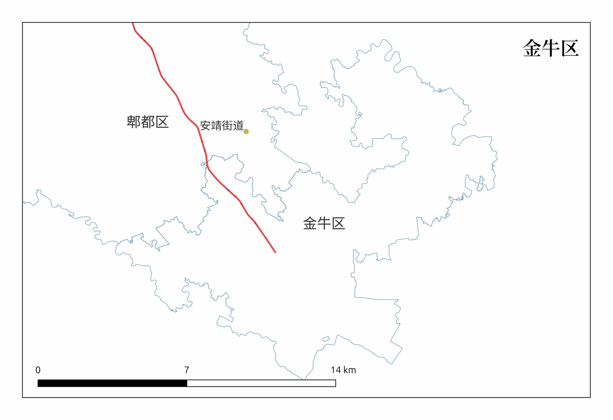

|                                                                                                                                                                                                                                                     |       |
| --------------------------------------------------------------------------------------------------------------------------------------------------------------------------------------------------------------------------------------------------- | ----- |
| 城市名                                                                                                                                                                                                                                                 | 距起点距离 |
| [四川省](https://zh.wikipedia.org/wiki/%E5%9B%9B%E5%B7%9D%E7%9C%81 "四川省")[成都市](https://zh.wikipedia.org/wiki/%E6%88%90%E9%83%BD%E5%B8%82 "成都市")                                                                                                        | 0     |
| [四川省](https://zh.wikipedia.org/wiki/%E5%9B%9B%E5%B7%9D%E7%9C%81 "四川省")[成都市](https://zh.wikipedia.org/wiki/%E6%88%90%E9%83%BD%E5%B8%82 "成都市")[郫都区](https://zh.wikipedia.org/wiki/%E9%83%AB%E9%83%BD%E5%8C%BA "郫都区")                                  | 20    |
| [四川省](https://zh.wikipedia.org/wiki/%E5%9B%9B%E5%B7%9D%E7%9C%81 "四川省")[都江堰市](https://zh.wikipedia.org/wiki/%E9%83%BD%E6%B1%9F%E5%A0%B0%E5%B8%82 "都江堰市")                                                                                             | 54    |
| [四川省](https://zh.wikipedia.org/wiki/%E5%9B%9B%E5%B7%9D%E7%9C%81 "四川省")[汶川县](https://zh.wikipedia.org/wiki/%E6%B1%B6%E5%B7%9D%E5%8E%BF "汶川县")                                                                                                        | 149   |
| [四川省](https://zh.wikipedia.org/wiki/%E5%9B%9B%E5%B7%9D%E7%9C%81 "四川省")[理县](https://zh.wikipedia.org/wiki/%E7%90%86%E5%8E%BF "理县")                                                                                                                   | 206   |
| [四川省](https://zh.wikipedia.org/wiki/%E5%9B%9B%E5%B7%9D%E7%9C%81 "四川省")[马尔康市](https://zh.wikipedia.org/wiki/%E9%A9%AC%E5%B0%94%E5%BA%B7%E5%B8%82 "马尔康市")                                                                                             | 394   |
| [四川省](https://zh.wikipedia.org/wiki/%E5%9B%9B%E5%B7%9D%E7%9C%81 "四川省")[炉霍县](https://zh.wikipedia.org/wiki/%E7%82%89%E9%9C%8D%E5%8E%BF "炉霍县")                                                                                                        | 661   |
| [四川省](https://zh.wikipedia.org/wiki/%E5%9B%9B%E5%B7%9D%E7%9C%81 "四川省")[甘孜县](https://zh.wikipedia.org/wiki/%E7%94%98%E5%AD%9C%E5%8E%BF "甘孜县")                                                                                                        | 756   |
| [四川省](https://zh.wikipedia.org/wiki/%E5%9B%9B%E5%B7%9D%E7%9C%81 "四川省")[德格县](https://zh.wikipedia.org/wiki/%E5%BE%B7%E6%A0%BC%E5%8E%BF "德格县")                                                                                                        | 960   |
| [西藏自治区](https://zh.wikipedia.org/wiki/%E8%A5%BF%E8%97%8F%E8%87%AA%E6%B2%BB%E5%8C%BA "西藏自治区")[江达县](https://zh.wikipedia.org/wiki/%E6%B1%9F%E8%BE%BE%E5%8E%BF "江达县")                                                                                  | 1070  |
| [西藏自治区](https://zh.wikipedia.org/wiki/%E8%A5%BF%E8%97%8F%E8%87%AA%E6%B2%BB%E5%8C%BA "西藏自治区")[昌都市](https://zh.wikipedia.org/wiki/%E6%98%8C%E9%83%BD%E5%B8%82 "昌都市")[卡若区](https://zh.wikipedia.org/wiki/%E5%8D%A1%E8%8B%A5%E5%8C%BA "卡若区")            | 1298  |
| [西藏自治区](https://zh.wikipedia.org/wiki/%E8%A5%BF%E8%97%8F%E8%87%AA%E6%B2%BB%E5%8C%BA "西藏自治区")[类乌齐县](https://zh.wikipedia.org/wiki/%E7%B1%BB%E4%B9%8C%E9%BD%90%E5%8E%BF "类乌齐县")                                                                       | 1403  |
| [西藏自治区](https://zh.wikipedia.org/wiki/%E8%A5%BF%E8%97%8F%E8%87%AA%E6%B2%BB%E5%8C%BA "西藏自治区")[丁青县](https://zh.wikipedia.org/wiki/%E4%B8%81%E9%9D%92%E5%8E%BF "丁青县")                                                                                  | 1546  |
| [西藏自治区](https://zh.wikipedia.org/wiki/%E8%A5%BF%E8%97%8F%E8%87%AA%E6%B2%BB%E5%8C%BA "西藏自治区")[巴青县](https://zh.wikipedia.org/wiki/%E5%B7%B4%E9%9D%92%E5%8E%BF "巴青县")                                                                                  | 1782  |
| [西藏自治区](https://zh.wikipedia.org/wiki/%E8%A5%BF%E8%97%8F%E8%87%AA%E6%B2%BB%E5%8C%BA "西藏自治区")[索县](https://zh.wikipedia.org/wiki/%E7%B4%A2%E5%8E%BF "索县")                                                                                             | 1812  |
| [西藏自治区](https://zh.wikipedia.org/wiki/%E8%A5%BF%E8%97%8F%E8%87%AA%E6%B2%BB%E5%8C%BA "西藏自治区")[那曲市](https://zh.wikipedia.org/wiki/%E9%82%A3%E6%9B%B2%E5%B8%82 "那曲市")[色尼区](https://zh.wikipedia.org/wiki/%E8%89%B2%E5%B0%BC%E5%8C%BA "色尼区")            | 2043  |
| [西藏自治区](https://zh.wikipedia.org/wiki/%E8%A5%BF%E8%97%8F%E8%87%AA%E6%B2%BB%E5%8C%BA "西藏自治区")[班戈县](https://zh.wikipedia.org/wiki/%E7%8F%AD%E6%88%88%E5%8E%BF "班戈县")                                                                                  |       |
| [西藏自治区](https://zh.wikipedia.org/wiki/%E8%A5%BF%E8%97%8F%E8%87%AA%E6%B2%BB%E5%8C%BA "西藏自治区")[申扎县](https://zh.wikipedia.org/wiki/%E7%94%B3%E6%89%8E%E5%8E%BF "申扎县")                                                                                  |       |
| [西藏自治区](https://zh.wikipedia.org/wiki/%E8%A5%BF%E8%97%8F%E8%87%AA%E6%B2%BB%E5%8C%BA "西藏自治区")[尼玛县](https://zh.wikipedia.org/wiki/%E5%B0%BC%E7%8E%9B%E5%8E%BF "尼玛县")                                                                                  |       |
| [西藏自治区](https://zh.wikipedia.org/wiki/%E8%A5%BF%E8%97%8F%E8%87%AA%E6%B2%BB%E5%8C%BA "西藏自治区")[改则县](https://zh.wikipedia.org/wiki/%E6%94%B9%E5%88%99%E5%8E%BF "改则县")                                                                                  | 2875  |
| [西藏自治区](https://zh.wikipedia.org/wiki/%E8%A5%BF%E8%97%8F%E8%87%AA%E6%B2%BB%E5%8C%BA "西藏自治区")[革吉县](https://zh.wikipedia.org/wiki/%E9%9D%A9%E5%90%89%E5%8E%BF "革吉县")                                                                                  |       |
| [西藏自治区](https://zh.wikipedia.org/wiki/%E8%A5%BF%E8%97%8F%E8%87%AA%E6%B2%BB%E5%8C%BA "西藏自治区")[噶尔县](https://zh.wikipedia.org/wiki/%E5%99%B6%E5%B0%94%E5%8E%BF "噶尔县")[狮泉河镇](https://zh.wikipedia.org/wiki/%E7%8B%AE%E6%B3%89%E6%B2%B3%E9%95%87 "狮泉河镇") | 3322  |

## 按县分乡镇

以下是按用qgis选择了路线10公里内的乡镇名称。在地图上，乡镇名称一般会标在乡镇的中心，一般也是最繁华的区域，但也不绝对。可以做为重要的参考。

